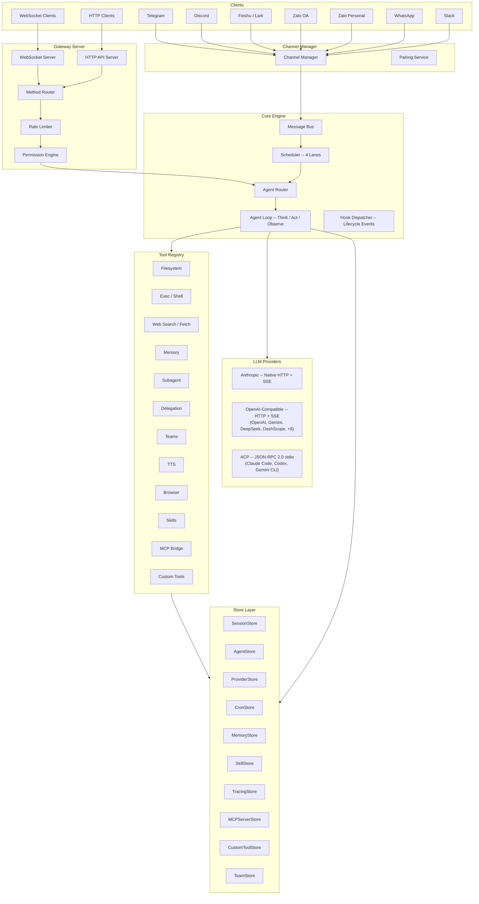
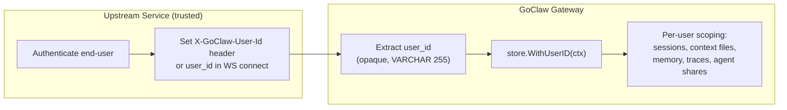
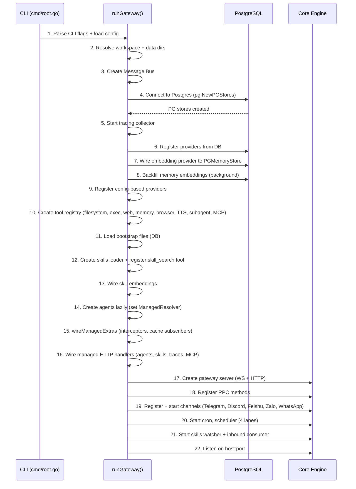
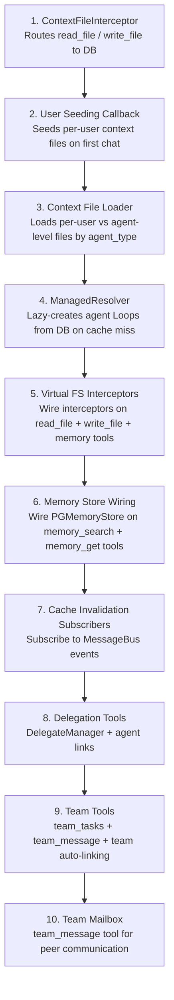
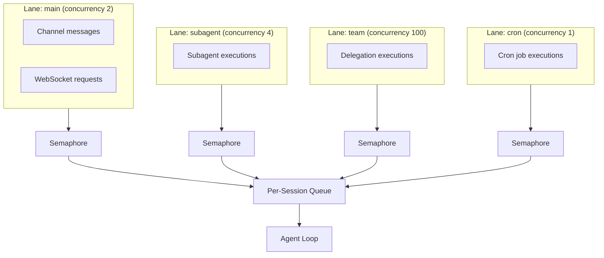
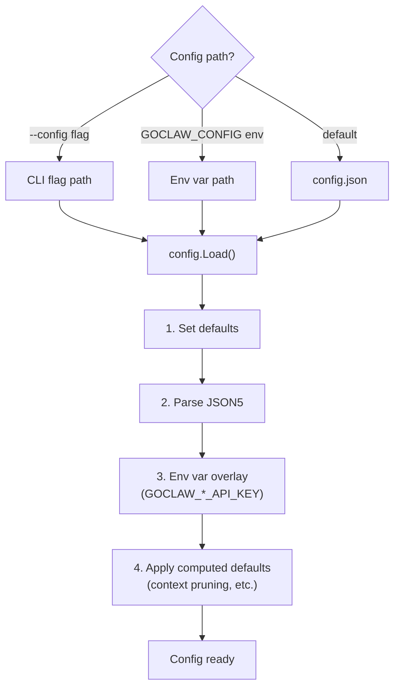

# 00 - Architecture Overview

## 1. Overview

GoClaw is an AI agent gateway written in Go. It exposes a WebSocket RPC (v3) interface and an OpenAI-compatible HTTP API for orchestrating LLM-powered agents. The system uses PostgreSQL as its storage backend with full multi-tenant isolation, per-user context files, encrypted credentials, agent delegation, teams, and LLM call tracing.

## 2. Component Diagram



## 3. Module Map

| Module | Description |
|--------|-------------|
| `internal/gateway/` | WebSocket + HTTP server, client handling, method router. Decomposed: gateway_deps, gateway_http_wiring, gateway_events, gateway_lifecycle, gateway_tools_wiring |
| `internal/gateway/methods/` | RPC method handlers: chat, agents, teams, delegations, sessions, config, skills, cron, pairing, exec approval, usage, send |
| `internal/agent/` | Agent loop (think, act, observe), router, resolver, system prompt builder, sanitization, pruning, tracing, memory flush, DELEGATION.md + TEAM.md injection |
| `internal/providers/` | LLM providers: Anthropic (native HTTP + SSE), OpenAI-compatible (HTTP + SSE, 12+ providers), DashScope (Qwen), ACP (JSON-RPC 2.0 subprocess), Claude CLI, Codex, extended thinking support, retry logic. Shared SSEScanner in providers/sse_reader.go |
| `internal/providers/acp/` | ACP protocol implementation: ProcessPool (subprocess lifecycle), ToolBridge (fs/terminal), session management |
| `internal/tools/` | Tool registry, filesystem ops, exec/shell, policy engine, subagent, delegation manager, team tools, context file + memory interceptors, credential scrubbing, rate limiting, PathDenyable |
| `internal/tools/dynamic_loader.go` | Custom tool loader: LoadGlobal (startup), LoadForAgent (per-agent clone), ReloadGlobal (cache invalidation) |
| `internal/tools/dynamic_tool.go` | Custom tool executor: command template rendering, shell escaping, encrypted env vars |
| `internal/store/` | Store interfaces: SessionStore, AgentStore, ProviderStore, SkillStore, MemoryStore, CronStore, PairingStore, TracingStore, MCPServerStore, TeamStore, ChannelInstanceStore, ConfigSecretsStore. Dual-DB support via Dialect pattern |
| `internal/store/base/` | Shared store abstractions: Dialect interface, NilStr, BuildMapUpdate, BuildScopeClause, and other common helpers for both PostgreSQL and SQLite |
| `internal/store/pg/` | PostgreSQL implementations (`database/sql` + `pgx/v5`) |
| `internal/store/sqlitestore/` | SQLite implementations (`modernc.org/sqlite`) for desktop edition |
| `internal/bootstrap/` | System prompt files (AGENTS.md, SOUL.md, TOOLS.md, IDENTITY.md, USER.md, BOOTSTRAP.md) + seeding + truncation |
| `internal/config/` | Config loading (JSON5) + env var overlay |
| `internal/skills/` | SKILL.md loader (5-tier hierarchy) + BM25 search + hot-reload via fsnotify |
| `internal/channels/` | Channel manager + adapters: Telegram (forum topics, STT, bot commands), Feishu/Lark (streaming cards, media), Zalo OA, Zalo Personal, Discord, WhatsApp, Slack |
| `internal/mcp/` | MCP server bridge (stdio, SSE, streamable-HTTP transports) |
| `internal/scheduler/` | Lane-based concurrency control (main, subagent, cron, team lanes) with per-session serialization. Per-edition rate limits (`MaxSubagentConcurrent`, `MaxSubagentDepth`) with tenant-scoped concurrency |
| `internal/memory/` | Memory system (pgvector hybrid search) |
| `internal/subagent/` | Subagent lifecycle: spawn, roster, task persistence (subagent_tasks table), announce queue (producer-consumer), auto-retry, per-edition rate limiting |
| `internal/permissions/` | RBAC policy engine (admin, operator, viewer roles) |
| `internal/store/pg/pairing.go` | DM/device pairing service (8-character codes, database-backed) |
| `internal/sandbox/` | Docker-based code execution sandbox |
| `internal/audio/` | Unified audio manager: 4 provider interfaces (TTS active; STT/Music/SFX stubbed/partial). Orchestrates ElevenLabs, OpenAI, Edge, MiniMax TTS providers. `internal/tts/` retained as backward-compat alias |
| `internal/tts/` | Backward-compat alias layer (24 symbols) — all pre-refactor callers compile unchanged |
| `internal/http/` | HTTP API handlers: /v1/chat/completions, /v1/agents, /v1/skills, /v1/traces, /v1/mcp, /v1/delegations, summoner |
| `internal/crypto/` | AES-256-GCM encryption for API keys |
| `internal/tracing/` | LLM call tracing (traces + spans), in-memory buffer with periodic store flush |
| `internal/tracing/otelexport/` | Optional OpenTelemetry OTLP exporter (opt-in via build tags; adds gRPC + protobuf) |
| `internal/cache/` | Caching layer for agent state and provider responses |
| `internal/bus/` | Event pub/sub message bus for inter-component communication |
| `internal/knowledgegraph/` | Knowledge graph storage and traversal |
| `internal/mcp/` | Model Context Protocol bridge/server (stdio, SSE, streamable-HTTP) |
| `internal/media/` | Media handling utilities |
| `internal/oauth/` | OAuth authentication integration |
| `internal/sessions/` | Session management and lifecycle |
| `internal/tasks/` | Task management system |
| `internal/upgrade/` | Database schema version tracking and migrations |
| `internal/pipeline/` | 8-stage pluggable agent pipeline (context → history → prompt → think → act → observe → memory → summarize) |
| `internal/orchestration/` | Orchestration primitives: BatchQueue[T] generic for result aggregation, ChildResult capture, media conversion helpers |
| `internal/eventbus/` | DomainEventBus: typed event publishing, worker pool, dedup, retry, used by consolidation workers |
| `internal/consolidation/` | Memory consolidation workers: episodic (recent facts), semantic (embeddings), dreaming (synthesis), dedup |
| `internal/tokencount/` | Token counting: tiktoken BPE counter with fallback, used by pipeline for context tracking |
| `internal/workspace/` | Workspace context resolver: 6 scenarios (agent default, team lead, team member, dispatch, subagent, cron) |
| `internal/vault/` | Knowledge Vault: wikilinks (semantic mesh), hybrid search (BM25+vector), filesystem sync, L0 auto-injection |
| `internal/channels/whatsapp/` | Native WhatsApp channel via whatsmeow (replaces WhatsApp API), QR auth, media handling |
| `internal/hooks/` | Agent lifecycle hooks: event dispatcher (sync/async), concrete handlers (command/http), matchers (regex + CEL), audit logging, edition gating, cost safeguards. Events: SessionStart, UserPromptSubmit, PreToolUse, PostToolUse, Stop, SubagentStart/Stop. Handlers: CommandHandler (shell, Lite-only), HTTPHandler (SSRF-hardened, auth decrypt) |
| `internal/hooks/handlers/` | Concrete hook handler implementations: `CommandHandler` (exec wrapper, JSON I/O, env allowlist, edition recheck), `HTTPHandler` (SSRF-hardened HTTP client, retry-once on 5xx, no redirects, encrypted auth headers) |

---

## 3.5 Agent Hooks System

**Lifecycle hooks** allow agents to perform custom logic at key execution points. The system is event-driven (sync/async), integrated into the 8-stage pipeline, and includes audit logging, edition gating, and security safeguards.

### Event Types

| Event | Stage | Sync/Async | Purpose |
|-------|-------|-----------|---------|
| **SessionStart** | ContextStage | Async | Fires once per session (first turn); before history loading |
| **UserPromptSubmit** | ContextStage | Sync | Fires on user message arrival; blocks with hook reason or mutates input |
| **PreToolUse** | ToolStage | Sync | Fires before each tool execution; blocks tool or mutates arguments |
| **PostToolUse** | ToolStage | Async | Fires after tool result is processed; non-blocking |
| **Stop** | FinalizeStage | Async | Fires when session terminates (stop/complete/error) |
| **SubagentStart** | (Delegate tool) | Sync | Fires before delegated task spawns; blocks delegation |
| **SubagentStop** | (Domain events) | Async | Fires on delegation completion/failure; non-blocking |

### Handler Types

| Handler | Edition | Config | Semantics |
|---------|---------|--------|-----------|
| **Command** | Lite only | `cmd`, `allowedEnvVars` | Exec shell command; stdin=event JSON; stdout=decision JSON; exit 0→allow, exit 2→block; timeout→block (fail-closed) |
| **HTTP** | All | `url`, `headers` | POST event JSON to webhook URL; parse response for decision, additionalContext, updatedInput; 5xx retry once; 4xx error no-retry; SSRF-hardened with pinned IP |
| **Prompt** | Phase 3+ | TBD | Integrates custom prompting logic (deferred) |

### Sync vs Async

**Sync hooks** (UserPromptSubmit, PreToolUse, SubagentStart):
- Block pipeline until decision received
- Support Copy-on-Write (COW) staged mutations: `updatedInput` buffered, committed only if ALL sync hooks succeed
- Timeout ≤5s per hook; chain total ≤10s wall-time
- Rejection blocks the step (e.g., tool not executed, user message not processed)

**Async hooks** (SessionStart, PostToolUse, Stop, SubagentStop):
- Fire-and-forget via worker pool (default 16 workers, bounded queue 512)
- Non-blocking (pipeline continues immediately)
- Timeout per hook; chain budget enforced but no blocking

### Security Model

- **Edition gating**: `CommandHandler` only on Lite edition; attempts on Standard/other editions rejected (defense-in-depth)
- **SSRF hardening (HTTPHandler)**: Caller supplies net.Dialer pinning resolved IP, blocking loopback/link-local/private ranges; no HTTP redirects (CheckRedirect returns ErrUseLastResponse)
- **Auth header encryption**: `Authorization` + other sensitive fields in cfg.Config["headers"] encrypted at rest via AES-256-GCM; decrypted only at HTTP send-time
- **Audit logging**: All hook invocations logged to `hook_executions` table (encrypted, PII-redacted) with dedup_key for idempotency
- **Loop-depth guard (M5)**: SubagentStart checks recursion depth; max 3 levels prevents infinite delegation chains
- **Circuit breaker**: Auto-disables hook after 3 consecutive failures in recent window (C4 mitigation)

### Pipeline Integration

Dispatcher wired into `PipelineDeps.HookDispatcher` (nil-safe noop fallback). All 8 stages support hook firing with zero overhead when dispatcher not configured. Example sync hook flow:

```
1. ContextStage: UserPromptSubmit → Hooks.Fire(sync)
2. Sync hooks buffer mutations (updatedInput)
3. All hooks succeed? → Commit mutations, proceed
4. Any hook rejects? → Discard buffer, abort pipeline, user sees reason
```

---

## 4. Multi-Tenant Identity Model

GoClaw uses the **Identity Propagation** pattern (also known as **Trusted Subsystem**). It does not implement authentication or authorization — instead, it trusts the upstream service that authenticates with the gateway token to provide accurate user identity.



### Identity Flow

| Entry Point | How user_id is provided | Enforcement |
|-------------|------------------------|-------------|
| HTTP API | `X-GoClaw-User-Id` header | Required |
| WebSocket | `user_id` field in `connect` handshake | Required |
| Channels | Derived from platform sender ID (e.g., Telegram user ID) | Automatic |

### Compound User ID Convention

The `user_id` field is **opaque** to GoClaw — it does not interpret or validate the format. For multi-tenant deployments, the recommended convention is:

```
tenant.{tenantId}.user.{userId}
```

This hierarchical format ensures natural isolation between tenants. Since `user_id` is used as a scoping key across all per-user tables (`user_context_files`, `user_agent_profiles`, `user_agent_overrides`, `agent_shares`, `sessions`, `traces`), the compound format guarantees that users from different tenants cannot access each other's data.

### Where user_id is used

| Component | Usage |
|-----------|-------|
| Session keys | `agent:{agentId}:{channel}:direct:{peerId}` — peerId derived from user_id |
| Context files | `user_context_files` table scoped by `(agent_id, user_id)` |
| User profiles | `user_agent_profiles` table — first/last seen, workspace |
| User overrides | `user_agent_overrides` — per-user provider/model preferences |
| Agent shares | `agent_shares` table — user-level access control |
| Memory | Per-user memory entries via context propagation |
| Traces | `traces` table includes `user_id` for filtering |
| MCP grants | `mcp_user_grants` — per-user MCP server access |
| Skills grants | `skill_user_grants` — per-user skill access |

---

## 6. Gateway Startup Sequence



---

## 7. Database Wiring

The `wireManagedExtras()` function in `cmd/gateway_managed.go` wires multi-tenant components:



### Cache Invalidation Events

| Event | Subscriber | Action |
|-------|-----------|--------|
| `cache:bootstrap` | ContextFileInterceptor | `InvalidateAgent()` or `InvalidateAll()` |
| `cache:agent` | AgentRouter | `InvalidateAgent()` -- forces re-resolve from DB |
| `cache:skills` | SkillStore | `BumpVersion()` |
| `cache:cron` | CronStore | `InvalidateCache()` |
| `cache:custom_tools` | DynamicToolLoader | `ReloadGlobal()` + `AgentRouter.InvalidateAll()` |

---

## 8. Scheduler Lanes

The scheduler uses a lane-based concurrency model. Each lane is a named worker pool with a bounded semaphore. Per-session queues control concurrency within each session.



### Lane Defaults

| Lane | Concurrency | Env Override | Purpose |
|------|:-----------:|-------------|---------|
| `main` | 30 | `GOCLAW_LANE_MAIN` | Primary user chat sessions |
| `subagent` | 50 | `GOCLAW_LANE_SUBAGENT` | Spawned subagents |
| `team` | 100 | `GOCLAW_LANE_TEAM` | Agent team/delegation executions |
| `cron` | 30 | `GOCLAW_LANE_CRON` | Scheduled cron jobs |

### Session Queue Concurrency

Per-session queues now support configurable `maxConcurrent`:
- **DMs**: `maxConcurrent = 1` (single-threaded per user)
- **Groups**: `maxConcurrent = 3` (multiple concurrent responses)
- **Adaptive throttle**: When session history exceeds 60% of context window, concurrency drops to 1

### Queue Modes

| Mode | Behavior |
|------|----------|
| `queue` | FIFO -- new messages wait until the current run completes |
| `followup` | Merges incoming message into the pending queue as a follow-up |
| `interrupt` | Cancels the active run and replaces it with the new message |

Default queue config: capacity 10, drop policy `old` (drops oldest on overflow), debounce 800ms.

### /stop and /stopall

- `/stop` -- Cancel the oldest running task (others keep going)
- `/stopall` -- Cancel all running tasks + drain the queue

Both are intercepted before the debouncer to avoid being merged with normal messages.

---

## 9. Graceful Shutdown

When the process receives SIGINT or SIGTERM:

1. Broadcast `shutdown` event to all connected WebSocket clients.
2. `channelMgr.StopAll()` -- stop all channel adapters.
3. `cronStore.Stop()` -- stop cron scheduler.
4. `sandboxMgr.Stop()` + `ReleaseAll()` -- release Docker containers.
6. `cancel()` -- cancel root context, propagating to consumer + scheduler.
7. Deferred cleanup: flush tracing collector, close memory store, close browser manager, stop scheduler lanes.
8. HTTP server shutdown with a **5-second timeout** (`context.WithTimeout`).

---

## 10. Config System

Configuration is loaded from a JSON5 file with environment variable overlay. Secrets are never persisted to the config file.



### Key Config Sections

| Section | Purpose |
|---------|---------|
| `gateway` | host, port, token, allowed_origins, rate_limit_rpm, max_message_chars |
| `agents` | defaults (provider, model, context_window) + list (per-agent overrides) |
| `tools` | profile, allow/deny lists, exec_approval, web, browser, mcp_servers, rate_limit_per_hour |
| `channels` | Per-channel: enabled, token, dm_policy, group_policy, allow_from |
| `database` | postgres_dsn read only from env var |

### Secret Handling

- Secrets exist only in env vars or `.env.local` -- never in `config.json`.
- `GOCLAW_POSTGRES_DSN` is tagged `json:"-"` and cannot be read from the config file.
- `MaskedCopy()` replaces API keys with `"***"` when returning config over WebSocket.
- `StripSecrets()` removes secrets before writing config to disk.
- Config hot-reload via `fsnotify` watcher with 300ms debounce.

---

## 11. File Reference

| Module | Path | Purpose |
|---|---|---|
| CLI & startup | `cmd/` | Cobra entry point, gateway orchestrator, DB wiring, provider registration, RPC method registration |
| Gateway server | `internal/gateway/` | WS + HTTP server, client lifecycle, method router, rate limiter |
| Config | `internal/config/` | JSON5 config loading, env overlay, channel config structs |
| Store layer | `internal/store/` | `Stores` container, `BaseModel`, `StoreConfig`, `GenNewID()` |

Use `grep` or your editor's symbol search for specific files.

---

## V3 Architecture (Wave 1 & Wave 2 - dev-v3 branch)

### Overview

V3 introduces a **pluggable 8-stage pipeline** (replacing the monolithic `runLoop`), an event-driven architecture via `DomainEventBus`, and advanced memory consolidation. The system maintains backward compatibility via a **dual-mode gate** at the loop level: agents can opt into v3 pipeline or stay on v2 monolithic loop per-agent via `other_config` JSONB.

### 8-Stage Pipeline

| Stage | Phase | Responsibility |
|-------|-------|-----------------|
| **ContextStage** | Setup (once) | Inject agent/user/workspace context, compute per-user files, calculate token overhead (system prompt, tools, etc.) |
| **ThinkStage** | Iteration | Build system prompt, filter tools by policy, call LLM |
| **PruneStage** | Iteration | Context pruning (2-pass: soft trim → hard clear), run memory flush if compaction triggered |
| **ToolStage** | Iteration | Execute tool calls (parallel goroutines for multiple calls) |
| **ObserveStage** | Iteration | Process tool results, append to messages |
| **CheckpointStage** | Iteration | Track iteration state, check for loop exit conditions |
| **FinalizeStage** | Finalize (once) | Sanitize output, flush messages, update session metadata |

### Feature Flags (in `agents.other_config` JSONB)

| Flag | Key | Type | Default | Purpose |
|------|-----|------|---------|---------|
| Pipeline | `v3_pipeline_enabled` | bool | false | Use v3 pipeline instead of v2 monolithic loop |
| Memory | `v3_memory_enabled` | bool | false | Enable episodic/semantic consolidation workers via DomainEventBus |
| Retrieval | `v3_retrieval_enabled` | bool | false | Enable Knowledge Vault with wikilinks + hybrid search, L0 auto-injection |
| Evolution Metrics | `self_evolution_metrics` | bool | false | Track agent metrics for evolution suggestions (tool usage, retrieval patterns) |
| Evolution Suggestions | `self_evolution_suggestions` | bool | false | Generate and apply evolution suggestions (auto-adapt prompt/tools) |

### Memory Consolidation System

**DomainEventBus** drives asynchronous consolidation:

- **Episodic Worker** — Extracts facts from recent runs, clusters by topic, stores in `episodic_memory` table with embeddings
- **Semantic Worker** — Reprocesses episodic clusters, generates abstracted summaries, produces `semantic_memory` entries
- **Dreaming Worker** — Synthesizes novel insights from memory clusters, cross-links related memories, drives self-evolution
- **Dedup Worker** — Prevents duplicate memory entries, maintains consistency across consolidation cycles

### Workspace Context Resolver

Six distinct workspace scenarios:

1. **Agent default** — Agent workspace from config, sandbox environment
2. **Team lead** — Team workspace as default (agent coordinates tasks)
3. **Team member** — Agent workspace with team workspace accessible via `WithToolTeamWorkspace()`
4. **Dispatch** — Temporary workspace from `req.TeamWorkspace` (one-off delegated task)
5. **Subagent** — Inherited workspace from parent agent via context propagation
6. **Cron** — Workspace resolved from agent + timezone context at cron trigger time

### Knowledge Vault (Wikilinks + Hybrid Search)

- **Wikilinks**: Bidirectional semantic links (`[[related-concept]]`) automatically extracted from memories
- **Hybrid Search**: BM25 keyword search + vector similarity (pgvector) combined via RRF (reciprocal rank fusion)
- **L0 Auto-Injection**: Top-K vault entries injected into system prompt as "relevant context from vault"
- **Filesystem Sync**: Vault entries exported as `.md` files for manual editing, re-imported with change tracking

### Audio & Voice System (ElevenLabs + Streaming TTS)

**Provider architecture** (`internal/audio/`):
- **`Manager`**: Central orchestrator dispatching TTS/STT/Music/SFX requests to pluggable providers
- **`TTSProvider` interface**: Core text-to-speech contract (blocking, buffered response)
- **`StreamingTTSProvider` interface**: Optional interface for ElevenLabs `/stream` endpoint (chunked audio via `io.ReadCloser`)
- **Implementations**: ElevenLabs, OpenAI, Edge, MiniMax (phase-gated; STT/Music/SFX partial)

**Voice discovery & caching**:
- **Voice cache** (`internal/audio/voice_cache.go`): In-memory LRU (cap 1000 tenants, TTL 1h) shared by HTTP `/v1/voices` + WS `voices.list` handlers. Thread-safe with `sync.Mutex` (LRU updates require write lock)
- **Cache miss recovery**: HTTP handler auto-fetches from ElevenLabs; WS handler requires prior cache warm (provider resolution deferred to Phase 3)
- **Agent audio context** (`store.WithAgentAudio` / `AgentAudioFromCtx`): Immutable snapshot bundle (AgentID + OtherConfig JSONB) injected by dispatcher before tool dispatch; consumed by `TtsTool.Execute` for voice/model resolution

**Agent-level configuration** (`agents.other_config` JSONB):
- `tts_voice_id`: ElevenLabs voice ID (e.g., "pMsXgVXv3BLzUgSXRplE")
- `tts_model_id`: Model choice (eleven_v3, eleven_flash_v2_5, eleven_multilingual_v2, eleven_turbo_v2_5)
- Resolution precedence: CLI args → agent config → tenant override → provider default

**Web UI voice picker** (`ui/web/src/components/voice-picker.tsx`):
- Combobox with BM25 search, preview playback button (HTML `<audio>`)
- Handles preview CDN 403 (expiry) via `onError` → auto-refresh cache
- Embedded in PromptSettingsSection, bound to `other_config.tts_voice_id`

---

## 12. Webhook Subsystem

External systems trigger agents or send channel messages via the webhook subsystem without using the gateway token (WebSocket/bearer) protocol.

### Components

| Component | Location | Role |
|-----------|----------|------|
| Admin CRUD handlers | `internal/http/webhooks_admin.go` | Create/list/get/patch/rotate/revoke webhook rows |
| Auth middleware | `internal/http/webhooks_auth.go` | Bearer + HMAC verification, localhost gate, kind check, rate limit, idempotency |
| LLM endpoint | `internal/http/webhooks_llm.go` | `POST /v1/webhooks/llm` — sync (30s) + async dispatch |
| Message endpoint | `internal/http/webhooks_message.go` | `POST /v1/webhooks/message` — channel delivery with media |
| Rate limiter | `internal/http/webhooks_ratelimit.go` | Per-webhook + per-tenant token bucket |
| Idempotency | `internal/http/webhooks_idempotency.go` | `Idempotency-Key` header cache (24h TTL) |
| Media fetch | `internal/http/webhooks_media_fetch.go` | SSRF-guarded HEAD probe + MIME validation |
| Callback worker | `internal/webhooks/worker.go` | Poll loop, claim, agent invoke, HMAC sign, HTTP POST, retry |
| Backoff | `internal/webhooks/backoff.go` | Exponential schedule `[30s, 2m, 10m, 1h, 6h]` with ±10% jitter |
| Signing | `internal/webhooks/sign.go` | `Sign(key, ts, body)` → `X-Webhook-Signature: t=...,v1=...` |
| Callback limiter | `internal/webhooks/limiter.go` | Per-tenant concurrency cap for outbound delivery goroutines |
| Store interfaces | `internal/store/` | `WebhookStore`, `WebhookCallStore` |
| PG store | `internal/store/pg/webhook_store.go`, `webhook_call_store.go` | Tenant-scoped SQL |
| SQLite store | `internal/store/sqlitestore/` | Lite edition support |
| Migrations | `migrations/` (PG), `internal/store/sqlitestore/schema.sql` (SQLite) | `webhooks` + `webhook_calls` tables |

### Inbound Flow

```
POST /v1/webhooks/llm or /v1/webhooks/message
  → WebhookAuthMiddleware
      body cap → bearer/HMAC auth → localhost gate → kind check
      → rate limit (per-webhook + per-tenant) → idempotency → inject context
  → Handler (LLM or Message)
      sync: agent.Run(30s timeout) → 200 with output
      async: store WebhookCallData{status=queued} → 202 {call_id}
```

### Outbound Callback Flow (async only)

```
WebhookWorker.pollOneTenant()
  → calls.ClaimNext(lease_token CAS) → execute goroutine
  → invokeAgent (30s) → build callbackPayload
  → SSRF re-validate callback_url
  → HMAC sign body → POST to callback_url
  → 2xx: UpdateStatus(done, lease_token) | 4xx: failed | 5xx/net: retry with backoff | 429: Retry-After
```

**Lease Token Idempotency:** Each call row has a `lease_token` (UUID). Worker claims the row only if it can CAS the token. On success, worker updates status with the token as proof of ownership. Stale/slow receivers cannot accidentally overwrite a faster delivery attempt.

**Secret Encryption:** The raw webhook secret is encrypted at rest via AES-256-GCM using the `GOCLAW_ENCRYPTION_KEY` environment variable (same key as LLM provider credentials). Database leaks do not compromise HMAC material. See `docs/webhooks.md` § 14 for details.

### Security Log Events

| Event | Level | Trigger |
|-------|-------|---------|
| `security.webhook.auth_failed` | Warn | Invalid bearer / HMAC |
| `security.webhook.hmac_invalid` | Warn (via auth_failed) | HMAC mismatch |
| `security.webhook.body_too_large` | Warn | Body exceeds cap |
| `security.webhook.localhost_only_violation` | Warn | Non-loopback caller on restricted webhook |
| `security.webhook.kind_mismatch` | Warn | Caller path vs webhook kind mismatch |
| `security.webhook.rate_limited` | Warn | Per-webhook or per-tenant rate cap hit |
| `security.webhook.tenant_mismatch` | Warn | Agent UUID does not match webhook tenant |
| `security.webhook.tenant_leak_attempt` | Warn | Channel belongs to different tenant |
| `security.webhook.ssrf_blocked` | Warn | `media_url` SSRF rejection |
| `security.webhook.callback_ssrf_blocked` | Warn | `callback_url` SSRF rejection at delivery |
| `security.webhook.worker_panic` | Error | Delivery goroutine panic caught |
| `security.webhook.admin_denied` | Warn | Non-admin access to admin CRUD routes |

See `docs/webhooks.md` for the full integrator reference (auth, retries, HMAC examples).

---

## Cross-References

| Document | Content |
|----------|---------|
| [01-agent-loop.md](./01-agent-loop.md) | Agent loop detail, v3 pipeline stages, sanitization pipeline, history management, orchestration modes, self-evolution |
| [02-providers.md](./02-providers.md) | LLM providers, retry logic, schema cleaning |
| [03-tools-system.md](./03-tools-system.md) | Tool registry, policy engine, interceptors, custom tools, MCP grants |
| [04-gateway-protocol.md](./04-gateway-protocol.md) | WebSocket protocol v3, HTTP API, RBAC, identity propagation |
| [05-channels-messaging.md](./05-channels-messaging.md) | Channel adapters, Telegram formatting, pairing, per-user scoping |
| [06-store-data-model.md](./06-store-data-model.md) | Store interfaces, PostgreSQL schema, session caching, custom tool store |
| [07-bootstrap-skills-memory.md](./07-bootstrap-skills-memory.md) | Bootstrap files, skills system, memory, skills grants |
| [08-scheduling-cron.md](./08-scheduling-cron.md) | Scheduler lanes, cron lifecycle |
| [09-security.md](./09-security.md) | Defense layers, encryption, rate limiting, RBAC, sandbox |
| [10-tracing-observability.md](./10-tracing-observability.md) | Tracing collector, span hierarchy, OTel export, trace API |
| [11-agent-teams.md](./11-agent-teams.md) | Agent teams, task board, mailbox, delegation integration |
| [12-extended-thinking.md](./12-extended-thinking.md) | Extended thinking, per-provider support, streaming |
