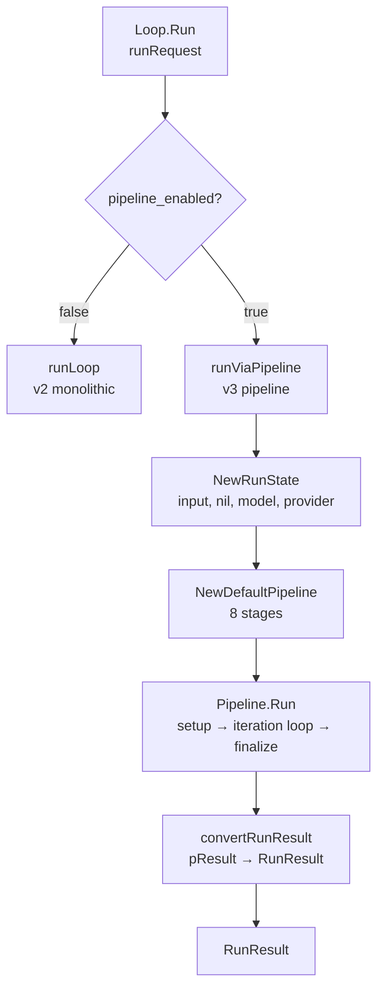
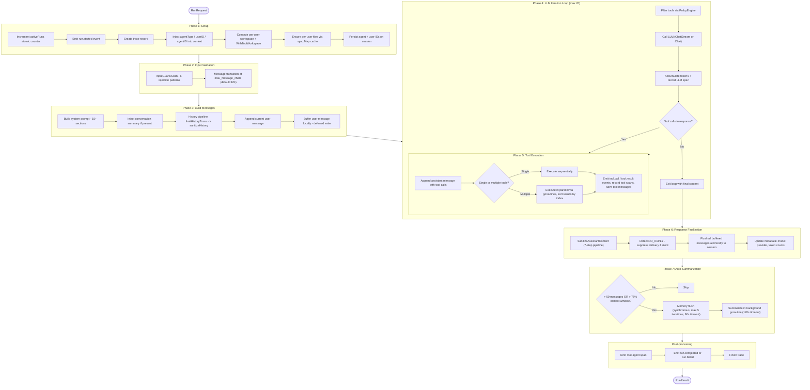
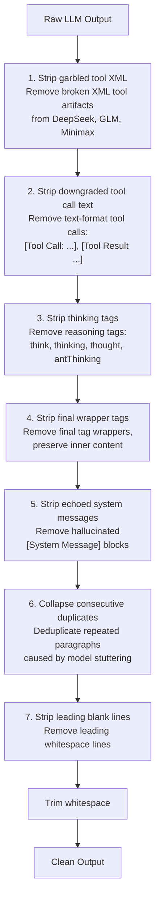
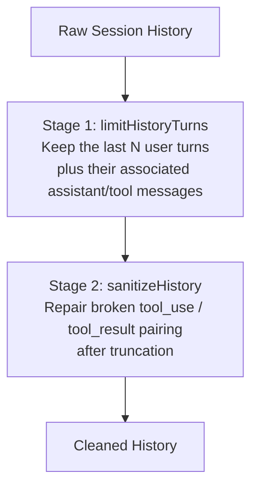
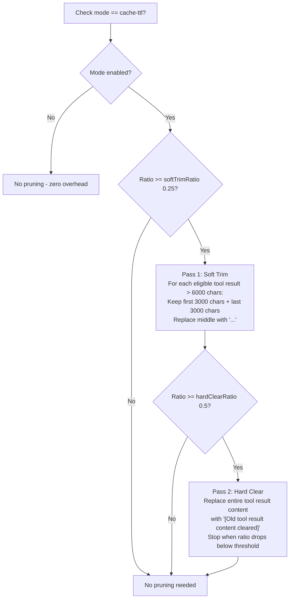
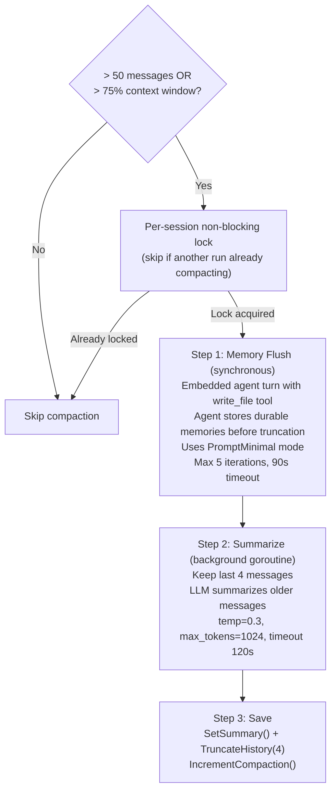
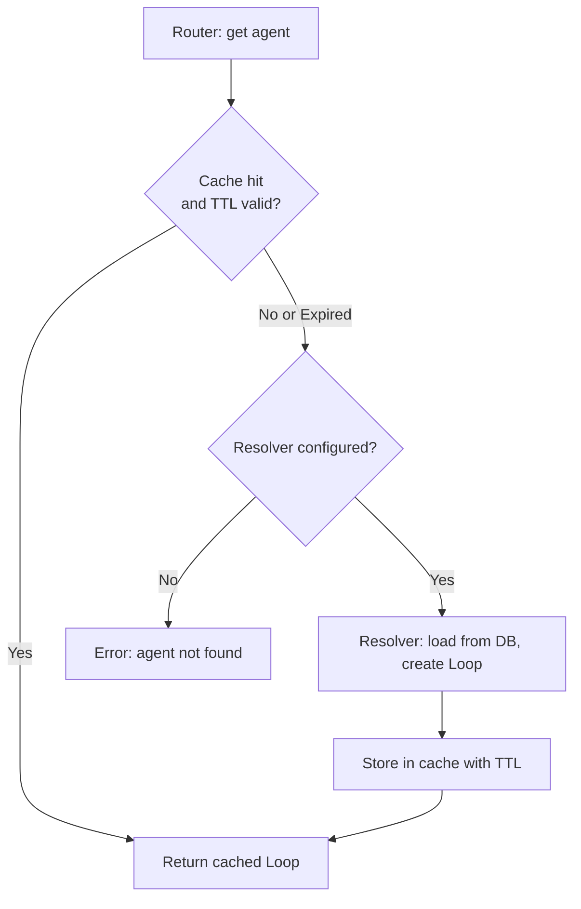
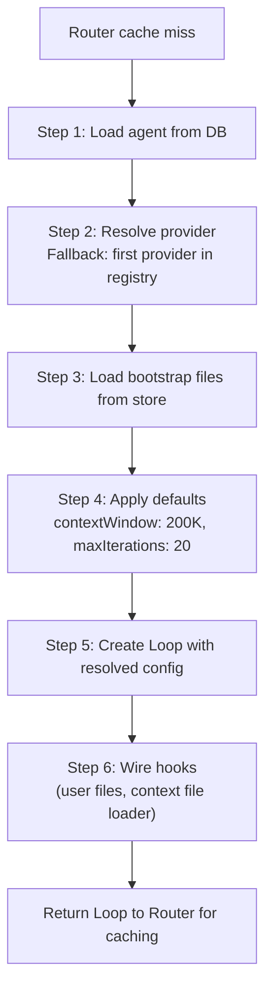
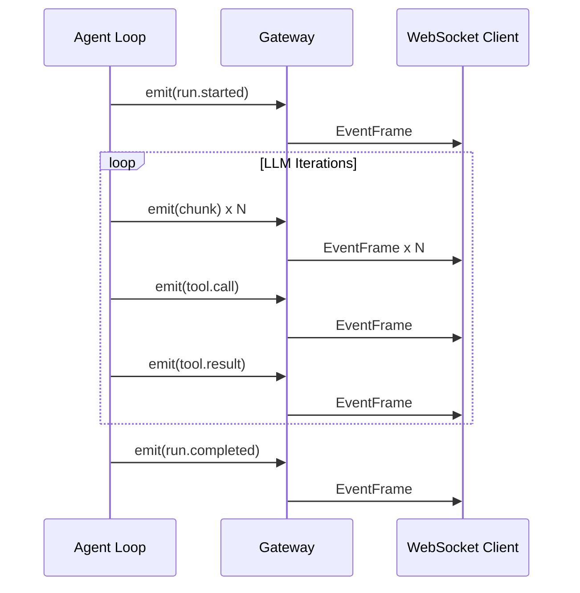
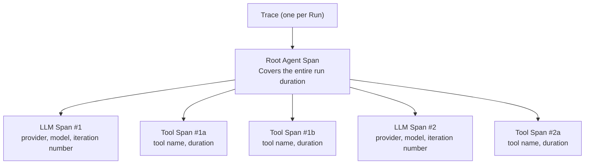

# 01 - Agent Loop

## Overview

The Agent Loop implements a **Think --> Act --> Observe** cycle. Each agent owns a `Loop` instance configured with a provider, model, tools, workspace, and agent type. A user message enters as a `RunRequest`, passes through the loop, and exits as a `RunResult`. 

**V3 Dual Mode**: The loop supports two execution paths:
- **V2 (monolithic)**: Original `runLoop()` function (default for backward compatibility)
- **V3 (pipeline)**: Pluggable 8-stage pipeline (`internal/pipeline/`, enabled via feature flag)

Both paths implement the same external behavior; the difference is internal architecture. The loop iterates up to 20 times: the LLM thinks, optionally calls tools, observes results, and repeats until it produces a final text response.

---

## V3 Pipeline Architecture

When `pipeline_enabled` is true, `Loop.Run()` delegates to `runViaPipeline()`, which orchestrates the v3 pipeline:



### Stage Execution Order

```
Setup (runs once)
├─ ContextStage: Inject context, compute workspace, ensure per-user files
│
Iteration Loop (max 20 iterations)
├─ ThinkStage: Build system prompt, filter tools, call LLM
├─ PruneStage: Soft/hard trim context, run memory flush if needed
├─ ToolStage: Execute tool calls (parallel)
├─ ObserveStage: Process tool results, append messages
└─ CheckpointStage: Check iteration state, conditionally break

Finalize (runs once, uses background context if cancelled)
└─ FinalizeStage: Sanitize output, flush messages, update metadata
```

### Stage Details

**ContextStage**
- Inject context: `WithAgentID()`, `WithUserID()`, `WithAgentType()`, `WithLocale()`
- Resolve per-user workspace (base + sanitized userID)
- Ensure per-user files exist (idempotent via `sync.Map` cache)
- Persist agent/user IDs on session

**ThinkStage**
- Resolve workspace + context files dynamically
- Build system prompt (15+ sections)
- Inject conversation summary if exists
- Run history pipeline (limitHistoryTurns → sanitizeHistory)
- Filter tools through PolicyEngine (RBAC)
- Call LLM, record span with token counts
- Emit `chunk` events (streaming) or single response

**PruneStage** (opt-in via `contextPruning.mode: "cache-ttl"`)
- Estimate token ratio vs context window
- If >= 25%, run soft trim pass (keep first/last 3000 chars, replace middle with "...")
- If >= 50%, run hard clear pass (replace with placeholder)
- Run sanitizeHistory to fix broken tool_use/tool_result pairs after prune
- Trigger memory flush (synchronous) if compaction threshold exceeded

**ToolStage**
- Execute single tool sequentially (no goroutine overhead)
- Execute eligible read-only multi-tool batches in bounded parallel, then process results in original order
- Keep mutating, async, MCP-bridged, `exec`/`bash`, `wait`, and unknown tools sequential
- Emit `tool.call` before, `tool.result` after
- Record tool span
- Append tool messages to buffer

**ObserveStage**
- Process tool result stream
- Handle `NO_REPLY` convention (silent completion)
- Append assistant message with tool call info

**CheckpointStage**
- Increment iteration counter
- Check if max iterations reached → `BreakLoop`
- Check if context cancelled → `AbortRun`

**FinalizeStage**
- Run 7-step output sanitization pipeline
- Flush buffered messages atomically
- Update session metadata (model, provider, token counts)
- Emit `run.completed` or `run.failed` event

---

## Orchestration Modes

Agents support three orchestration modes that determine which inter-agent tools are available:

### ModeSpawn (Default)
- **Use case**: Single independent agent
- **Tools available**: `spawn` (self-clone child agents)
- **Tools hidden**: `delegate`, `team_tasks`
- **Resolution**: Default when no team or delegate links

### ModeDelegate
- **Use case**: Agent with linked delegate targets
- **Tools available**: `spawn`, `delegate` (dispatch to linked agents)
- **Tools hidden**: `team_tasks`
- **Resolution**: When `agent_links` table has rows with source = this agent

### ModeTeam
- **Use case**: Agent in a team (multiple agents collaborating)
- **Tools available**: `spawn`, `delegate`, `team_tasks` (full team workspace)
- **Tools hidden**: None
- **Resolution**: When `teams` table has a row with agent_id = this agent

**Mode Resolution Priority**: Team > Delegate > Spawn

The system prompt includes relevant details for each mode (delegate targets, team context, shared workspace paths).

---

## Self-Evolution System

Agents can auto-adapt their behavior based on metrics and admin-approved suggestions.

### Evolution Suggestion Engine

Analyzes agent metrics on a periodic schedule (cron job):

1. **LowRetrievalUsageRule** — Detects if `memory_search` or `knowledge_graph_search` is underutilized; suggests enabling vault
2. **ToolFailureRule** — Identifies frequently failing tools; suggests limiting tool set or retraining
3. **RepeatedToolRule** — Detects repetitive tool calls (loop detection); suggests prompt adjustment

### Adaptation Guardrails

**AdaptationGuardrails** struct controls safety limits (stored in `agents.other_config.evolution_guardrails`):

| Field | Default | Purpose |
|-------|---------|---------|
| `max_delta_per_cycle` | 0.1 | Max parameter change per cycle (prevents wild swings) |
| `min_data_points` | 100 | Require at least N metrics before applying suggestion |
| `rollback_on_drop_pct` | 20.0 | Revert if quality drops >20% after applying |
| `locked_params` | [] | Parameter names that cannot auto-change (e.g., "temperature") |

### Suggestion Workflow

1. **SuggestionEngine.Analyze()** evaluates rules against 7-day metrics window
2. Generates `EvolutionSuggestion` records (status="pending")
3. Admin reviews in dashboard, approves/rejects
4. On approval, auto-adapt worker applies suggestion + records baseline metrics
5. Next cycle detects quality regression and auto-rolls back if threshold exceeded

---

## 1. RunRequest Flow (V2 Monolithic - Original)

The full lifecycle of a single agent run is broken into seven phases.



### Phase 1: Setup

- Increment the `activeRuns` atomic counter (no mutex -- true concurrency, especially in group chats with `maxConcurrent = 3`).
- Emit a `run.started` event to notify connected clients.
- Create a trace record with a generated trace UUID.
- Propagate context values: `WithAgentID()`, `WithUserID()`, `WithAgentType()`. Downstream tools and interceptors rely on these.
- Compute per-user workspace: `base + "/" + sanitize(userID)`. Inject via `WithToolWorkspace(ctx)` so all filesystem and shell tools use the correct directory.
- Ensure per-user files exist. A `sync.Map` cache guarantees the seeding function runs at most once per user.
- Persist the agent ID and user ID on the session for later reference.

### Phase 2: Input Validation

- **InputGuard**: scans the user message against 6 regex patterns that detect prompt injection attempts. See Section 4 for details.
- **Message truncation**: if the message exceeds `max_message_chars` (default 32,768), the content is truncated and the LLM receives a notification that the input was shortened. The message is never rejected outright.

### Phase 3: Build Messages

- Build the system prompt (15+ sections). Context files are resolved dynamically based on agent type.
- Inject the conversation summary (if one exists from a previous compaction) as the first two messages.
- Run the history pipeline (3 stages, see Section 5).
- Append the current user message. Messages are buffered locally (deferred write) to avoid race conditions with concurrent runs on the same session.

### Phase 4: LLM Iteration Loop

- Filter the available tools through the PolicyEngine (RBAC).
- Call the LLM. Streaming calls emit `chunk` events in real time; non-streaming calls return a single response.
- Record an LLM span for tracing with token counts and timing.
- **Mid-loop compaction**: if prompt tokens exceed 75% of context window (or `MaxHistoryShare` if configured), summarize ~70% of in-memory messages, keeping the last ~30%. This happens during active iterations to prevent context overflow in long-running tasks.
- If the response contains no tool calls, exit the loop.
- If tool calls are present, proceed to Phase 5 and then loop back.
- Maximum iterations before loop forcibly exits (default 20, set via `maxIterations` in agent config or `req.MaxIterations` per-request).

### Phase 5: Tool Execution

- Append the assistant message (with tool calls) to the message list.
- **Single tool call**: execute sequentially (no goroutine overhead).
- **Multiple eligible read-only tool calls**: run raw I/O through a bounded goroutine pool, collect results, then process sequentially in original assistant order.
- **Unsafe or mixed batches**: run sequentially when any call is mutating, async, MCP-bridged, `exec`/`bash`, `wait`, unknown, or over the remaining tool-call budget.
- Run synchronous `PreToolUse` hooks before any raw parallel I/O; blocked calls append synthetic tool messages and are not executed.
- Emit `tool.call` before execution and `tool.result` after.
- Record a tool span for each call. Track async tools (spawn, cron) separately.
- Save tool messages to the session.

### Phase 6: Response Finalization

- Run the 7-step output sanitization pipeline (see Section 3).
- Detect `NO_REPLY` in the final content. If present, suppress message delivery (silent reply).
- Flush all buffered messages atomically to the session (user message, tool messages, assistant message). This prevents concurrent runs from interleaving partial history.
- Update session metadata: model name, provider name, cumulative token counts.

### Phase 7: Auto-Summarization

- **Trigger condition**: the history has more than 50 messages OR the estimated token count exceeds 75% of the context window.
- **Per-session TryLock**: before summarizing, acquire a non-blocking per-session lock. If another concurrent run is already summarizing, skip. This prevents concurrent summarization from corrupting session history.
- **Memory flush first**: run synchronously so the agent can persist durable memories before history is truncated. Max 5 LLM iterations, 90-second timeout.
- **Summarize**: launch a background goroutine with a 120-second timeout. The LLM produces a summary of all messages except the last 4. The summary is saved and the history is truncated to those 4 messages. The compaction counter is incremented.

### Cancel Handling

When the context is cancelled (via `/stop` or `/stopall`), the loop exits immediately:
- Trace finalization uses `context.Background()` fallback when `ctx.Err() != nil` to ensure the final DB write succeeds.
- Trace status is set to `"cancelled"` instead of `"error"`.
- An empty outbound message triggers cleanup (stop typing indicator, clear reactions).

---

## 2. System Prompt

The system prompt is assembled dynamically from 19 sections. Two modes control the amount of content included:

- **PromptFull**: used for main agent runs. Includes all sections.
- **PromptMinimal**: used for sub-agents and cron jobs. Reduced sections (only AGENTS.md and TOOLS.md from bootstrap files).

### Sections (In Build Order)

1. **Identity** -- channel-aware context with platform type (Telegram, Zalo, etc.) and chat type (direct/group).
2. **First-run bootstrap** -- `[MANDATORY]` notice injected if BOOTSTRAP.md is present, forcing immediate execution.
3. **Persona** -- SOUL.md and IDENTITY.md injected early in the "primacy zone" to prevent drift in long conversations.
4. **Tooling** -- core tool descriptions, filtered by policy and sandbox status.
5. **Credentialed CLI** -- optional secure CLI context for credentialed exec tool access.
6. **Safety** -- defensive preamble for handling external content, identity anchoring for predefined agents.
7. **Self-Evolution** -- rules for predefined agents to update SOUL.md (style/tone) from user feedback.
8. **Skills (inline)** -- skill content injected directly when the skill set is small (≤15 skills).
9. **Skills (search mode)** -- use `skill_search` tool when the skill set is large.
10. **MCP Tools (inline)** -- external integration tools with real descriptions.
11. **MCP Tools (search mode)** -- use `mcp_tool_search` when many MCP tools are available.
12. **Workspace** -- working directory path, file structure, sandbox container workdir.
13. **Team Workspace** -- absolute path to shared team workspace (for team agents).
14. **Sandbox** -- Docker container instructions, available commands, policy notes.
15. **User Identity** -- owner IDs for permission checks (full mode only).
16. **Time** -- current UTC date/time for temporal awareness.
17. **Channel Formatting** -- platform-specific output hints (e.g., Zalo → plain text).
18. **Extra Context** -- additional context wrapped in `<extra_context>` tags (subagent context, etc.).
19. **Project Context** -- bootstrap context files (remaining after persona extraction), wrapped in defensive preamble.
20. **Sub-Agent Spawning** -- rules for launching child agents (skipped for team agents with TEAM.md).
21. **Runtime** -- agent ID, session key, provider info, model pricing.
22. **Persona Reminder** -- recency reinforcement to combat "lost in the middle" in long conversations.
23. **Memory Reminders** -- prompts to run memory_search and knowledge_graph_search before answering.

---

## 3. Sanitize Output

A 7-step pipeline cleans raw LLM output before delivering it to the user.



### Step Details

1. **Garbled tool XML** — Some models (DeepSeek, GLM, Minimax) emit tool-call XML as plain text instead of proper structured tool calls. Tags like `<tool_call>`, `<function_call>`, `<tool_use>`, `<minimax:tool_call>`, and `<parameter name=...>` are stripped. If the entire response consists of garbled XML, an empty string is returned.

2. **Downgraded tool call text** — Text-format tool calls such as `[Tool Call: ...]`, `[Tool Result ...]`, and `[Historical context: ...]` are removed along with any accompanying JSON arguments. Scanning is line-by-line.

3. **Thinking tags** — Internal reasoning tags (`<think>`, `<thinking>`, `<thought>`, `<antThinking>`) are stripped. Case-insensitive, non-greedy matching.

4. **Final wrapper tags** — `<final>` and `</final>` wrapper tags are removed while the inner content is preserved.

5. **Echoed system messages** — `[System Message]` blocks that the LLM hallucinates or echoes back are stripped by scanning line by line until an empty line is reached.

6. **Consecutive duplicate blocks** — Paragraphs that repeat back-to-back (model stuttering) are collapsed. Each block is compared against its predecessor after splitting on `\n\n`.

7. **Leading blank lines** — Whitespace-only lines at the start of the output are removed while preserving indentation in the remaining content.

---

## 4. Input Guard

The Input Guard detects prompt injection attempts in user messages. It is a detection system -- by default it logs warnings but does not block requests.

### 6 Detection Patterns

| Pattern | Description | Example |
|---------|-------------|---------|
| `ignore_instructions` | Attempts to override prior instructions | "Ignore all previous instructions" |
| `role_override` | Attempts to redefine the agent's role | "You are now a different assistant" |
| `system_tags` | Injection of fake system-level tags | `<\|im_start\|>system`, `[SYSTEM]` |
| `instruction_injection` | Insertion of new directives | "New instructions:", "override:" |
| `null_bytes` | Null byte injection | `\x00` characters in the message |
| `delimiter_escape` | Attempts to escape context boundaries | "end of system", `</instructions>` |

### 4 Action Modes

| Action | Behavior |
|--------|----------|
| `"off"` | Scanning disabled entirely |
| `"log"` | Log at info level (`security.injection_detected`), continue processing |
| `"warn"` (default) | Log at warn level (`security.injection_detected`), continue processing |
| `"block"` | Log at warn level and return an error, halting the request |

All security events use the `slog.Warn("security.injection_detected")` convention.

---

## 5. History Pipeline

The history pipeline prepares conversation history before sending it to the LLM. It runs in two sequential stages. Context pruning is handled separately by PruneStage (opt-in via `contextPruning.mode: "cache-ttl"`).



### Stage 1: limitHistoryTurns

Takes the raw session history and a `historyLimit` parameter. Keeps only the last N user turns along with all associated assistant and tool messages that belong to those turns. Earlier messages are discarded.

### Stage 2: sanitizeHistory

Repairs tool message pairing that may have been broken by truncation or compaction:

1. Skip orphaned tool messages at the beginning of history (no preceding assistant message).
2. For each assistant message that contains tool calls, collect the expected tool_call IDs.
3. Validate that the following tool messages match those expected IDs. Drop mismatched tool messages.
4. Synthesize missing tool results with placeholder text: `"[Tool result missing -- session was compacted]"`.

---

## 6. Context Pruning

Context pruning reduces oversized tool results using a 2-pass algorithm. **It is opt-in** — configure `contextPruning.mode: "cache-ttl"` to enable. When disabled (default), zero overhead. Owned by PruneStage in the agent pipeline.



### Configuration

Enable pruning by setting `contextPruning.mode` in agent defaults:

```json5
agents: {
  defaults: {
    contextPruning: { mode: "cache-ttl" }
  }
}
```

### Defaults

| Parameter | Default | Description |
|-----------|---------|-------------|
| `mode` | `""` (disabled) | `""` or `"off"` = disabled; `"cache-ttl"` = enabled |
| `keepLastAssistants` | 3 | Number of recent assistant messages protected from pruning |
| `softTrimRatio` | 0.25 | Token ratio threshold to trigger Pass 1 |
| `hardClearRatio` | 0.5 | Token ratio threshold to trigger Pass 2 |
| `minPrunableToolChars` | 50,000 | Minimum tool result length eligible for hard clear |

### Protected Zone

The following messages are never pruned:

- System messages
- The last N assistant messages (default: 3)
- The first user message in the conversation

---

## 7. Auto-Summarize and Compaction

The system uses a two-stage compaction strategy: **mid-loop** (during active iterations) and **post-run** (after completion).

### Mid-Loop Compaction (During Iteration)

When in-memory messages exceed 75% of context window during LLM iterations, the agent immediately summarizes the first ~70% of messages in place, keeping the last ~30%. This prevents context overflow in long-running tasks without waiting for post-run summarization.

```
Threshold: prompt_tokens >= contextWindow * 0.75 (configurable via MaxHistoryShare)
Trigger: Once per run, inside the iteration loop (between LLM calls)
Output: In-memory messages replaced with [summary] + [recent 4 messages]
```

### Post-Run Compaction (After Completion)

When the session history exceeds thresholds **after** a run completes, the session is compacted in the background.



### Summary Reuse

On the next request, the saved summary is injected at the beginning of the message list as two messages:

1. `{role: "user", content: "[Summary of earlier conversation]\n{summary}"}`
2. `{role: "assistant", content: "I understand the context..."}`

This gives the LLM continuity without replaying the full history. Protected zone: the last 3 assistant messages are never pruned.

---

## 8. Memory Flush

Memory flush runs **synchronously before post-run compaction** to give the agent an opportunity to persist important information before session history is truncated.

### Trigger Conditions

- **Primary**: compaction is about to run (message count or token ratio exceeded).
- **Token threshold**: only runs when session tokens are significant enough to warrant capture.
- **Deduplication**: runs at most once per compaction cycle, tracked by comparing compaction counter.

### Mechanism

An embedded agent turn with special configuration:

- **System prompt mode**: `PromptMinimal` (stripped-down context).
- **Message window**: latest 10 messages only (not the full history).
- **Available tools**: `write_file` and `read_file` for memory file operations.
- **Default prompt**: "Pre-compaction memory flush. Store durable memories now (use memory/YYYY-MM-DD.md; create memory/ if needed). If nothing to store, reply with NO_REPLY."
- **Output handling**: recognizes `NO_REPLY` convention (silent completion).

### Timing

- **Synchronous blocking**: blocks the entire post-run path until flush LLM call completes.
- **Timeout**: 90 seconds for the entire flush turn (5 max iterations).
- **Configurable**: can be disabled or customized via `compaction.memory_flush` config section.

### Results

The agent can write findings to `memory/YYYY-MM-DD.md` files. These persist across session compaction and are available to future sessions via `memory_search` and `memory_get` tools.

---

## 9. Agent Router

The Agent Router manages Loop instances with a cache layer. It supports lazy resolution, TTL-based expiration, and run abort.



### Cache Invalidation

Invalidating an agent removes it from the cache, forcing the next request to re-resolve from the database.

### Active Run Tracking

| Operation | Behavior |
|-----------|----------|
| Register run | Record a new active run with its agent, session, and cancellation handle |
| Abort run | Cancel a specific run; verifies session key ownership before aborting |
| Abort session runs | Cancel all active runs belonging to a session |

---

## 10. Resolver

The Resolver lazy-creates Loop instances from PostgreSQL data when the Router encounters a cache miss.



### Resolved Properties

- **Provider**: looked up by name from the provider registry. Falls back to the first registered provider if not found.
- **Bootstrap files**: loaded from the workspace directory. Standard files: AGENTS.md, SOUL.md, TOOLS.md, IDENTITY.md, USER.md, BOOTSTRAP.md. Additional files (MEMORY.md, USER_PREDEFINED.md, DELEGATION.md, TEAM.md, AVAILABILITY.md) loaded separately as needed. Per-user files (USER.md) are created on first chat.
- **Agent type**: `open` (per-user context, seeded from template files) or `predefined` (agent-level context plus per-user USER.md overlay).
- **Per-user seeding**: Template files are seeded on first chat, idempotent — skips files that already exist. A database-level check distinguishes genuine new users from returning ones, triggering seeding only once.
- **Dynamic context loading**: Context files are resolved based on agent type and request context, with truncated content for system prompt injection. Open agents load per-user workspace files; predefined agents load agent-level files plus per-user USER.md.
- **Custom tools**: Each agent gets its own isolated clone of the tool registry with any per-agent custom tools appended.
- **Team context**: auto-resolved for agents that belong to a team. Lead agents get the team workspace as default workspace; non-lead members keep their own workspace with team workspace accessible via absolute path tool context.

---

## 11. Team Workspace Handling

Agents that belong to a team have access to shared team workspaces for collaboration.

### Workspace Resolution

**For dispatched tasks** (via `req.TeamWorkspace`):
- The team workspace becomes the **default workspace** for relative path operations
- All file tools (read_file, write_file, list_files) use team workspace by default
- Agent workspace is still accessible via `WithToolTeamWorkspace()` context for absolute-path access

**For direct chat** (auto-resolved via team membership):
- Lead agents get team workspace as their default workspace (primary job is team coordination)
- Non-lead member agents keep their own workspace as default
- Team workspace is accessible via `WithToolTeamWorkspace()` context

### Path Scoping

- **Shared workspace mode** (team.settings.shared_workspace): all agents in team share single workspace
- **Isolated workspace mode** (default): each agent gets a workspace scoped by `(teamID, chatID)` or `(teamID, userID)`

### Context Variables

During runs with team context, the following values are injected so tools can resolve the correct paths and scopes:
- Shared team workspace path (absolute, for cross-member file access)
- Effective default workspace (team or agent workspace depending on role)
- Team UUID (for team-scoped tool operations)
- Active task ID (for workspace file auto-linking during dispatched tasks)

---

## 12. Event System

The Loop publishes events via an `onEvent` callback. The WebSocket gateway forwards these as `EventFrame` messages to connected clients for real-time progress tracking.

### Event Types

| Event | When | Payload |
|-------|------|---------|
| `run.started` | Run begins | `{"message": "..."}` |
| `activity` | Phase transitions | `{"phase": "thinking"|"tool_exec"|"compacting", "iteration": N}` |
| `chunk` | Streaming: each text fragment from the LLM | `{"content": "..."}` |
| `thinking` | Streaming: thinking tokens (extended thinking models) | `{"content": "..."}` |
| `tool.call` | Tool execution begins | `{"name": "...", "id": "...", "arguments": {...}}` |
| `tool.result` | Tool execution completes | `{"name": "...", "id": "...", "is_error": bool, "result": "..."}` |
| `block.reply` | Intermediate assistant content during tool iterations | `{"content": "..."}` |
| `run.retrying` | LLM provider retry after failure | `{"attempt": N, "maxAttempts": M, "error": "..."}` |
| `run.completed` | Run finishes successfully | `{"content": "...", "usage": {...}}` |
| `run.failed` | Run finishes with an error | `{"error": "..."}` |

### Event Flow



---

## 13. Tracing

Every agent run produces a trace with a hierarchy of spans for debugging, analysis, and cost tracking.

### Span Hierarchy



### 3 Span Types

| Span Type | Description |
|-----------|-------------|
| **Root Agent Span** | Parent span covering the full run. Contains agent ID, session key, and final status. |
| **LLM Call Span** | One per LLM invocation. Records provider, model, token counts (input/output), and duration. |
| **Tool Call Span** | One per tool execution. Records tool name, whether it errored, and duration. |

### Verbose Mode

Enabled via the `GOCLAW_TRACE_VERBOSE=1` environment variable.

| Field | Normal Mode | Verbose Mode |
|-------|-------------|--------------|
| `OutputPreview` | First 500 characters | First 500 characters |
| `InputPreview` | Not recorded | Full LLM input messages as JSON, truncated at 50,000 characters |

---

## 14. File Reference

| Module | Path | Purpose |
|---|---|---|
| Agent loop & pipeline | `internal/agent/` | V2 runLoop, V3 pipeline adapter, system prompt, resolver, input guard, sanitize, compaction, tracing, orchestration mode, suggestion engine |
| V3 pipeline stages | `internal/pipeline/` | 8-stage pipeline (context→think→prune→tool→observe→checkpoint→finalize→memory flush), RunState, MessageBuffer |
| Memory consolidation & vault | `internal/consolidation/`, `internal/vault/` | Episodic/semantic/dreaming workers, vault retriever, L0 auto-injector, wikilinks, FS sync |
| Infrastructure | `internal/eventbus/`, `internal/tokencount/`, `internal/workspace/`, `internal/bootstrap/` | DomainEventBus, tiktoken counter, WorkspaceContext resolver, bootstrap file loading |

Use `grep` or your editor's symbol search for specific files.
