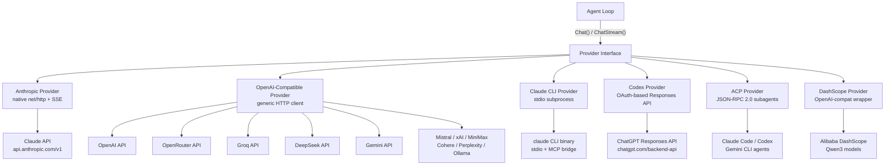
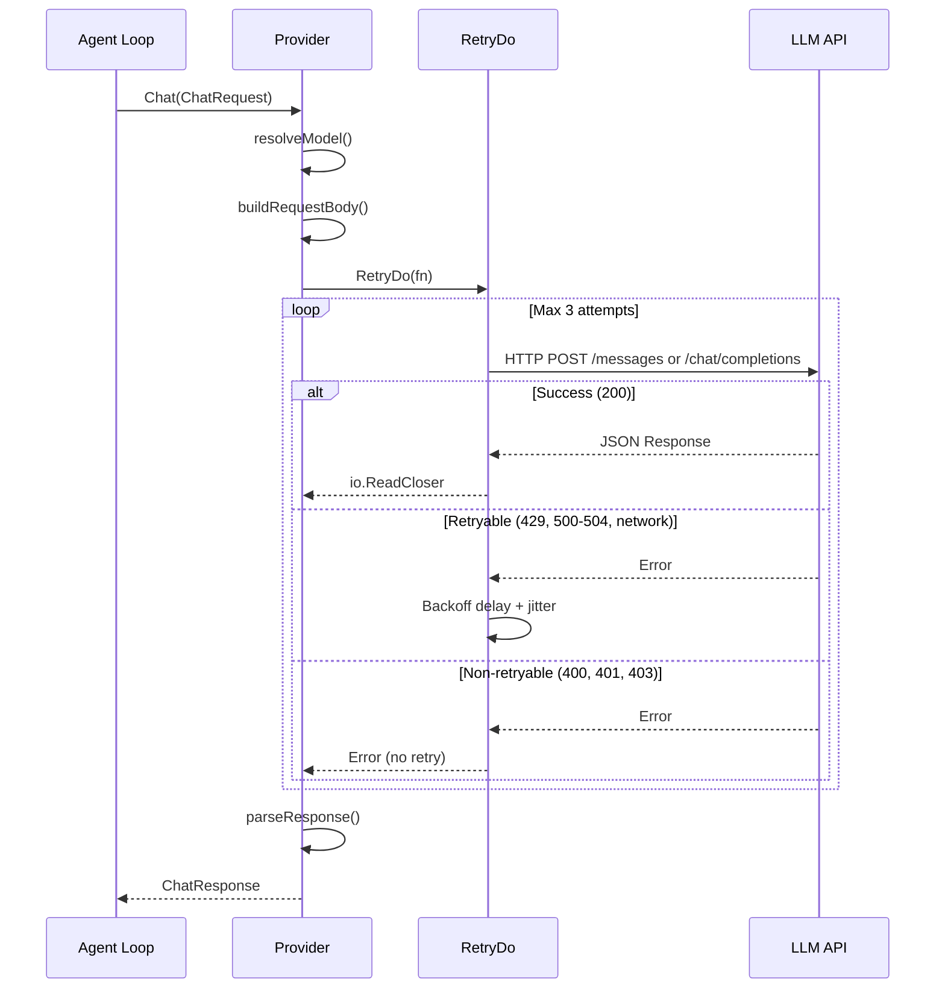
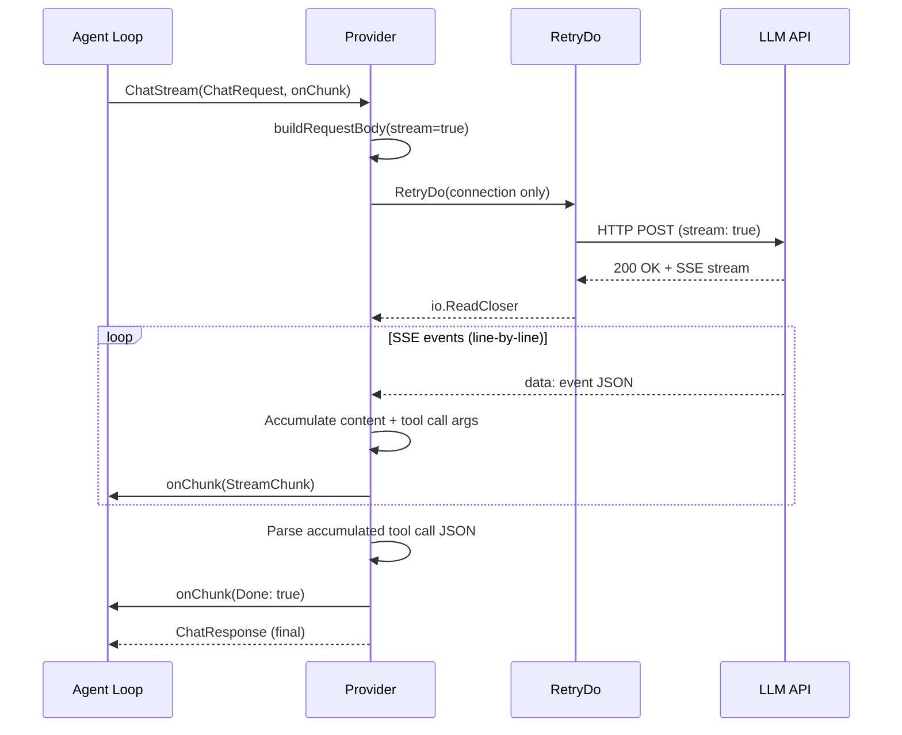
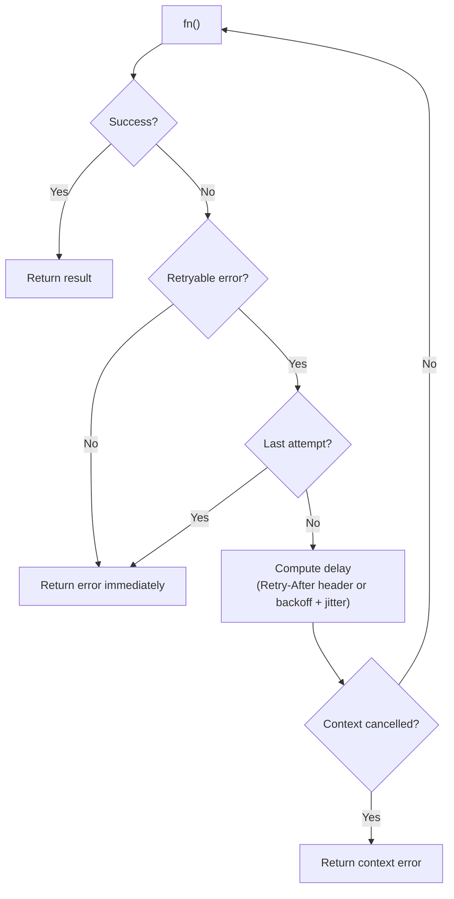
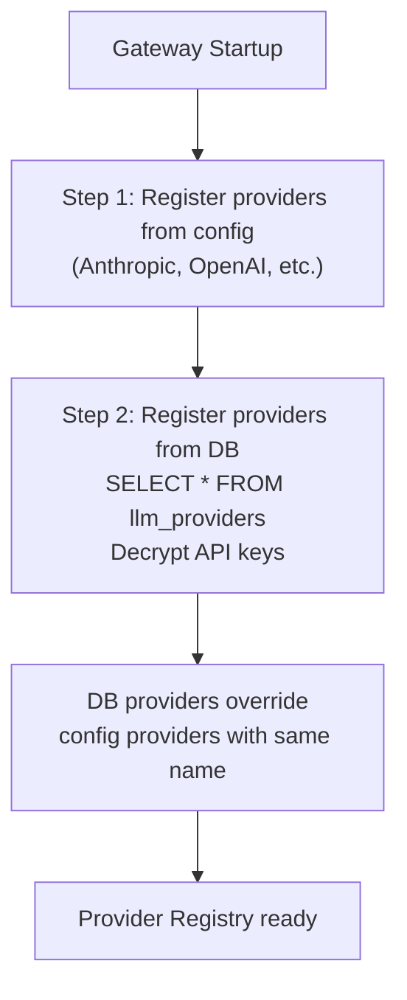
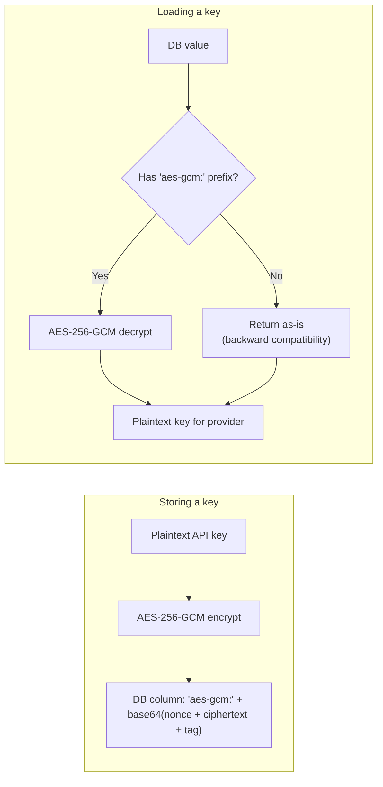
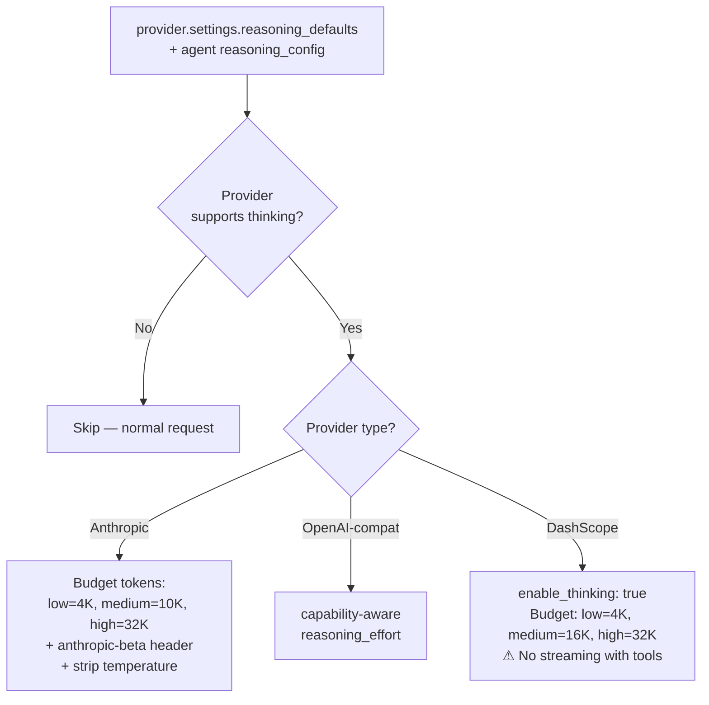
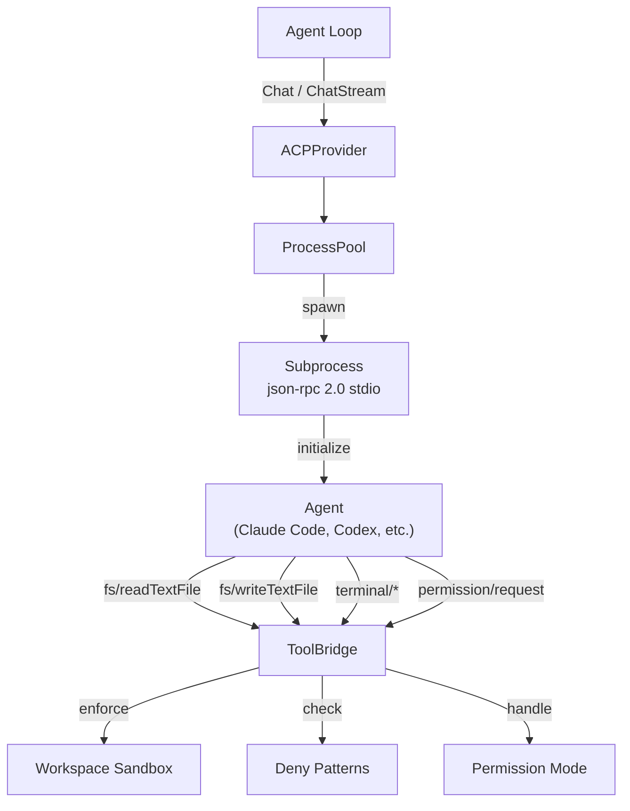
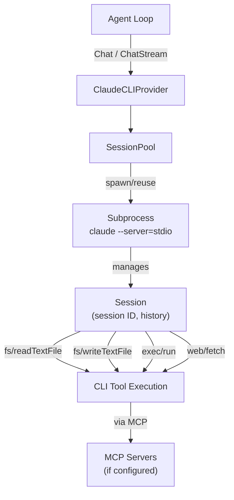

# 02 - LLM Providers

GoClaw abstracts LLM communication behind a single `Provider` interface, allowing the agent loop to work with any backend without knowing the wire format. Six concrete implementations exist: Anthropic (native HTTP+SSE), OpenAI-compatible (covering 10+ API endpoints), Claude CLI (local binary), Codex (OAuth-based), ACP (subagent orchestration), and DashScope (Alibaba Qwen with thinking). The OpenAI-compatible provider also supports BytePlus ModelArk (Seed 2.0 models with image/video generation).

---

## 1. Provider Architecture

All providers implement four methods: `Chat()`, `ChatStream()`, `Name()`, and `DefaultModel()`. The agent loop calls `Chat()` for non-streaming requests and `ChatStream()` for token-by-token streaming. Both return a unified `ChatResponse` with content, tool calls, finish reason, and token usage.



Authentication and timeouts vary by provider type:
- **Anthropic**: `x-api-key` header + `anthropic-version: 2023-06-01`
- **OpenAI-compatible**: `Authorization: Bearer` token
- **Claude CLI**: stdio subprocess (no auth; uses local CLI session)
- **Codex**: OAuth access token (auto-refreshed via TokenSource)
- **ACP**: JSON-RPC 2.0 over subprocess stdio
- **DashScope**: `Authorization: Bearer` token (inherits from OpenAI-compatible)

All HTTP-based providers (Anthropic, OpenAI-compatible, Codex) use 300-second timeout.

---

## Agent Model Fallback

Agents can define `model_fallback` as an ordered list of backup provider/model pairs. The agent's configured `provider` and `model` are always the primary route; fallback candidates are tried in UI order when the primary route returns a classifiable provider failure such as rate limit, overload, timeout, auth/billing failure, model-not-found, or unknown transport failure. Context overflow is not treated as fallback because it needs compaction, not a different model.

Fallback is runtime-only and per agent. Explicit `ProviderOverride` or `ModelOverride` requests bypass the fallback wrapper so manual runs, heartbeats, or call sites that intentionally choose a model keep exact override behavior.

Streaming fallback is conservative: backup models are tried only if the stream fails before any content, thinking, or image chunk is emitted.

---

## Usage Cap Pricing Enforcement

Standard edition can enforce AI budget caps before billable provider dispatch. API-key providers use OpenRouter `/models` pricing as the catalog source, with optional tenant/provider/model overrides in the dashboard.

Excluded provider classes:
- `chatgpt_oauth`, `claude_cli`, and `bailian` are treated as subscription/non-API pricing in round one.
- local/no-key subprocess providers such as `acp` and `ollama` are skipped unless a future feature explicitly enables pricing for them.

Runtime flow:
1. Resolve the stored provider by name and skip non-billable provider classes.
2. Load matching policies for tenant, agent, provider, provider type, and model.
3. Resolve custom pricing override first, then OpenRouter catalog pricing when a matching policy has a cost ceiling. Native provider model IDs are mapped to OpenRouter prefixes for common providers such as OpenAI, Anthropic, and Gemini.
4. Reserve estimated tokens and cost atomically before each dispatch attempt.
5. Reconcile reserved counters after the provider returns usage or after a failed call.

Token-only policies do not require catalog pricing. Model fallback routes reserve against the actual candidate provider/model before each attempt. Cached input is separated from uncached input for OpenAI-compatible usage accounting. Partial stream failures keep the estimate, or actual provider usage when available, instead of clearing billed output to zero. Internal LLM calls for memory flush, compaction, media reading tools (`read_image`, `read_document`, `read_audio`, `read_video`), and subagents use the same preflight/reconcile path.

The legacy agent-level `budget_monthly_cents` field is treated as a generated monthly agent USD cap. Existing values are backfilled during migration, and later agent budget edits update or remove the generated cap policy.

Supported price units: input, output, cache read, cache write, reasoning, request, image, and web search.

---

## 2. Supported Providers

### Six Core Provider Types

| Provider | Type | Configuration | Default Model |
|----------|------|----------|---------------|
| **anthropic** | Native HTTP + SSE | API key required | `claude-sonnet-4-5-20250929` |
| **claude_cli** | stdio subprocess + MCP | Binary path (default: `claude`) | `sonnet` |
| **codex** | OAuth Responses API | OAuth token source | `gpt-5.5` |
| **acp** | JSON-RPC 2.0 subagents | Binary + workspace dir | `claude` |
| **dashscope** | OpenAI-compat wrapper | API key + custom models | `qwen3-max` |
| **openai** (+ 10+ variants) | OpenAI-compatible | API key + endpoint URL | Model-specific |

### OpenAI-Compatible Providers

| Provider | API Base | Default Model | Notes |
|----------|----------|---------------|-------|
| openai | `https://api.openai.com/v1` | `gpt-4o` | |
| openrouter | `https://openrouter.ai/api/v1` | `anthropic/claude-sonnet-4-5-20250929` | Model must contain `/` |
| groq | `https://api.groq.com/openai/v1` | `llama-3.3-70b-versatile` | |
| deepseek | `https://api.deepseek.com/v1` | `deepseek-chat` | |
| gemini | `https://generativelanguage.googleapis.com/v1beta/openai` | `gemini-2.0-flash` | Skips empty content fields |
| mistral | `https://api.mistral.ai/v1` | `mistral-large-latest` | |
| xai | `https://api.x.ai/v1` | `grok-3-mini` | |
| minimax | `https://api.minimax.io/v1` | `MiniMax-M2.5` | Uses custom chat path |
| cohere | `https://api.cohere.ai/compatibility/v1` | `command-a` | |
| perplexity | `https://api.perplexity.ai` | `sonar-pro` | |
| ollama | `http://localhost:11434/v1` | `llama3.3` | Local/configurable |
| bailian | `https://coding-intl.dashscope.aliyuncs.com/v1` | `qwen3.5-plus` | Alibaba Coding API |
| zai | `https://api.z.ai/api/paas/v4` | `glm-5` | |
| zai-coding | `https://api.z.ai/api/coding/paas/v4` | `glm-5` | |
| byteplus | `https://ark.ap-southeast.bytepluses.com/api/v3` | `seed-2-0-lite-260228` | Seed 2.0 models |
| byteplus_coding | `https://ark.ap-southeast.bytepluses.com/api/coding/v3` | `seed-2-0-lite-260228` | Seed 2.0 Coding Plan |

---

## 3. Call Flow

### Non-Streaming (Chat)



### Streaming (ChatStream)



Key difference: non-streaming wraps the entire request in `RetryDo`. Streaming retries only the connection phase -- once SSE events start flowing, no retry occurs mid-stream.

---

## 4. Anthropic vs OpenAI-Compatible

| Aspect | Anthropic | OpenAI-Compatible |
|--------|-----------|-------------------|
| Base URL override | `WithAnthropicBaseURL()` option | Via config `api_base` field |
| Implementation | Native `net/http` | Generic HTTP client |
| System messages | Separate `system` field (array of text blocks) | Inline in `messages` array with `role: "system"` |
| Tool definitions | `name` + `description` + `input_schema` | Standard OpenAI function schema |
| Tool results | `role: "user"` with `tool_result` content block + `tool_use_id` | `role: "tool"` with `tool_call_id` |
| Tool call arguments | `map[string]interface{}` (parsed JSON object) | JSON string in `function.arguments` (manual marshal) |
| Tool call streaming | `input_json_delta` events | `delta.tool_calls[].function.arguments` fragments |
| Stop reason mapping | `tool_use` mapped to `tool_calls`, `max_tokens` mapped to `length` | Direct passthrough of `finish_reason` |
| Gemini compatibility | N/A | Skip empty `content` field in assistant messages with tool_calls |
| OpenRouter compatibility | N/A | Model must contain `/` (e.g., `anthropic/claude-...`); unprefixed falls back to default |

---

## 5. Retry Logic

### RetryDo[T] Generic Function

`RetryDo` is a generic function that wraps any provider call with exponential backoff, jitter, and context cancellation support.

### Configuration

| Parameter | Default | Description |
|-----------|---------|-------------|
| Attempts | 3 | Total tries (1 = no retry) |
| MinDelay | 300ms | Initial delay before first retry |
| MaxDelay | 30s | Upper cap on delay |
| Jitter | 0.1 (10%) | Random variation applied to each delay |

### Backoff Formula

```
delay = MinDelay * 2^(attempt - 1)
delay = min(delay, MaxDelay)
delay = delay +/- (delay * jitter * random)

Example:
  Attempt 1: 300ms (+/-30ms)  -> 270ms..330ms
  Attempt 2: 600ms (+/-60ms)  -> 540ms..660ms
  Attempt 3: 1200ms (+/-120ms) -> 1080ms..1320ms
```

If the response includes a `Retry-After` header (HTTP 429 or 503), the header value completely replaces the computed backoff. The header is parsed as integer seconds or RFC 1123 date format.

### Retryable vs Non-Retryable Errors

| Category | Conditions |
|----------|------------|
| Retryable | HTTP 429, 500, 502, 503, 504; network errors (`net.Error`); connection reset; broken pipe; EOF; timeout |
| Non-retryable | HTTP 400, 401, 403, 404; all other status codes |

### Retry Flow



---

## 6. Schema Cleaning

Some providers reject tool schemas containing unsupported JSON Schema fields. `CleanSchemaForProvider()` recursively removes these fields from the entire schema tree, including nested `properties`, `anyOf`, `oneOf`, and `allOf`.

| Provider | Fields Removed |
|----------|---------------|
| Gemini | `$ref`, `$defs`, `additionalProperties`, `examples`, `default` |
| Anthropic | `$ref`, `$defs` |
| All others | No cleaning applied |

The Anthropic provider calls `CleanSchemaForProvider("anthropic", ...)` when converting tool definitions to the `input_schema` format. The OpenAI-compatible provider calls `CleanToolSchemas()` which applies the same logic per provider name.

---

## 7. Providers from Database

Providers are loaded from the `llm_providers` table in addition to the config file. Database providers override config providers with the same name.

### Loading Flow



### API Key Encryption



`GOCLAW_ENCRYPTION_KEY` accepts three formats:
- **Hex**: 64 characters (32 bytes decoded)
- **Base64**: 44 characters (32 bytes decoded)
- **Raw**: 32 characters (32 bytes direct)

---

## 8. Extended Thinking

Extended thinking allows LLMs to generate internal reasoning tokens before producing a response, improving quality for complex tasks. GoClaw supports this across multiple providers with provider-owned reasoning defaults, agent inherit/custom overrides, and a legacy `thinking_level` shim for rollback compatibility. See [12-extended-thinking.md](./12-extended-thinking.md) for full details.

### Provider Mapping



### Streaming

- **Anthropic**: `thinking_delta` events accumulate into `StreamChunk.Thinking`
- **OpenAI-compat**: `reasoning_content` in response delta, with GPT-5/Codex effort normalization when the model is known
- **DashScope**: Falls back to non-streaming when tools are present, synthesizes chunk callbacks

### Tool Loop Handling

Anthropic requires thinking blocks (including cryptographic signatures) to be echoed back in subsequent tool-use turns. `RawAssistantContent` preserves these raw blocks for API passback. Other providers handle reasoning content as independent per-turn metadata.

---

## 9. DashScope and Bailian Providers

Two providers for the Alibaba Cloud AI ecosystem.

### DashScope (Alibaba Qwen)

Wraps the OpenAI-compatible provider with a critical override: when tools are present, streaming is disabled. The provider falls back to a single `Chat()` call and synthesizes chunk callbacks to maintain the event flow.

- **Default model**: `qwen3-max`
- **Thinking support**: Custom budget mapping (low=4,096, medium=16,384, high=32,768)
- **Known limitation**: No simultaneous streaming + tools

### Bailian Coding

Standard OpenAI-compatible provider targeting the Alibaba Coding API.

- **Default model**: `qwen3.5-plus`
- **Base URL**: `https://coding-intl.dashscope.aliyuncs.com/v1`
- **Catalog source**: hardcoded because the Coding API does not expose a standard `/v1/models` endpoint

| Model | Display name | Capabilities |
|-------|--------------|--------------|
| `qwen3.7-plus` | Qwen 3.7 Plus | Text Generation, Deep Thinking, Visual Understanding |

---

## 10. ACP Provider (Agent Client Protocol)

The ACP provider enables GoClaw to orchestrate external coding agents (Claude Code, Codex CLI, Gemini CLI, or any ACP-compatible agent) as subprocesses via JSON-RPC 2.0 over stdio. This allows delegating complex code generation tasks to specialized agents while maintaining GoClaw's unified interface.

### Architecture Overview



### Configuration

ACPConfig struct fields:

```go
type ACPConfig struct {
	Binary   string   // agent binary name or path (e.g. "claude", "codex")
	Args     []string // extra spawn args
	Model    string   // default model/agent name (e.g. "claude")
	WorkDir  string   // base workspace dir
	IdleTTL  string   // process idle TTL (e.g. "5m")
	PermMode string   // "approve-all" (default), "approve-reads", "deny-all"
}
```

Example config.json:

```json5
{
  "providers": {
    "acp": {
      "binary": "claude",
      "args": ["--profile", "goclaw"],
      "model": "claude",
      "work_dir": "/tmp/workspace",
      "idle_ttl": "5m",
      "perm_mode": "approve-all"
    }
  }
}
```

Database-based provider registration:

- `provider_type = "acp"`
- `api_base = "claude"` (binary name)
- `settings = { "args": [...], "idle_ttl": "5m", "perm_mode": "approve-all", "work_dir": "..." }`

### Session Management

#### ProcessPool

Manages subprocess lifecycle with idle TTL reaping and crash recovery:

1. **GetOrSpawn** — Retrieve existing session or spawn new subprocess
2. **Idle TTL** — Reap idle processes after configured duration (default 5m)
3. **Crash Recovery** — Restart failed subprocesses transparently

#### ToolBridge

Handles agent → client requests for filesystem and terminal operations:

- **fs/readTextFile** — Read file within workspace sandbox
- **fs/writeTextFile** — Write file within workspace sandbox
- **terminal/createTerminal** — Spawn terminal subprocess
- **terminal/terminalOutput** — Fetch terminal output + exit status
- **terminal/waitForTerminalExit** — Block until terminal exit
- **terminal/releaseTerminal** — Clean up terminal resources
- **terminal/killTerminal** — Force-terminate terminal
- **permission/request** — Request user approval (approve-all, approve-reads, deny-all)

### Content Handling

ACP messages use `ContentBlock` with three types:

```go
type ContentBlock struct {
	Type     string // "text", "image", "audio"
	Text     string // text content
	Data     string // base64 for image/audio
	MimeType string // e.g., "image/png", "audio/wav"
}
```

Request extraction:

1. Extract system prompt + user message from GoClaw `ChatRequest.Messages`
2. Prepend system prompt to first user message (ACP agents lack separate system API)
3. Attach images as separate blocks

Response collection:

1. Accumulate `SessionUpdate` notifications during prompt execution
2. Collect text blocks into response content
3. Return finish reason mapped from `stopReason` ("maxContextLength" → "length", others → "stop")

### Security & Sandboxing

#### Workspace Isolation

All file operations are scoped to `WorkDir`. Attempts to escape (e.g., `../../../etc/passwd`) are rejected.

#### Deny Patterns

Regex patterns (from config or tools policy) prevent access to sensitive paths:

```
[
  "^/etc/",
  "^\\.env",
  "^secret",
  "^[Cc]redentials"
]
```

Each agent request is validated against deny patterns before execution.

#### Permission Modes

| Mode | Behavior |
|------|----------|
| `approve-all` | All requests approved (default) |
| `approve-reads` | Read-only; filesystem writes denied |
| `deny-all` | All requests denied |

### Session Sequencing

Per-session requests are serialized via `sessionMu` mutex to prevent concurrent tool access that could corrupt file state:

```go
unlock := p.lockSession(sessionKey)
defer unlock()
// ... execute Chat or ChatStream with guaranteed serial access
```

### Streaming vs Non-Streaming

#### Chat (Non-Streaming)

Returns complete response after agent execution finishes. Collects all text blocks and returns single `ChatResponse`.

#### ChatStream

Emits `StreamChunk` for each text delta via callback. Supports context cancellation by sending `session/cancel` notification. Returns combined response when complete.

---

## 11. Claude CLI Provider

The Claude CLI provider enables GoClaw to delegate requests to a local `claude` CLI binary. The CLI manages session history, context files, and tool execution independently; GoClaw only passes messages and streams responses back.

### Architecture Overview



### Configuration

ClaudeCLIProvider can be configured in `config.json`:

```json5
{
  "providers": {
    "claude_cli": {
      "cli_path": "claude",           // binary path or name
      "default_model": "sonnet",      // opus, sonnet, haiku
      "base_work_dir": "/tmp/agents", // workspace directory
      "perm_mode": "bypassPermissions", // permission mode
      "disable_hooks": false,         // disable security hooks if true
      "deny_patterns": ["^/etc/", "^\\.env"]
    }
  }
}
```

Or via database `llm_providers` table with `provider_type = "claude_cli"`. For database providers, `api_base` is the CLI executable selector (`"claude"` or an absolute binary path), not an HTTP base URL, so provider URL SSRF opt-ins do not apply to Claude CLI.

### Session Management

Each conversation gets a persistent session tied to `session_key` option. Sessions survive across multiple requests and maintain:
- Conversation history
- Workspace directory (for file operations)
- MCP server connections
- Tool execution state

Idle sessions are automatically cleaned up after inactivity.

### Tool Execution

Claude CLI executes tools natively (filesystem, exec, web, memory). GoClaw forwards tool results back and lets the CLI loop continue. This differs from standard providers which return tool calls for the agent loop to execute.

### Model Aliases

Like the Anthropic provider, Claude CLI supports short aliases:
- `opus` → `claude-opus-4-6`
- `sonnet` → `claude-sonnet-4-6`
- `haiku` → `claude-haiku-4-5-20251001`

### MCP Configuration

Per-session MCP servers are configured via `MCPConfigData`. The CLI automatically loads and communicates with configured MCP servers for extended functionality.

### Streaming

- **Chat**: Returns complete response after CLI execution
- **ChatStream**: Streams text chunks as they are produced by the CLI

### Thinking Support

Claude CLI inherits thinking support from the underlying Claude model. Thinking blocks are passed through in streaming chunks if the model supports them.

---

## 12. Codex Provider

The Codex provider integrates with OpenAI's ChatGPT Responses API (OAuth-based), defaulting to `gpt-5.5` through the chatgpt.com backend. Unlike standard OpenAI endpoints, Codex uses OAuth token refresh and a custom response format with "phase" markers.

### Configuration

Codex requires an OAuth token source (handles auto-refresh):

```go
tokenSource := &MyTokenSource{} // implements TokenSource interface
provider := NewCodexProvider("codex", tokenSource, "", "")
// or specify custom API base and model:
provider := NewCodexProvider("codex", tokenSource,
  "https://chatgpt.com/backend-api", "gpt-5.5")
```

### API Endpoint

```
POST https://chatgpt.com/backend-api/codex/responses
Authorization: Bearer {oauth_token}
```

The provider automatically handles token refresh via the TokenSource.

### Response Format

Codex returns structured responses with phase markers:

```json
{
  "id": "...",
  "model": "gpt-5.5",
  "choices": [{
    "message": {
      "role": "assistant",
      "content": "...",
      "metadata": {
        "phase": "commentary"  // or "final_answer"
      }
    },
    "finish_reason": "stop"
  }],
  "usage": { ... }
}
```

### Phase Field

The `phase` field indicates message purpose:
- `"commentary"` — intermediate reasoning
- `"final_answer"` — closeout response

GoClaw persists this on assistant messages and passes it back in subsequent requests. Codex performance depends on this field being echoed correctly.

### Streaming

Codex supports SSE streaming similar to Anthropic:
- Each SSE event contains a partial response
- Phase marker included in final delta
- Tool calls streamed via `input_json_delta` equivalent

### Extended Thinking

Codex provider reports `SupportsThinking() = true`, allowing capability-aware reasoning effort injection. Providers can save reusable `settings.reasoning_defaults`, agents inherit them by default, and custom agent overrides remain additive. For known GPT-5/Codex models, GoClaw resolves requested versus effective effort before the request and records the source and outcome in trace metadata.

### Token Usage

Tracks prompt, completion, and total tokens. `CacheCreationTokens` and `CacheReadTokens` are supported for prompt caching if available.

### Provider-Level Defaults + Agent Overrides

Multiple authenticated `chatgpt_oauth` providers can coexist in one tenant. Each provider name is one OpenAI Codex OAuth alias. Pool membership is authoritative at the provider layer: one alias owns the reusable pool, while member aliases stay leaf accounts.

Provider default example:

```json
{
  "name": "openai-codex",
  "provider_type": "chatgpt_oauth",
  "settings": {
    "codex_pool": {
      "strategy": "round_robin",
      "extra_provider_names": ["codex-work"]
    }
  }
}
```

Provider reasoning default example:

```json
{
  "name": "openai-codex",
  "provider_type": "chatgpt_oauth",
  "settings": {
    "reasoning_defaults": {
      "effort": "high",
      "fallback": "provider_default"
    }
  }
}
```

Agent override example:

```json
{
  "provider": "openai-codex",
  "reasoning_config": {
    "override_mode": "custom",
    "effort": "xhigh",
    "fallback": "downgrade"
  }
}
```

Routing behavior:
- The main `provider` field remains the preferred/default account.
- Provider aliases are arbitrary. `openai-codex` and `codex-work` are examples, not required prefixes.
- `settings.codex_pool.extra_provider_names` is the authoritative membership list for that pool owner.
- A provider listed in another pool cannot also manage its own pool.
- `override_mode: "inherit"` uses the primary provider's `settings.codex_pool`.
- `override_mode: "custom"` is limited to routing behavior for that provider-owned pool.
- `round_robin` rotates requests across the preferred account plus the provider-owned extra authenticated OpenAI Codex OAuth accounts.
- `priority_order` tries the preferred account first, then drains the provider-owned extra accounts in order.
- Legacy `primary_first` configs are read back as `priority_order`. Existing agent overrides that explicitly saved an empty `extra_provider_names` list still remain single-account-only after migration.
- Retryable upstream failures can fall through to the next eligible OpenAI Codex OAuth account in the same request.
- Explicit provider names remain explicit. OAuth auth/logout is still provider-scoped.
- Runtime observability for one agent is available at `GET /v1/agents/{id}/codex-pool-activity`, which exposes recent routed traces plus per-alias health derived from those traces.

Reasoning behavior:
- `settings.reasoning_defaults` is provider-owned and reusable across agents.
- `reasoning_config.override_mode: "inherit"` follows the provider default.
- `reasoning_config.override_mode: "custom"` stores an agent-local reasoning policy.
- Existing legacy `other_config.reasoning` payloads without `override_mode` still behave as custom overrides.
- If no provider default is saved, inherit resolves to reasoning `off`.
- Trace metadata surfaces the reasoning `source` so provider-default behavior is no longer implicit.

---

## 13. Wave 2: Provider Resilience (v3)

GoClaw v3 Wave 2 adds composable request middleware, error classification, per-model cooldown, and 2-tier failover for production resilience.

**Request Middleware** — Transforms provider requests in composable pipeline. Built-in: `CacheMiddleware` (prompt caching), `ServiceTierMiddleware` (routing hints), `RateLimitMiddleware` (quota management). Zero-alloc fast path: `ComposeMiddlewares` returns nil if all inputs nil.

**Error Classification** — Maps provider errors to 9 canonical reasons: `FailoverAuth`, `FailoverAuthPermanent`, `FailoverRateLimit`, `FailoverOverloaded`, `FailoverBilling`, `FailoverFormat`, `FailoverModelNotFound`, `FailoverTimeout`, `FailoverUnknown`. `DefaultClassifier` pattern-matches body strings (OpenAI, Anthropic pre-registered). Detects context overflow (triggers auto-compaction).

**Cooldown Tracking** — `CooldownTracker` in-memory state machine. Per-reason durations: 30s (rate limit), 60s→120s escalated (overloaded), 10m (auth), 1h (permanent auth/model not found), 15s (timeout), 5m (billing). Auto-decay 24h TTL; probe interval ≥30s.

**2-Tier Failover** — `RunWithFailover[T]`: Tier 1 rotates API profiles for transient errors (≤5 rotations); Tier 2 falls back to next model for permanent errors. Returns all attempts with classifications. Exhausted → `FailoverSummaryError`.

**Model Registry** — Thread-safe forward-compat resolver. Seeds Claude, GPT, Qwen models. Each spec: context window, max tokens, reasoning/vision flags, per-1M cost. Unknown models → provider's `ForwardCompatResolver` (caches hit). Template cloning with patch overrides.

**Embedding Providers** — OpenAI (text-embedding-3-small, 1536 dims, batch 2048) and Voyage AI (1024 dims, batch 1024) via `store.EmbeddingProvider`. Used by vault and episodic memory. All vectors normalized to 1536 for pgvector column.

---

## 14. File Reference

| Module | Path | Purpose |
|---|---|---|
| Provider implementations | `internal/providers/` | Anthropic, OpenAI-compatible, Claude CLI, Codex, ACP, DashScope providers; retry logic; schema cleaning; model registry; embedding providers |
| Resilience middleware | `internal/providers/` | `middleware*.go`, `error_classify.go`, `cooldown.go`, `failover.go` — request middleware, error classification, 2-tier failover |
| Provider interface & types | `internal/providers/types.go` | `Provider` interface, `ChatRequest`, `ChatResponse`, `Message`, `ToolCall`, `Usage` |
| Gateway wiring | `cmd/gateway_providers.go` | Provider registration from config and database at startup |

Use `grep` or your editor's symbol search for specific files.

---

## Cross-References

| Document | Relevant Content |
|----------|-----------------|
| [12-extended-thinking.md](./12-extended-thinking.md) | Full extended thinking documentation |
| [01-agent-loop.md](./01-agent-loop.md) | LLM iteration loop, streaming chunk handling |
