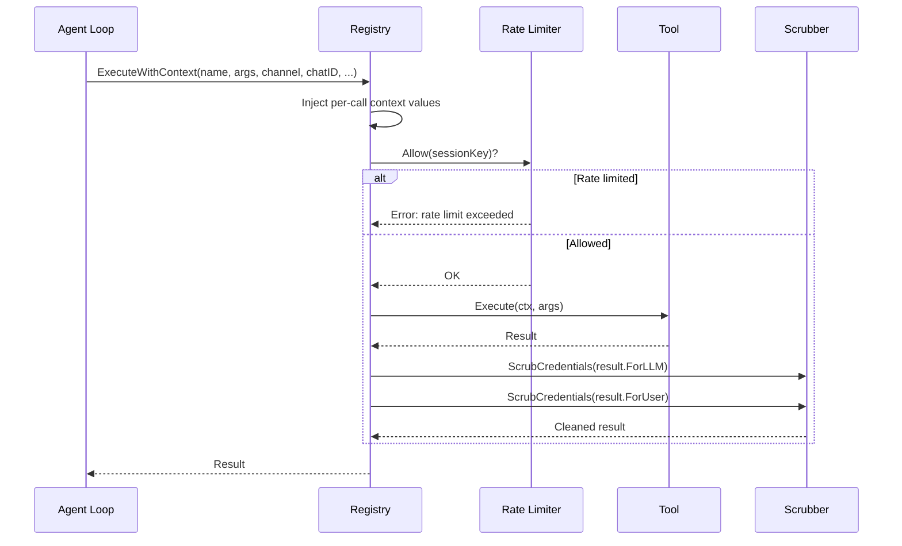
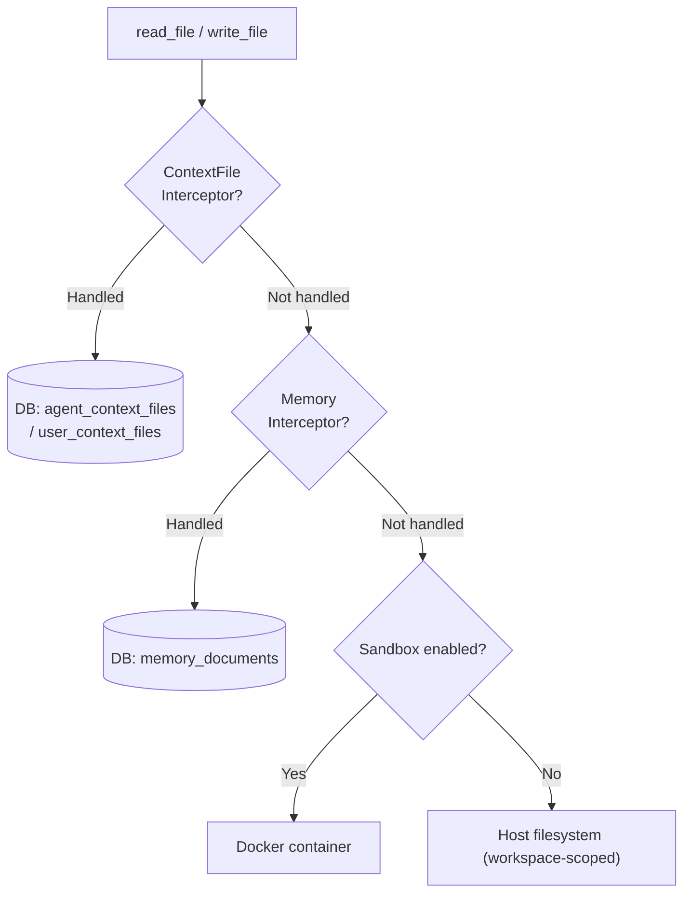
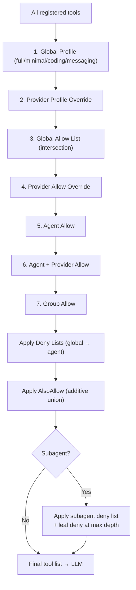
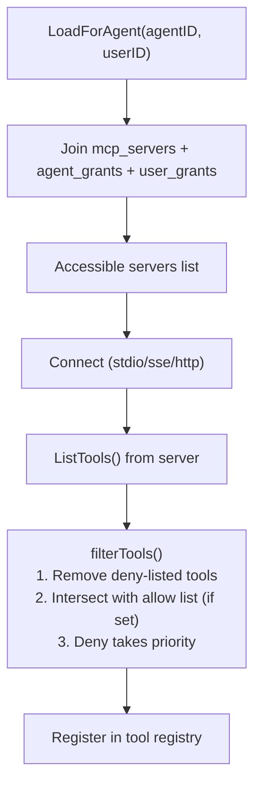
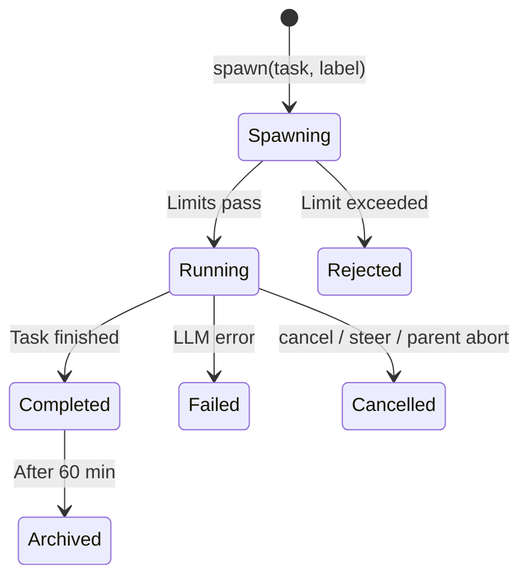

# 03 - Tools System

The tools system bridges the agent loop and the external environment. When the LLM emits a tool call, the registry handles rate limiting, credential scrubbing, policy enforcement, and virtual filesystem routing before returning results for the next LLM iteration.

---

## 1. Overview

Tools are the agent's hands. The registry owns all tool instances and mediates every invocation — injecting request context, enforcing rate limits, running deny-pattern checks, and scrubbing credentials from output. Agents never call tools directly; everything routes through `Registry.ExecuteWithContext`.

Key concerns the tool system manages:
- **Discovery** — which tools exist and which a given agent may use (policy engine)
- **Invocation** — per-call context injection, rate limiting, execution, result scrubbing
- **Isolation** — workspace path containment, path traversal prevention, Docker sandbox routing
- **Customization** — per-tenant config overlay, custom shell-based tools at runtime

---

## 2. Registry & Lifecycle



Per-call context values injected before execution: channel identity, chat ID, peer kind, sandbox key. Tool instances are shared safely across goroutines because mutable state lives in context, not structs.

**Custom tools** (shell-based, stored in DB) use a two-phase registry:
- Global tools (no agent scope) are loaded at startup into a shared registry.
- Per-agent tools are merged on first access; the registry is cloned, never mutated globally.
- Cache invalidation via pub/sub causes a reload + router invalidation on next agent turn.

---

## 3. Tool Capabilities

Each tool carries structured metadata describing side-effect class, group membership, and workspace requirements.

| Capability | Meaning | Examples |
|---|---|---|
| `read-only` | No side effects; safe to retry | `read_file`, `web_search`, `memory_search` |
| `mutating` | Modifies state or external systems | `write_file`, `exec`, `cron`, `team_tasks` |
| `async` | Returns immediately; result delivered later | `spawn` |
| `mcp-bridged` | Proxied to an external MCP server | MCP tools registered dynamically |

Capabilities are inferred from tool name when no explicit metadata is registered. The policy engine can use capability class to gate entire sets (e.g. restrict an agent to read-only tools).

The agent loop also uses this metadata for parallel tool-call scheduling. Only registered read-only tools are eligible for bounded parallel raw I/O. Mutating, async, MCP-bridged, `exec`/`bash`, `wait`, and unknown tools stay sequential by default. `PreToolUse` hooks run before any parallel I/O so hooks can block or rewrite arguments consistently.

---

## 4. Built-in Tool Inventory

### Filesystem (`group:fs`)

| Tool | Description |
|---|---|
| `read_file` | Read file contents with optional line range |
| `write_file` | Write or create a file |
| `edit` | Apply targeted edits to a file (old/new string replace) |
| `list_files` | List directory contents |

### Runtime (`group:runtime`)

| Tool | Description |
|---|---|
| `exec` | Execute a shell command; supports credentialed CLI mode for secure credential injection |

**Credentialed CLI mode** — when the invoked binary is registered in `secure_cli_binaries`, the exec tool injects encrypted env vars directly into the child process (no shell involved) and verifies the agent has an explicit grant. Shell-wrapper unwrapping (up to depth 3) prevents bypass via `sh -c`. Fail-closed on DB error.

### Web (`group:web`)

| Tool | Description |
|---|---|
| `web_search` | Search the web (Exa, Tavily, Brave, DuckDuckGo provider chain) |
| `web_fetch` | Fetch and parse a URL (HTML → Markdown); domain allow/block policy |

### Memory (`group:memory`)

| Tool | Description |
|---|---|
| `memory_search` | Search memory documents (BM25 + vector hybrid) — returns L1 abstracts |
| `memory_get` | Retrieve a specific memory document by ID |
| `memory_expand` | Load full episodic memory content (L2 deep retrieval) |

Memory layers: L1 (`memory_search`) returns ranked abstracts; L2 (`memory_expand`) loads the full summary for a given episodic ID.

### Sessions (`group:sessions`)

| Tool | Description |
|---|---|
| `sessions_list` | List active sessions |
| `sessions_history` | View session message history |
| `sessions_send` | Send a message to a session |
| `session_status` | Get current session status |
| `spawn` | Spawn a subagent or delegate to another session |

### Knowledge & Vault (`group:knowledge` / `group:goclaw`)

| Tool | Description |
|---|---|
| `vault_search` | Unified hybrid search across vault docs, memory, and knowledge graph |
| `vault_read` | Read full content of a vault document by doc_id |
| `knowledge_graph_search` | Search knowledge graph entities and relationships |
| `skill_search` | Search available skills (BM25) |

### Automation (`group:automation`)

| Tool | Description |
|---|---|
| `cron` | Manage scheduled tasks (create, list, delete) |
| `datetime` | Get current date/time with timezone support |
| `heartbeat` | Configure agent periodic proactive check-ins |

### Messaging (`group:messaging`)

| Tool | Description |
|---|---|
| `message` | Send a message to a channel |
| `send_file` | Send an existing workspace file as a chat attachment (with optional caption); marks `DeliveredMedia` to prevent duplicate delivery |
| `create_forum_topic` | Create a Telegram forum topic |
| `list_group_members` | List members in a group chat (Feishu/Lark) |

### Delegation

| Tool | Description |
|---|---|
| `delegate` | Inter-agent task delegation via agent_links (async/sync modes with timeout) |

### Teams (`group:team`)

| Tool | Description |
|---|---|
| `team_tasks` | Task board: create, list, get, claim, complete, cancel, assign, review, approve, reject, comment, progress, attach, ask_user, search, update |

### Media Generation

| Tool | Description |
|---|---|
| `create_image` | Generate images from text (OpenAI, Gemini, MiniMax, DashScope, BytePlus) |
| `create_audio` | Generate audio/music/sound effects (MiniMax, ElevenLabs) |
| `create_video` | Generate video from text/image (MiniMax, Gemini, BytePlus) |
| `tts` | Text-to-speech synthesis (OpenAI, ElevenLabs, Edge, MiniMax) |

### Media Reading

| Tool | Description |
|---|---|
| `read_image` | Analyze/describe images using vision AI (Gemini, Anthropic, OpenRouter, DashScope) |
| `read_audio` | Transcribe audio to text using Gemini File API, native OpenAI audio input, or OpenAI-compatible transcription models; unsupported provider/model routes fail closed instead of sending audio as image data |
| `read_document` | Extract and analyze documents (PDF, DOCX, images). Supports local-first extraction via pdftotext/pandoc before falling back to cloud vision (opt-in via config) |
| `read_video` | Analyze/transcribe video content |

### Skills & Content

| Tool | Description |
|---|---|
| `use_skill` | Activate a skill (marker tool for observability) |
| `publish_skill` | Register a skill directory in the database |
| `skill_manage` | Manage skill lifecycle (admin operations) |

---

## 5. Tool Contracts (JSON Schemas)

User-facing parameter schemas for the most commonly configured tools.

### `web_search` tenant config shape
```json
{
  "provider_order": ["brave", "exa"],
  "brave": { "enabled": true, "max_results": 5 },
  "exa": { "enabled": false },
  "duckduckgo": { "enabled": false }
}
```
- `provider_order`: provider preference list; unknown names silently ignored.
- Per-provider: `enabled` (bool) + `max_results` (int). DuckDuckGo `enabled: false` is ignored — it is always the final fallback.
- API keys go in `config_secrets`, never in settings JSON.

### `web_fetch` tenant config shape
```json
{
  "policy": "allow_all",
  "allowed_domains": ["github.com", "*.example.com"],
  "blocked_domains": ["malicious.com"]
}
```

### `tts` tenant config shape
```json
{
  "primary": "elevenlabs",
  "default_voice_id": "pMsXgVXv3BLzUgSXRplE",
  "default_model": "eleven_flash_v2_5"
}
```
- `primary`: provider (`elevenlabs`, `openai`, `edge`, `minimax`).
- Per-agent overrides: `agent.other_config.tts_voice_id`, `agent.other_config.tts_model_id`.

### `document_parser` config shape
```json
{
  "local_first": false,
  "max_pages": 200,
  "timeout_sec": 30,
  "min_text_len": 16
}
```
Controls local-first document text extraction in the `read_document` tool.
- `local_first`: Enable local extraction via `pdftotext` (PDF) and `pandoc` (DOCX) before cloud vision fallback (default `false` — opt-in). Requires binaries on PATH; present in `full` Docker variant or builds with `ENABLE_FULL_SKILLS=true`.
- `max_pages`: Page limit for PDF extraction (default 200). Passed to `pdftotext -l`.
- `timeout_sec`: Per-extraction timeout in seconds (default 30). Process group killed on timeout.
- `min_text_len`: Minimum characters (after trim) to consider extraction successful; shorter output triggers cloud fallback (default 16).

**Note:** Config values are captured at tool construction (startup) and not picked up by hot-reload. Binary availability is re-checked per call, so runtime binary installations are detected without restart. Any extraction miss (disabled, unsupported mime, missing binary, timeout, empty output) transparently falls back to the cloud vision chain with no caller-visible difference.

### Custom tool definition
```json
{
  "name": "dns_lookup",
  "description": "Look up DNS records for a domain",
  "parameters": {
    "type": "object",
    "properties": {
      "domain": { "type": "string", "description": "Domain name" },
      "record_type": { "type": "string", "enum": ["A", "AAAA", "MX", "CNAME", "TXT"] }
    },
    "required": ["domain"]
  },
  "command": "dig +short {{.record_type}} {{.domain}}",
  "timeout_seconds": 10,
  "enabled": true
}
```

### Credentialed binary config (`secure_cli_binaries` table)
```json
{
  "binary_name": "gh",
  "encrypted_env": {"GH_TOKEN": "ghp_..."},
  "deny_args": ["auth\\s+", "ssh-key"],
  "timeout_seconds": 30,
  "tips": "GitHub CLI. Available: gh api, gh repo, gh issue, etc."
}
```
Available presets: `gh`, `gcloud`, `aws`, `kubectl`, `terraform`.

### Credentialed CLI keyword allowlist

`config.tools.commandKeywordAllowlist` lets operators allow specific product or security vocabulary inside selected credentialed CLI content arguments without disabling `deny_args`.

Example:

```json
{
  "tools": {
    "commandKeywordAllowlist": [
      {
        "id": "github-content",
        "command": "gh",
        "subcommands": ["issue create", "issue edit", "pr create", "pr comment"],
        "args": ["--body", "--title"],
        "argPositions": [],
        "keywords": ["secret", "secrets", "token", "credential"],
        "reason": "Allow security vocabulary in GitHub issue and PR prose"
      }
    ]
  }
}
```

The rule above allows `gh issue create --body "secret rotation notes"` but still blocks command paths like `gh secret set TOKEN`. `argPositions` are 0-based after the matched subcommand. The scanner evaluates command arguments only; it does not read the contents of files passed through arguments such as `--body-file`.

---

## 6. Interception Layer

### Virtual Filesystem Routing

Filesystem calls are intercepted before hitting host disk. Two interceptors route specific paths to the database.



**ContextFileInterceptor** — routes 6 known bootstrap files (`SOUL.md`, `IDENTITY.md`, `AGENTS.md`, `TOOLS.md`, `USER.md`, `BOOTSTRAP.md`) to the DB instead of disk. Routing depends on agent type:
- **Open agents**: all files are per-user; agent-level file is the fallback template.
- **Predefined agents**: only `USER.md` is per-user; all others come from agent-level store.

**MemoryInterceptor** — routes `MEMORY.md`, `memory.md`, and `memory/*` paths to `memory_documents`. Writing a `.md` file automatically triggers chunking + embedding.

### Path Security

`resolvePath()` joins relative paths with the workspace root, applies `filepath.Clean()`, and verifies the result starts with the workspace prefix — preventing path traversal attacks.

### Workspace Context

Filesystem and shell tools read their workspace from context (injected by the agent loop per user and agent). This enables per-user workspace isolation without tool code changes.

### Policy Engine

The policy engine determines which tools reach the LLM through a layered allow pipeline:



**Profiles:**

| Profile | Tool Set |
|---|---|
| `full` | All registered tools |
| `coding` | `group:fs`, `group:runtime`, `group:sessions`, `group:memory`, `group:web`, `read_image`, `create_image`, `skill_search` |
| `messaging` | `group:messaging`, `group:web`, sessions read, `read_image`, `skill_search` |
| `minimal` | `session_status` only |

**Tool Groups** (reference `group:<name>` in allow/deny lists):

| Group | Members |
|---|---|
| `fs` | `read_file`, `write_file`, `list_files`, `edit`, `send_file` |
| `runtime` | `exec` |
| `web` | `web_search`, `web_fetch` |
| `memory` | `memory_search`, `memory_get` |
| `sessions` | `sessions_list`, `sessions_history`, `sessions_send`, `spawn`, `session_status` |
| `automation` | `cron` |
| `messaging` | `message`, `create_forum_topic`, `list_group_members` |
| `team` | `team_tasks` |
| `goclaw` | All native built-in tools (composite) |

MCP groups (`mcp`, `mcp:{serverName}`) are registered dynamically at connection time.

**Per-request allow list** — channels can inject a final intersection step via message metadata (e.g. Telegram forum topics restrict tools per topic).

---

## 7. Custom Tools

Custom tools are shell-based tools defined at runtime via the HTTP API — no recompile or restart needed. Stored in the `custom_tools` table.

**Authoring fields:**

| Field | Required | Purpose |
|---|---|---|
| `name` | yes | Tool identifier (lowercase, underscores) |
| `description` | yes | Shown to the LLM as tool description |
| `parameters` | yes | JSON Schema object defining tool params |
| `command` | yes | Shell command with `{{.param}}` Go template placeholders |
| `timeout_seconds` | no | Execution timeout (default 60s) |
| `env` | no | Encrypted environment variables injected at runtime |
| `enabled` | no | Toggle without deleting (default true) |

Credentialed CLI env entries support two API/UI kinds:

- `sensitive` (default): encrypted at rest, masked in normal API responses, replace-only in UI, and flattened only at credential injection time.
- `value`: encrypted at rest but visible to authorized admins in API/UI for non-secret settings such as public URLs, domains, limits, regions, and feature flags.

Legacy env JSON like `{"TOKEN":"..."}` is still accepted and treated as `sensitive`.

**Execution:** Template placeholders are rendered with shell-escaped argument values, then run via `sh -c`. The same deny-pattern check as the `exec` tool applies — no reverse shells, no `curl | sh`, etc.

**Scope:**
- `agent_id = NULL` → global; available to all agents.
- `agent_id = <uuid>` → available only to that agent.

---

## 8. Credential Scrubbing

Tool output is automatically scrubbed before being returned to the LLM or the user. The scrubber intercepts both the `ForLLM` and `ForUser` result fields.

**Static patterns** cover well-known credential shapes including provider API keys, cloud access keys, generic key-value assignments, connection string URIs, and long hex strings. All matches are replaced with `[REDACTED]`.

**Dynamic scrubbing** — values can be registered at runtime (e.g. server IPs, deployment-specific tokens). Thread-safe; checked alongside static patterns on every tool result.

The exact patterns are intentionally not published here (defense-in-depth). The scrubber is always enabled in the registry by default.

### 8a. Credential adapter framework

For tool binaries that need per-user typed credentials (PAT, SSH key,
kubeconfig, `.pgpass`, etc.), the `CredentialAdapter` interface in
`internal/tools/credential_adapter.go` transforms a stored credential into
the argv/env/ephemeral-file shape the binary expects.

- **`Name() string`** — the value stored in `secure_cli_binaries.adapter_name`.
- **`ShouldInject(argv []string) bool`** — gate that skips local-only
  subcommands (e.g. `git status` does not trigger injection).
- **`Prepare(...) (*Injection, error)`** — returns the four-field
  `Injection{ArgvPrefix, Env, Cleanup, ScrubValues}` consumed by
  `credentialed_exec.go`.

Adapters are registered in their own `init()` via `RegisterAdapter`. Lookup
falls back to the `passthrough` no-op adapter on unknown/empty names, so
unrelated presets (`gh`, `aws`, `gcloud`, `kubectl`, `terraform`, `gws`)
keep their legacy env-injection path bit-for-bit.

Per-injection audit: every adapter run emits one
`slog.Warn("security.system_env_injection", …)` line with the field schema
documented in [09-security.md § 14](./09-security.md#14-cli-credential-adapters).

To author a new adapter (kubectl, docker, npm, aws, …), follow the worked
mappings + interface-validation gate in
[credential-adapter-playbook.md](./credential-adapter-playbook.md). User-facing
config for the shipped `git` adapter is documented in
[git-credential-adapter.md](./git-credential-adapter.md).

---

## 9. Per-Tenant Config (4-Tier Overlay)

Tools that support tenant configuration resolve a merged settings map at execution time. Priority order (most specific wins):

```
Tool Execute(ctx, params)
  ↓
Merged settings map:
  1. Per-agent override   (agents.builtin_tool_settings)
  2. Tenant override      (builtin_tool_tenant_configs.settings)
  3. Global default       (builtin_tools.settings)
  4. Hardcoded fallback   (tool internal defaults)
```

Merge is per-tool-name: tenant entry for `web_search` wins wholesale over global default — no deep field merge. Tools that do not read the settings map are unaffected.

`exec` reads `settings.timeout_seconds` for host command execution. The REST API validates `exec` settings as a JSON object with optional integer `timeout_seconds` in the `1..3600` range. Missing or invalid runtime values fall back to 60 seconds, while values above the maximum are clamped to 3600 seconds for defense in depth. Docker sandbox tool calls still use `sandbox_config.timeout_sec`; this setting only controls the host `exec` built-in.

**Secret vs non-secret split:**
- Non-secret config (provider priorities, limits, domain policies) → `builtin_tool_tenant_configs.settings`
- Secrets (API keys, tokens) → `config_secrets` table (AES-256-GCM encrypted, tenant-scoped)

Never put credentials in the settings JSON blob — backend does not validate the split.

**Cache invalidation:** settings changes propagate via pub/sub (tenant-scoped). Next agent turn re-resolves automatically.

**Tenant admin workflow:** Settings → Builtin Tools → gear icon → typed form when available, otherwise JSON editor → Save. Changes take effect on the next agent turn. "Reset to default" reverts to platform defaults.

**Master-scope guard:** Writes to global `builtin_tools` table require master tenant scope. Tenant admins use the `/tenant-config` endpoint. Same guard applies on the WS config methods.

Current adopters: `exec`, `web_search`, `web_fetch`, `tts`, `create_image`, `read_image`, `create_audio`, `read_audio`, `knowledge_graph_search`.

### Shell Deny-Groups (Runtime Config)

**Global shell deny-groups** are controlled via `config.tools.shellDenyGroups` (map[string]bool). Operators can toggle deny-group classes (e.g. `package_install`, `env_dump`) at runtime from the /config Web UI without restarting the gateway.

**Merge semantics:**
- Global config serves as base (`config.tools.shellDenyGroups`)
- Per-agent overrides in `agents.other_config.shell_deny_groups` (if set)
- Per-key: agent value takes precedence over global value
- Multi-tenant invariant: each tenant's config is isolated

**Live reload:** Changes to `config.tools.shellDenyGroups` and `config.tools.commandKeywordAllowlist` propagate via `bus.TopicConfigChanged` pub/sub. Next agent turn automatically applies new toggles.

**Deny-group classes** (from `internal/tools/shell_deny_groups.go` — all denied by default):

| Class | Blocks |
|---|---|
| `destructive_ops` | rm -rf, dd, mkfs, shutdown, fork bombs |
| `data_exfiltration` | curl/wget piped to shell, curl POST, DNS tools, /dev/tcp |
| `reverse_shell` | nc, bash -i, sh -i, reverse-shell payloads |
| `code_injection` | eval/exec on untrusted input, dynamic code loaders |
| `privilege_escalation` | sudo, su, setuid abuse |
| `dangerous_paths` | writes to /etc, /root, system dirs |
| `env_injection` | export of sensitive env, LD_PRELOAD tricks |
| `container_escape` | mount, nsenter, capability changes |
| `crypto_mining` | xmrig and other miners |
| `filter_bypass` | encoding/quoting tricks to evade pattern matching |
| `network_recon` | nmap, masscan and similar scanners |
| `package_install` | apt, yum, brew, pip, npm install (separately routes to approval) |
| `persistence` | cron edits, systemd unit writes, rc.local |
| `process_control` | kill -9 of arbitrary PIDs, killall |
| `env_dump` | env, printenv (full-environment dumps) |

---

## 10. MCP Integration

GoClaw integrates with Model Context Protocol (MCP) servers. The MCP Manager connects to external tool servers and registers their tools in the tool registry with a configurable prefix (e.g. `mcp_servername_toolname`).

**Transports:**

| Transport | Description |
|---|---|
| `stdio` | Launch subprocess; communicate via stdin/stdout |
| `sse` | Connect to SSE endpoint via URL |
| `streamable-http` | Connect to HTTP streaming endpoint |

**Reliability:** Health checks every 30 seconds. Reconnection via exponential backoff (2s initial, 60s max, 10 attempts).

**Access control:**



**Grant types:**

| Grant | Table | Scope |
|---|---|---|
| Agent grant | `mcp_agent_grants` | Per server + agent; `tool_allow`, `tool_deny` JSONB arrays |
| User grant | `mcp_user_grants` | Per server + user; `tool_allow`, `tool_deny` JSONB arrays |

**Access request workflow:** Users request server access → admins approve/reject → on approval a grant is created transactionally.

---

## 11. Team Tools

Teams add a shared coordination layer on top of delegation: a task board and peer communication.

### Architecture

When a user messages the team lead:
1. Lead sees `TEAM.md` in its system prompt (teammate list + roles).
2. Lead posts tasks to the shared board.
3. Teammates claim tasks and work in parallel (each has their own session).
4. Lead synthesizes results and replies to the user.

Only the lead receives `TEAM.md` — teammates discover context through tools, saving tokens on idle agents.

### Task Board (`team_tasks`)

Actions: `create`, `list`, `get`, `claim` (race-safe row lock), `complete`, `cancel`, `assign`, `review`, `approve`, `reject`, `comment` (note/blocker types), `progress`, `attach`, `ask_user`, `search`, `update`.

Completing a task auto-unblocks dependent tasks listed in `blocked_by`.

### Message Routing

Teammate results route through the message bus with a `"teammate:"` prefix, surfacing to the lead and ultimately the user.

---

## 12. Media Tools

Media tools follow a provider-chain pattern: multiple backends are tried in priority order; the first successful response wins.

**Generation chain** (configurable via per-tenant config):
- Images: OpenAI DALL-E → Gemini → MiniMax → DashScope → BytePlus
- Audio/music: MiniMax → ElevenLabs
- Video: MiniMax → Gemini → BytePlus
- TTS: ElevenLabs → OpenAI → Edge → MiniMax

**Reading chain:**
- Images: Gemini → Anthropic → OpenRouter → DashScope
- Audio/documents/video: Resolve service or Gemini File API

Media outputs are written to the agent workspace and referenced by path or URL in the result. File naming is deterministic (content-hashed) to enable deduplication.

---

## 13. Subagent System

Subagents are child agent instances spawned to handle parallel or complex tasks.



**Limits:**

| Constraint | Default |
|---|---|
| Max concurrent | 8 (across all parents) |
| Max spawn depth | 1 |
| Max children per agent | 5 |
| Archive after | 60 min |
| Max iterations | 20 per subagent |

**Actions:** `spawn` (async, returns immediately), `run` (sync, blocks until done), `list`, `cancel` (by ID / `"all"` / `"last"`), `steer` (cancel + respawn with new message).

Subagents share the same `SecureCLIStore` as their parent — the credentialed binary gate cannot be bypassed by delegating exec to a child.

---

## 14. File Reference

| Module | Path | Purpose |
|---|---|---|
| Registry & policy | `internal/tools/` | Tool registry, policy engine, rate limiter, scrubber, capability metadata |
| MCP bridge | `internal/mcp/` | MCP server connections, tool bridge, access grants |
| Custom tools | `internal/tools/` (`dynamic_loader.go`, `dynamic_tool.go`) | Runtime shell-based custom tool loading and execution |
| Team tools | `internal/tools/` (`team_tasks_tool.go`, `team_tool_*.go`) | Task board backend, team tool dispatch and cache |

Use `grep` or your editor's symbol search for specific files.
