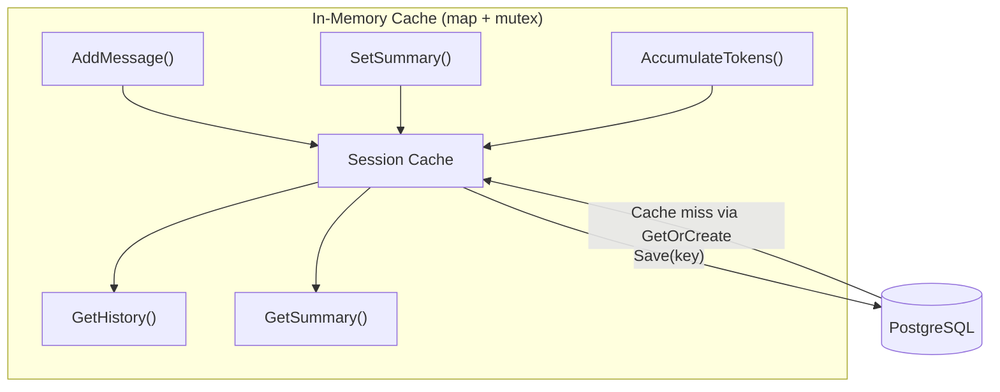
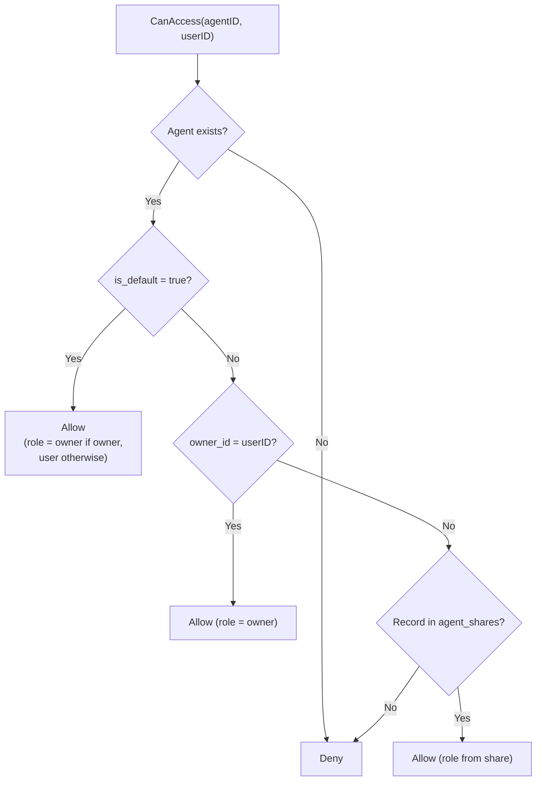
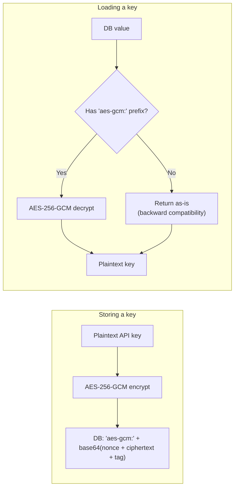
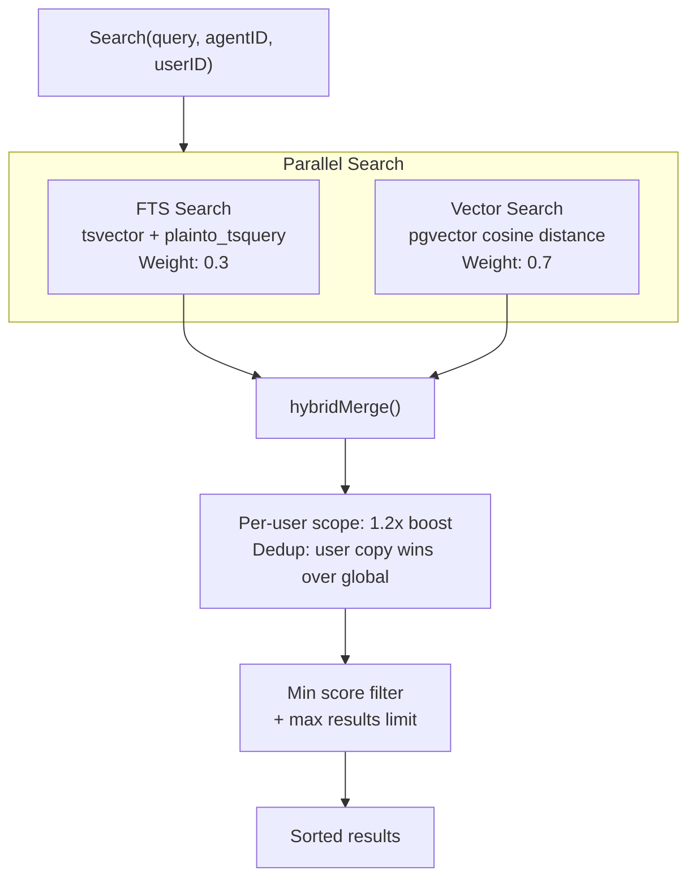
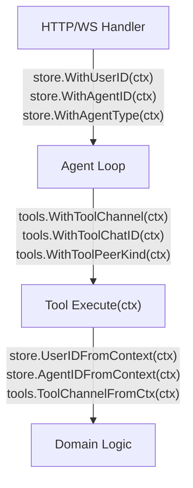
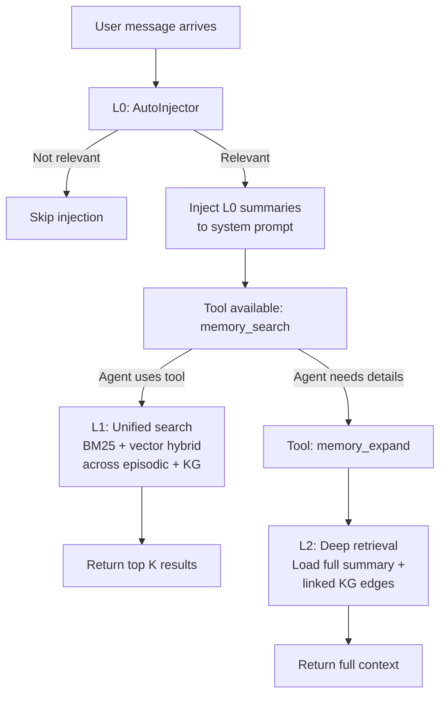
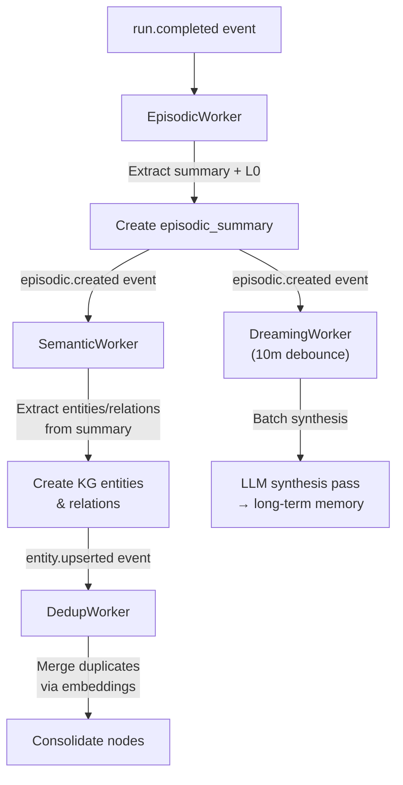

# 06 - Store Layer and Data Model

The store layer abstracts all persistence behind Go interfaces. Each store interface has a PostgreSQL implementation (standard edition) or SQLite implementation (Lite desktop edition). Implementations are wired at startup based on `//go:build` tags and edition configuration.

---

## 1. Store Layer

```mermaid
flowchart TD
    START["Gateway Startup"] --> CHOOSE{"Edition<br/>& Build Tag"}
    
    CHOOSE -->|Standard<br/>(PostgreSQL)| PG["PostgreSQL Backend"]
    CHOOSE -->|Lite<br/>(-tags sqliteonly)| SQLite["SQLite Backend"]

    PG --> PG_STORES["PGSessionStore<br/>PGMemoryStore<br/>PGCronStore<br/>PGPairingStore<br/>PGSkillStore<br/>PGAgentStore<br/>PGProviderStore<br/>PGTracingStore<br/>PGMCPServerStore<br/>PGCustomToolStore<br/>PGChannelInstanceStore<br/>PGConfigSecretsStore<br/>PGTeamStore<br/>PGBuiltinToolStore<br/>PGPendingMessageStore<br/>PGKnowledgeGraphStore<br/>PGContactStore<br/>PGActivityStore<br/>PGSnapshotStore<br/>PGSecureCLIStore<br/>PGAPIKeyStore<br/>PGUsersStore<br/>PGUserSessionsStore<br/>PGSkillVersionsStore<br/>PGCuratorRunsStore<br/>PGUserHookBudgetStore"]
    
    SQLite --> SQLITE_STORES["SQLiteActivityStore<br/>SQLiteEpisodicStore<br/>SQLiteEvolutionMetrics<br/>SQLiteEvolutionSuggestions<br/>SQLiteKnowledgeGraph<br/>SQLiteVaultStore<br/>SQLiteAgentLinks<br/>SQLiteSubagentTasks<br/>SQLiteSecureCLIStore"]
```

---

## 2. Store Interface Map

The `Stores` struct is the top-level container holding all PostgreSQL-backed storage implementations.

| Interface | Implementation | Purpose |
|-----------|---|---------|
| SessionStore | `PGSessionStore` | Conversation history with in-memory write-behind cache |
| MemoryStore | `PGMemoryStore` | Memory documents, embedding, FTS, hybrid search (tsvector + pgvector) |
| CronStore | `PGCronStore` | Scheduled job definitions and execution logs |
| PairingStore | `PGPairingStore` | Browser pairing codes and paired device tracking |
| SkillStore | `PGSkillStore` | SKILL.md definitions, BM25 search, agent/user grants |
| AgentStore | `PGAgentStore` | Agent definitions, soft delete, RBAC sharing, access control |
| ProviderStore | `PGProviderStore` | LLM provider configs, encrypted API keys, model listings |
| TracingStore | `PGTracingStore` | LLM call traces, spans, observability aggregation |
| MCPServerStore | `PGMCPServerStore` | MCP server configs, transport (stdio/sse), tool grants |
| CustomToolStore | `PGCustomToolStore` | Dynamic tool definitions, shell command templates, agent/global scoping |
| ChannelInstanceStore | `PGChannelInstanceStore` | Channel instance configs (Telegram account, Discord guild, etc.) |
| ConfigSecretsStore | `PGConfigSecretsStore` | Encrypted configuration secrets (AES-256-GCM) |
| TeamStore | `PGTeamStore` | Teams, tasks (atomic claim), members, messages, delegation history |
| BuiltinToolStore | `PGBuiltinToolStore` | System tool metadata, enable/disable toggles, settings |
| PendingMessageStore | `PGPendingMessageStore` | Offline group chat message queue, auto-compaction to summaries |
| KnowledgeGraphStore | `PGKnowledgeGraphStore` | Entity-relationship graphs, traversal, inference extraction |
| ContactStore | `PGContactStore` | Channel contacts (auto-collected), cross-channel deduplication, merge |
| ActivityStore | `PGActivityStore` | Audit logs, action tracking, compliance |
| SnapshotStore | `PGSnapshotStore` | Hourly usage snapshots, cost aggregation, time series queries |
| SecureCLIStore | `PGSecureCLIStore` | CLI binary configs with encrypted credential injection |
| APIKeyStore | `PGAPIKeyStore` | Gateway API keys, scopes, expiration, revocation |
| HookStore | `PGHookStore` | Lifecycle hook definitions (event, handler type, matcher, config), execution audit log |
| UsersStore | `PGUsersStore` | User identity and profile metadata (v4 Phase 05) |
| UserSessionsStore | `PGUserSessionsStore` | Per-user session lifecycle tracking (v4 Phase 05) |
| SkillVersionsStore | `PGSkillVersionsStore` | Skill version history and evolution (v4 Phase 05) |
| CuratorRunsStore | `PGCuratorRunsStore` | Curator task execution logs and results (v4 Phase 05) |
| UserHookBudgetStore | `PGUserHookBudgetStore` | User hook execution budget and rate limiting (v4 Phase 05) |

### SQLite Parity (Lite Edition)

**New in v3:** SQLite backend supports 9 additional stores for Lite desktop edition (`-tags sqliteonly`). Schema v9 adds 4 new tables. Text search uses LIKE (no FTS5). Vector features omitted.

| Interface | Implementation | PostgreSQL vs SQLite |
|-----------|---|---|
| ActivityStore | `SQLiteActivityStore` | ✓ Parity |
| EpisodicStore | `SQLiteEpisodicStore` | LIKE search (no tsvector), no vector embedding |
| EvolutionMetrics | `SQLiteEvolutionMetrics` | ✓ Parity (json_extract instead of JSONB operator) |
| EvolutionSuggestions | `SQLiteEvolutionSuggestions` | ✓ Parity |
| KnowledgeGraphStore | `SQLiteKnowledgeGraph` | LIKE search, Go-side dedup (Jaro-Winkler), no vector embedding, recursive CTE for traversal, depth cap 5 |
| VaultStore | `SQLiteVaultStore` | LIKE search (no tsvector), no vector embedding |
| AgentLinksStore | `SQLiteAgentLinks` | LIKE search, no vector |
| SubagentTasksStore | `SQLiteSubagentTasks` | ✓ Parity (json_set for metadata merge) |
| SecureCLIStore | `SQLiteSecureCLIStore` | ✓ Parity + AES-256-GCM encryption mandatory (GOCLAW_KEY env var required) |
| HookStore | `SQLiteHookStore` | ✓ Parity (agent_hooks + hook_executions tables, same schema as PG) |

---

## 3. Session Caching

The session store uses an in-memory write-behind cache to minimize database I/O during the agent tool loop. All reads and writes happen in memory; data is flushed to the persistent backend only when `Save()` is called at the end of a run.



### Lifecycle

1. **GetOrCreate(key)**: Check cache; on miss, load from DB into cache; return session data.
2. **AddMessage/SetSummary/AccumulateTokens**: Update in-memory cache only (no DB write).
3. **Save(key)**: Snapshot data under read lock, flush to DB via UPDATE.
4. **Delete(key)**: Remove from both cache and DB. `List()` always reads directly from DB.

### Session Key Format

| Type | Format | Example |
|------|--------|---------|
| DM | `agent:{agentId}:{channel}:direct:{peerId}` | `agent:default:telegram:direct:386246614` |
| Group | `agent:{agentId}:{channel}:group:{groupId}` | `agent:default:telegram:group:-100123456` |
| Subagent | `agent:{agentId}:subagent:{label}` | `agent:default:subagent:my-task` |
| Cron | `agent:{agentId}:cron:{jobId}:run:{runId}` | `agent:default:cron:reminder:run:abc123` |
| Main | `agent:{agentId}:{mainKey}` | `agent:default:main` |

### Session Metadata - Compaction Tracking

**New well-known metadata key** (Phase 5 follow-up): `last_compaction_at` (RFC3339 string)

This timestamp is written to `sessions.metadata` JSONB after successful message compaction (context pruning). Both execution paths update it:
- **V3 pipeline**: `PruneStage.CompactMessages()` after successful compaction
- **V2 legacy**: `maybeSummarize()` goroutine after successful summarization

Operators can read this via `GetSessionMetadata()` to understand when a session was last compacted. The web UI optionally displays this timestamp in a context-usage tooltip.

Go constant export: `agent.SessionMetaKeyLastCompactionAt = "last_compaction_at"`

---

## 4. Agent Access Control

Agent access is checked via a 4-step pipeline.



The `agent_shares` table stores `UNIQUE(agent_id, user_id)` with roles: `user`, `admin`, `operator`.

`ListAccessible(userID)` queries: `owner_id = ? OR is_default = true OR id IN (SELECT agent_id FROM agent_shares WHERE user_id = ?)`.

---

## 5. API Key Encryption

API keys in the `llm_providers` and `mcp_servers` tables are encrypted with AES-256-GCM before storage.



`GOCLAW_ENCRYPTION_KEY` accepts three formats:
- **Hex**: 64 characters (decoded to 32 bytes)
- **Base64**: 44 characters (decoded to 32 bytes)
- **Raw**: 32 characters (32 bytes direct)

---

## 6. Hybrid Memory Search

Memory search combines full-text search (FTS) and vector similarity in a weighted merge.



### Merge Rules

1. Normalize FTS scores to [0, 1] (divide by highest score)
2. Vector scores already in [0, 1] (cosine similarity)
3. Combined score: `vec_score * 0.7 + fts_score * 0.3` for chunks found by both
4. When only one channel returns results, its weight auto-adjusts to 1.0
5. Per-user results receive a 1.2x boost
6. Deduplication: if a chunk exists in both global and per-user scope, the per-user version wins

### Fallback

When FTS returns no results (e.g., cross-language queries), a `likeSearch()` fallback runs ILIKE queries using up to 5 keywords (minimum 3 characters each), scoped to the agent's index.

### Search Implementation

| Aspect | Detail |
|--------|--------|
| FTS engine | PostgreSQL tsvector |
| Vector | pgvector extension |
| Search function | `plainto_tsquery('simple', ...)` |
| Distance operator | `<=>` (cosine) |

---

## 7. Context Files Routing

Context files are stored in two tables and routed based on agent type.

### Tables

| Table | Scope | Unique Key |
|-------|-------|------------|
| `agent_context_files` | Agent-level | `(agent_id, file_name)` |
| `user_context_files` | Per-user | `(agent_id, user_id, file_name)` |

### Routing by Agent Type

| Agent Type | Agent-Level Files | Per-User Files |
|------------|-------------------|----------------|
| `open` | Template fallback only | All files (SOUL, IDENTITY, AGENTS, TOOLS, BOOTSTRAP, USER) |
| `predefined` | Agent-level files (SOUL, IDENTITY, AGENTS, TOOLS, BOOTSTRAP) | Only USER.md |

The `ContextFileInterceptor` checks agent type from context and routes read/write operations accordingly. For open agents, per-user files take priority with agent-level as fallback.

---

## 8. MCP Server Store

The MCP server store manages external tool server configurations and access grants.

### Tables

| Table | Purpose |
|-------|---------|
| `mcp_servers` | Server configurations (name, transport, command/URL, encrypted API key) |
| `mcp_agent_grants` | Per-agent access grants with tool allow/deny lists |
| `mcp_user_grants` | Per-user access grants with tool allow/deny lists |
| `mcp_access_requests` | Pending/approved/rejected access requests |

### Transport Types

| Transport | Fields Used |
|-----------|-------------|
| `stdio` | `command`, `args` (JSONB), `env` (JSONB) |
| `sse` | `url`, `headers` (JSONB) |
| `streamable-http` | `url`, `headers` (JSONB) |

`ListAccessible(agentID, userID)` returns all MCP servers the given agent+user combination can access, with effective tool allow/deny lists merged from both agent and user grants.

---

## 9. Custom Tool Store

Dynamic tool definitions stored in PostgreSQL. Each tool defines a shell command template that the LLM can invoke at runtime.

### Table: `custom_tools`

| Column | Type | Description |
|--------|------|-------------|
| `id` | UUID v7 | Primary key |
| `name` | VARCHAR | Unique tool name |
| `description` | TEXT | Tool description for the LLM |
| `parameters` | JSONB | JSON Schema for tool arguments |
| `command` | TEXT | Shell command template with `{{.key}}` placeholders |
| `working_dir` | VARCHAR | Optional working directory |
| `timeout_seconds` | INT | Execution timeout (default 60) |
| `env` | BYTEA | Encrypted environment variables (AES-256-GCM) |
| `agent_id` | UUID | `NULL` = global tool, UUID = per-agent tool |
| `enabled` | BOOLEAN | Soft enable/disable |
| `created_by` | VARCHAR | Audit trail |

**Scoping**: Global tools (`agent_id IS NULL`) are loaded at startup into the global registry. Per-agent tools are loaded on-demand when the agent is resolved, using a cloned registry to avoid polluting the global one.

---

## 10. Delegation History

### Table: `delegation_history`

| Column | Type | Description |
|--------|------|-------------|
| `id` | UUID v7 | Primary key |
| `source_agent_id` | UUID | Delegating agent |
| `target_agent_id` | UUID | Target agent |
| `team_id` | UUID | Team context (nullable) |
| `team_task_id` | UUID | Related team task (nullable) |
| `user_id` | VARCHAR | User who triggered the delegation |
| `task` | TEXT | Task description sent to target |
| `mode` | VARCHAR(10) | `sync` or `async` |
| `status` | VARCHAR(20) | `completed`, `failed`, `cancelled` |
| `result` | TEXT | Target agent's response |
| `error` | TEXT | Error message on failure |
| `iterations` | INT | Number of LLM iterations |
| `trace_id` | UUID | Linked trace for observability |
| `duration_ms` | INT | Wall-clock duration |
| `completed_at` | TIMESTAMPTZ | Completion timestamp |

Every sync and async delegation is persisted here automatically via `SaveDelegationHistory()`. Results are truncated for WS transport (500 runes for list, 8000 runes for detail).

---

## 11. Team Store

The team store manages collaborative multi-agent teams with a shared task board and peer-to-peer mailbox.

### Tables

| Table | Purpose | Key Columns |
|-------|---------|-------------|
| `agent_teams` | Team definitions | `name`, `lead_agent_id` (FK → agents), `status`, `settings` (JSONB) |
| `agent_team_members` | Team membership | PK `(team_id, agent_id)`, `role` (lead/member) |
| `team_tasks` | Shared task board | `subject`, `status` (pending/in_progress/completed/blocked), `owner_agent_id`, `blocked_by` (UUID[]), `priority`, `result`, `tsv` (FTS) |
| `team_messages` | Peer-to-peer mailbox | `from_agent_id`, `to_agent_id` (NULL = broadcast), `content`, `message_type` (chat/broadcast), `read` |

### TeamStore Interface (22 methods)

**Team CRUD**: `CreateTeam`, `GetTeam`, `DeleteTeam`, `ListTeams`

**Members**: `AddMember`, `RemoveMember`, `ListMembers`, `GetTeamForAgent` (find team by agent)

**Tasks**: `CreateTask`, `UpdateTask`, `ListTasks` (orderBy: priority/newest, statusFilter: active/completed/all), `GetTask`, `SearchTasks` (FTS on subject+description), `ClaimTask`, `CompleteTask`

**Delegation History**: `SaveDelegationHistory`, `ListDelegationHistory` (with filter opts), `GetDelegationHistory`

**Messages**: `SendMessage`, `GetUnread`, `MarkRead`

### Atomic Task Claiming

Two agents grabbing the same task is prevented at the database level:

```sql
UPDATE team_tasks
SET status = 'in_progress', owner_agent_id = $1
WHERE id = $2 AND status = 'pending' AND owner_agent_id IS NULL
```

One row updated = claimed. Zero rows = someone else got it. Row-level locking, no distributed mutex needed.

### Task Dependencies

Tasks can declare `blocked_by` (UUID array) pointing to prerequisite tasks. When a task is completed via `CompleteTask`, all dependent tasks whose blockers are now all completed are automatically unblocked (status transitions from `blocked` to `pending`).

---

## 12. Additional Store Interfaces

### BuiltinToolStore

System tool metadata storage. Built-in tools are seeded at startup with category, settings, and dependency metadata. Only `enabled` and `settings` are user-editable.

| Method | Purpose |
|--------|---------|
| `List()` | Return all tool definitions |
| `Get(name)` | Fetch tool by name |
| `Update(name, updates)` | Modify settings or enabled status |
| `Seed(tools)` | Populate tools at startup |
| `ListEnabled()` | Return only enabled tools |
| `GetSettings(name)` | Fetch settings JSON for a tool |

### PendingMessageStore

Offline message queue for group chats. Buffers messages when the bot is not actively listening, auto-compacts into summaries to prevent unbounded growth.

| Method | Purpose |
|--------|---------|
| `AppendBatch(msgs)` | Insert multiple messages in one query |
| `ListByKey(channelName, historyKey)` | Retrieve buffered messages for a group |
| `DeleteByKey(channelName, historyKey)` | Clear messages after processing |
| `Compact(deleteIDs, summary)` | Atomically delete old messages + insert summary |
| `DeleteStale(olderThan)` | Prune messages older than duration |
| `ListGroups()` | Return distinct channel+key groups with counts |
| `CountAll()` | Total pending messages across all groups |
| `ResolveGroupTitles(groups)` | Look up chat titles from session metadata |

### KnowledgeGraphStore

Entity-relationship graph storage for AI inference and knowledge extraction. Supports graph traversal, confidence pruning, and bulk ingestion.

| Method | Purpose |
|--------|---------|
| `UpsertEntity(entity)` | Create or update entity node |
| `GetEntity(agentID, userID, entityID)` | Fetch single entity |
| `DeleteEntity(agentID, userID, entityID)` | Remove entity (cascades relations) |
| `ListEntities(agentID, userID, opts)` | List with pagination and type filter |
| `SearchEntities(agentID, userID, query, limit)` | Full-text search entities |
| `UpsertRelation(relation)` | Create or update edge |
| `DeleteRelation(agentID, userID, relationID)` | Remove edge |
| `ListRelations(agentID, userID, entityID)` | Get edges connected to an entity |
| `Traverse(agentID, userID, startEntityID, maxDepth)` | Breadth-first graph traversal |
| `IngestExtraction(agentID, userID, entities, relations)` | Bulk insert from LLM extraction |
| `PruneByConfidence(agentID, userID, minConfidence)` | Remove low-confidence nodes/edges |
| `Stats(agentID, userID)` | Aggregate entity and relation counts |

### ContactStore

Auto-collected channel contact registry. Tracks users across platforms and supports cross-channel deduplication (merge contacts as same person).

| Method | Purpose |
|--------|---------|
| `UpsertContact(...)` | Create or update contact; on conflict (channel_type, sender_id) updates metadata |
| `ListContacts(opts)` | Search with pagination and filters (ILIKE on name/username/sender_id) |
| `CountContacts(opts)` | Count matching contacts |
| `GetContactsBySenderIDs(senderIDs)` | Batch lookup contacts by sender IDs |
| `MergeContacts(contactIDs)` | Link multiple contacts as same person (set merged_id) |

### ActivityStore

Audit logging for compliance and troubleshooting. Logs all significant actions with actor, entity, and optional details.

| Method | Purpose |
|--------|---------|
| `Log(entry)` | Record a single audit entry |
| `List(opts)` | Retrieve audit logs with filters (actor_type, action, entity_type, etc.) |
| `Count(opts)` | Count matching audit entries |

### SnapshotStore

Pre-computed usage snapshots (hourly aggregations) for analytics dashboards. Tracks token usage, cost, request counts, and tool utilization.

| Method | Purpose |
|--------|---------|
| `UpsertSnapshots(snapshots)` | Insert or replace batch of hourly aggregations |
| `GetTimeSeries(query)` | Fetch hourly or daily time series for charting |
| `GetBreakdown(query)` | Aggregate by dimension (provider, model, channel, agent) |
| `GetLatestBucket()` | Return most recent bucket_hour (worker resume point) |

### SecureCLIStore

CLI binary credential configuration with encrypted environment variable injection. Credentials are auto-injected into child processes without exposing them to command output.

| Method | Purpose |
|--------|---------|
| `Create(binary)` | Register new CLI binary config |
| `Get(id)` | Fetch config by ID |
| `Update(id, updates)` | Modify settings (enable/disable, denyArgs, etc.) |
| `Delete(id)` | Remove config |
| `List()` | Return all configs |
| `ListByAgent(agentID)` | Return configs for a specific agent |
| `LookupByBinary(binaryName, agentID)` | Find best-matching config (agent-specific > global) |
| `ListEnabled()` | Return enabled configs for TOOLS.md generation |

### APIKeyStore

Gateway API key management. Keys are SHA-256 hashed at rest; validation compares hash to incoming key. Supports scopes, expiration, and revocation.

| Method | Purpose |
|--------|---------|
| `Create(key)` | Insert new API key record |
| `GetByHash(keyHash)` | Lookup active (non-revoked, non-expired) key by hash |
| `List()` | Return all keys for admin display (hashes omitted) |
| `Revoke(id)` | Mark key as revoked |
| `Delete(id)` | Permanently remove key |
| `TouchLastUsed(id)` | Update last_used_at timestamp |

---

## 14. Database Schema

All tables use UUID v7 (time-ordered) as primary keys via `GenNewID()`.

```mermaid
flowchart TD
    subgraph Providers
        LP["llm_providers"] --> LM["llm_models"]
    end

    subgraph Agents
        AG["agents"] --> AS["agent_shares"]
        AG --> ACF["agent_context_files"]
        AG --> UCF["user_context_files"]
        AG --> UAP["user_agent_profiles"]
    end

    subgraph Teams
        AT["agent_teams"] --> ATM["agent_team_members"]
        AT --> TT["team_tasks"]
        AT --> TM["team_messages"]
    end

    subgraph Sessions
        SE["sessions"]
    end

    subgraph Memory
        MD["memory_documents"] --> MC["memory_chunks"]
    end

    subgraph Cron
        CJ["cron_jobs"] --> CRL["cron_run_logs"]
    end

    subgraph Pairing
        PR["pairing_requests"]
        PD["paired_devices"]
    end

    subgraph Skills
        SK["skills"] --> SAG["skill_agent_grants"]
        SK --> SUG["skill_user_grants"]
    end

    subgraph Tracing
        TR["traces"] --> SP["spans"]
    end

    subgraph MCP
        MS["mcp_servers"] --> MAG["mcp_agent_grants"]
        MS --> MUG["mcp_user_grants"]
        MS --> MAR["mcp_access_requests"]
    end

    subgraph "Custom Tools"
        CT["custom_tools"]
    end
```



### Key Tables

| Table | Purpose | Key Columns |
|-------|---------|-------------|
| `agents` | Agent definitions | `agent_key` (UNIQUE), `owner_id`, `agent_type` (open/predefined), `is_default`, `frontmatter`, `tsv`, `embedding`, soft delete via `deleted_at` |
| `agent_shares` | Agent RBAC sharing | UNIQUE(agent_id, user_id), `role` (user/admin/operator) |
| `agent_context_files` | Agent-level context | UNIQUE(agent_id, file_name) |
| `user_context_files` | Per-user context | UNIQUE(agent_id, user_id, file_name) |
| `user_agent_profiles` | User tracking | `first_seen_at`, `last_seen_at`, `workspace` |
| `agent_teams` | Team definitions | `name`, `lead_agent_id`, `status`, `settings` (JSONB) |
| `agent_team_members` | Team membership | PK(team_id, agent_id), `role` (lead/member) |
| `team_tasks` | Shared task board | `subject`, `status`, `owner_agent_id`, `blocked_by` (UUID[]), `tsv` (FTS) |
| `team_messages` | Peer-to-peer mailbox | `from_agent_id`, `to_agent_id`, `message_type`, `read` |
| `delegation_history` | Persisted delegation records | `source_agent_id`, `target_agent_id`, `mode`, `status`, `result`, `trace_id` |
| `sessions` | Conversation history | `session_key` (UNIQUE), `messages` (JSONB), `summary`, token counts |
| `memory_documents` | Memory docs | UNIQUE(agent_id, COALESCE(user_id, ''), path) |
| `memory_chunks` | Chunked + embedded text | `embedding` (VECTOR), `tsv` (TSVECTOR) |
| `llm_providers` | Provider configuration | `api_key` (AES-256-GCM encrypted) |
| `traces` | LLM call traces | `agent_id`, `user_id`, `status`, `parent_trace_id`, aggregated token counts |
| `spans` | Individual operations | `span_type` (llm_call, tool_call, agent, embedding), `parent_span_id` |
| `skills` | Skill definitions | Content, metadata, grants |
| `cron_jobs` | Scheduled tasks | `schedule_kind` (at/every/cron), `payload` (JSONB) |
| `mcp_servers` | MCP server configs | `transport`, `api_key` (encrypted), `tool_prefix` |
| `custom_tools` | Dynamic tool definitions | `command` (template), `agent_id` (NULL = global), `env` (encrypted) |

### Migrations

| Migration | Purpose |
|-----------|---------|
| `000001_init_schema` | Core tables (agents, sessions, providers, memory, cron, pairing, skills, traces, MCP, custom tools) |
| `000002_agent_links` | `agent_links` table + `frontmatter`, `tsv`, `embedding` on agents + `parent_trace_id` on traces |
| `000003_agent_teams` | `agent_teams`, `agent_team_members`, `team_tasks`, `team_messages` + `team_id` on agent_links |
| `000004_teams_v2` | FTS on `team_tasks` (tsv column) + `delegation_history` table |
| `000005_phase4` | Additional team and delegation features |
| `000001_initial` (v4 line) | v4 greenfield rebuild — supersedes the 000001…000005 v3 chain. Includes `users`, `user_sessions`, `skill_versions`, `curator_runs`, `user_hook_budget` and drops multi-tenant tables. |

**v4 user-scoped stores:** 5 stores introduced (`UsersStore`, `UserSessionsStore`, `SkillVersionsStore`, `CuratorRunsStore`, `UserHookBudgetStore`) backed by the new tables above. Canonical `store.ErrNotFound` sentinel for not-found rows. All IDs use `uuid.NewV7()`. Tables intentionally have NO `tenant_id` column — multi-tenant primitives are being removed in v4. `skill_versions` has no `archived_at` column; archival is a higher-layer concern.

### Required PostgreSQL Extensions

- **pgvector**: Vector similarity search for memory embeddings
- **pgcrypto**: UUID generation functions

---

## 15. Context Propagation

Metadata flows through `context.Context` instead of mutable state, ensuring thread safety across concurrent agent runs.



### Store Context Keys

| Key | Type | Purpose |
|-----|------|---------|
| `goclaw_user_id` | string | External user ID (e.g., Telegram user ID) |
| `goclaw_agent_id` | uuid.UUID | Agent UUID |
| `goclaw_agent_type` | string | Agent type: `"open"` or `"predefined"` |
| `goclaw_sender_id` | string | Original individual sender ID (in group chats, `user_id` is group-scoped but `sender_id` preserves the actual person) |

### Tool Context Keys

| Key | Purpose |
|-----|---------|
| `tool_channel` | Current channel (telegram, discord, etc.) |
| `tool_chat_id` | Chat/conversation identifier |
| `tool_peer_kind` | Peer type: `"direct"` or `"group"` |
| `tool_sandbox_key` | Docker sandbox scope key |
| `tool_async_cb` | Callback for async tool execution |
| `tool_workspace` | Per-user workspace directory (injected by agent loop, read by filesystem/shell tools) |

---

## 16. Key PostgreSQL Patterns

### Database Driver

All PG stores use `database/sql` with the `pgx/v5/stdlib` driver. No ORM is used -- all queries are raw SQL with positional parameters (`$1`, `$2`, ...).

### Nullable Columns

Nullable columns are handled via Go pointers: `*string`, `*int`, `*time.Time`, `*uuid.UUID`. Helper functions `nilStr()`, `nilInt()`, `nilUUID()`, `nilTime()` convert zero values to `nil` for clean SQL insertion.

### Dynamic Updates

`execMapUpdate()` builds UPDATE statements dynamically from a `map[string]any` of column-value pairs. This avoids writing a separate UPDATE query for every combination of updatable fields.

### Error Handling

**v4 unified sentinel:** New store interfaces (UsersStore, UserSessionsStore, SkillVersionsStore, CuratorRunsStore, UserHookBudgetStore) return `store.ErrNotFound` for missing rows. Callers use `errors.Is(err, store.ErrNotFound)` — never `==`. Existing v3 stores return raw `sql.ErrNoRows` or custom errors; Phase 05 PR-05B will reconcile all to `store.ErrNotFound`.

### Upsert Pattern

All "create or update" operations use `INSERT ... ON CONFLICT DO UPDATE`, ensuring idempotency:

| Operation | Conflict Key |
|-----------|-------------|
| `SetAgentContextFile` | `(agent_id, file_name)` |
| `SetUserContextFile` | `(agent_id, user_id, file_name)` |
| `ShareAgent` | `(agent_id, user_id)` |
| `PutDocument` (memory) | `(agent_id, COALESCE(user_id, ''), path)` |
| `GrantToAgent` (skill) | `(skill_id, agent_id)` |

### User Profile Detection

`GetOrCreateUserProfile` uses the PostgreSQL `xmax` trick:
- `xmax = 0` after RETURNING means a real INSERT occurred (new user) -- triggers context file seeding
- `xmax != 0` means an UPDATE on conflict (existing user) -- no seeding needed

### Batch Span Insert

`BatchCreateSpans` inserts spans in batches of 100. If a batch fails, it falls back to inserting each span individually to prevent data loss.

---

## 17. V3 Memory & Evolution System (New in v3)

GoClaw v3 introduces a 3-tier memory architecture with event-driven consolidation.

### 3-Tier Memory Model

```
L0 (Working Memory)           L1 (Episodic Memory)        L2 (Semantic Memory)
┌─────────────────────────┐  ┌──────────────────────┐     ┌──────────────────────┐
│ Current conversation    │  │ Session summaries    │     │ Knowledge graph      │
│ messages in session     │  │ w/ embeddings        │     │ entities & relations │
│ High context window     │  │ Auto-injected via    │     │ Temporal validity    │
└─────────────────────────┘  │ memory search tool   │     │ Long-term recall     │
                             │ 90-day retention     │     └──────────────────────┘
                             │ Query via hybrid     │
                             │ search (FTS + vec)   │
                             └──────────────────────┘
```

**L0 (Working Memory):** Current session messages stored in `sessions` table. Auto-compacted via summarization at context window threshold.

**L1 (Episodic Memory):** Session summaries extracted after `run.completed` events. Stored in `episodic_summaries` with L0 abstracts (~50 tokens each) for fast auto-inject. Hybrid search returns top results as context for memory_search/memory_expand tools.

**L2 (Semantic Memory):** Knowledge Graph with temporal validity windows (`valid_from`, `valid_until`). Supports long-term facts, relationships, and inference. Queried via kg_entities/kg_relations with current-only filters.

### New Store Interfaces

| Interface | Purpose | Key Methods |
|-----------|---------|-------------|
| `EpisodicStore` | Tier 1.5 memory CRUD + hybrid search | `Create`, `Search`, `ExistsBySourceID`, `ListUnpromoted`, `MarkPromoted` |
| `EvolutionMetricsStore` | Stage 1: record metrics (retrieval, tool, feedback) | `RecordMetric`, `AggregateToolMetrics`, `AggregateRetrievalMetrics` |
| `EvolutionSuggestionStore` | Stage 2: generate & track improvement suggestions | `CreateSuggestion`, `ListSuggestions`, `UpdateSuggestionStatus` |
| `VaultStore` | Knowledge Vault: document registry + links | `UpsertDocument`, `Search`, `CreateLink`, `GetOutLinks`, `GetBacklinks` |
| `AgentLinkStore` | Inter-agent delegation links (replaces v2 `agent_links` in teams context) | `CreateLink`, `CanDelegate`, `DelegateTargets`, `SearchDelegateTargets` |

### New Tables

| Table | Purpose | Key Columns |
|-------|---------|-------------|
| `episodic_summaries` | Session conversation summaries | `agent_id`, `user_id`, `session_key`, `summary`, `l0_abstract`, `key_topics` (TEXT[]), `embedding` (vector), `source_id` (dedup), `expires_at`, `recall_count` (INT), `recall_score` (FLOAT), `last_recalled_at` (TIMESTAMPTZ) |
| `agent_evolution_metrics` | Self-evolution performance data | `agent_id`, `session_key`, `metric_type` (retrieval/tool/feedback), `metric_key`, `value` (JSONB) |
| `agent_evolution_suggestions` | Data-driven improvement suggestions | `agent_id`, `suggestion_type`, `suggestion`, `rationale`, `parameters` (JSONB), `status` (pending/approved/rejected/applied) |
| `vault_documents` | Knowledge Vault document registry | `agent_id`, `scope` (personal/team/shared), `path`, `title`, `doc_type`, `content_hash`, `embedding` (vector), `metadata` (JSONB) |
| `vault_links` | Wikilinks between vault documents | `from_doc_id`, `to_doc_id`, `link_type`, `context` (snippet) |
| `vault_versions` | Document version history (prepared for v3.1) | `doc_id`, `version`, `content`, `changed_by`, `created_at` |
| `kg_entities` | Extended with temporal columns | `valid_from` (TIMESTAMPTZ), `valid_until` (TIMESTAMPTZ) for temporal facts |
| `kg_relations` | Extended with temporal columns | `valid_from` (TIMESTAMPTZ), `valid_until` (TIMESTAMPTZ) for temporal edges |

### 12 Promoted Agent Columns

Migration 000037 moves 12 config fields from `agents.other_config` JSONB to dedicated columns:

**Scalar columns:**
- `emoji` (VARCHAR) — agent emoji/icon
- `agent_description` (VARCHAR) — human-friendly description
- `thinking_level` (VARCHAR) — extended thinking depth
- `max_tokens` (INT) — context window limit
- `self_evolve` (BOOLEAN) — enable self-evolution metrics
- `skill_evolve` (BOOLEAN) — enable skill evolution
- `skill_nudge_interval` (INT) — suggestion frequency (days)

**JSONB columns (structures stay JSON-shaped):**
- `reasoning_config` (JSONB) — reasoning model settings
- `workspace_sharing` (JSONB) — workspace access config
- `chatgpt_oauth_routing` (JSONB) — ChatGPT OAuth fallback rules
- `shell_deny_groups` (JSONB) — shell command deny patterns
- `kg_dedup_config` (JSONB) — KG deduplication thresholds

---

## 18. Progressive Memory Loading (L0/L1/L2)

Three-stage memory loading strategy minimizes token cost while maximizing relevance.



### L0: Auto-Injection

Runs in ContextStage (once per turn). Checks user message relevance against episodic summaries and KG. Returns formatted section (~200 tokens max) for system prompt. Disabled if agent has `auto_inject_enabled: false`.

| Parameter | Default |
|-----------|---------|
| `MaxEntries` | 5 |
| `MaxTokens` | 200 |
| `Threshold` | 0.3 (relevance) |

### L1: Unified Search

Agent calls `memory_search(query)` tool. Hybrid search across:
- **Episodic (L0 abstracts)** — fast (~50 token summaries) with FTS + vector
- **Knowledge Graph** — current entities/relations (temporal `valid_until IS NULL`)

Weights: FTS 0.3, vector 0.7. Returns top K results within score threshold.

### L2: Memory Expansion

Agent calls `memory_expand(episodic_id)` for deep retrieval. Returns full summary + linked KG edges. Used when agent needs comprehensive context from a specific episodic entry.

---

## 19. Consolidation Pipeline (Event-Driven)

Event bus fires workers asynchronously to extract and build long-term memory.



### Workers

| Worker | Triggers | Responsibility |
|--------|----------|-----------------|
| **EpisodicWorker** | `run.completed` | Extract session summary via LLM or compaction summary. Generate L0 abstract. Store in `episodic_summaries`. Emit `episodic.created` |
| **SemanticWorker** | `episodic.created` | Parse summary for entity mentions and relationships. Extract via regex/NER. Insert into KG tables (`kg_entities`, `kg_relations`). Emit `entity.upserted` |
| **DedupWorker** | `entity.upserted` | Check for duplicate entities via embedding similarity. Merge duplicate nodes by redirecting relations. Update timestamps to reflect consolidation |
| **DreamingWorker** | `episodic.created` (debounced 10m) | Batch collect unpromoted episodic summaries scored by usefulness (recall signal). Call LLM for synthesis/insight pass. Write results to long-term memory (update KG, write to vault, etc.) |

### Dreaming Weighted Scoring (Phase 10, Migration 000045)

The DreamingWorker prioritizes unpromoted episodic summaries by usefulness via a 4-component running-average score:

**ComputeRecallScore formula** (14-day half-life):
```
score = 0.30 * frequency + 0.35 * relevance + 0.20 * recency + 0.15 * freshness
```

**Tracking columns** (added to `episodic_summaries`):
- `recall_count INT DEFAULT 0` — Number of times this summary was returned in memory searches
- `recall_score DOUBLE PRECISION DEFAULT 0` — Weighted average score (0 to 1)
- `last_recalled_at TIMESTAMPTZ` — Timestamp of most recent search hit

**Index for DreamingWorker**: `idx_episodic_recall_unpromoted` on `(agent_id, user_id, recall_score DESC) WHERE promoted_at IS NULL`. Enables efficient `ListUnpromotedScored()` queries to fetch highest-scoring summaries first.

**Integration with memory_search tool**: After search results are returned to agent, a fire-and-forget task increments `recall_count`, updates `recall_score` via running average, and sets `last_recalled_at`. No blocking — search returns immediately.

### Configuration

| Parameter | Default |
|-----------|---------|
| `ConsolidationEnabled` | true |
| `EpisodicTTLDays` | 90 |

Workers subscribe on startup via `consolidation.Register()`.

---

## 18. File Reference

| Module | Path | Purpose |
|---|---|---|
| Store interfaces | `internal/store/` | All 22+ store interfaces (`SessionStore`, `AgentStore`, `TeamStore`, etc.), `Stores` container, context propagation helpers, v3 stores (episodic, vault, evolution, agent links) |
| PostgreSQL implementations | `internal/store/pg/` | PG factory, `PGSessionStore`, `PGAgentStore`, `PGTeamStore`, `PGMemoryStore`, and all other PG-backed implementations; connection pool; helpers |
| SQLite implementations | `internal/store/sqlitestore/` | SQLite-backed stores for desktop/Lite edition |
| Tool context keys | `internal/tools/context_keys.go` | Tool context keys including `WithToolWorkspace` |

Use `grep` or your editor's symbol search for specific files.
