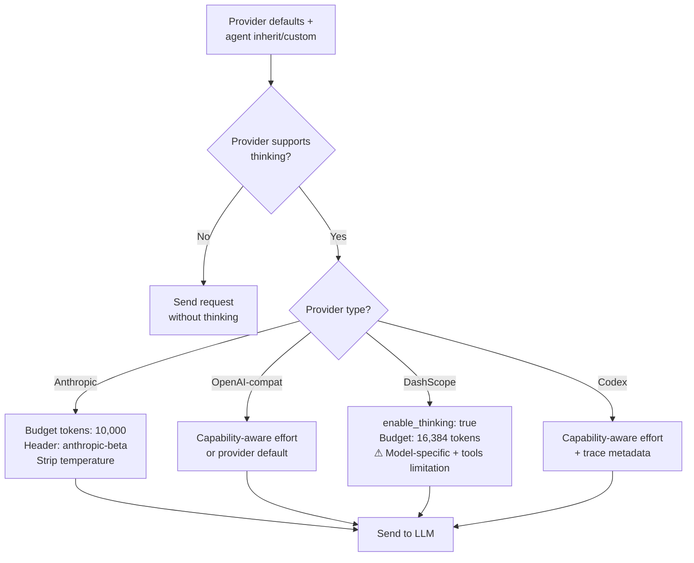
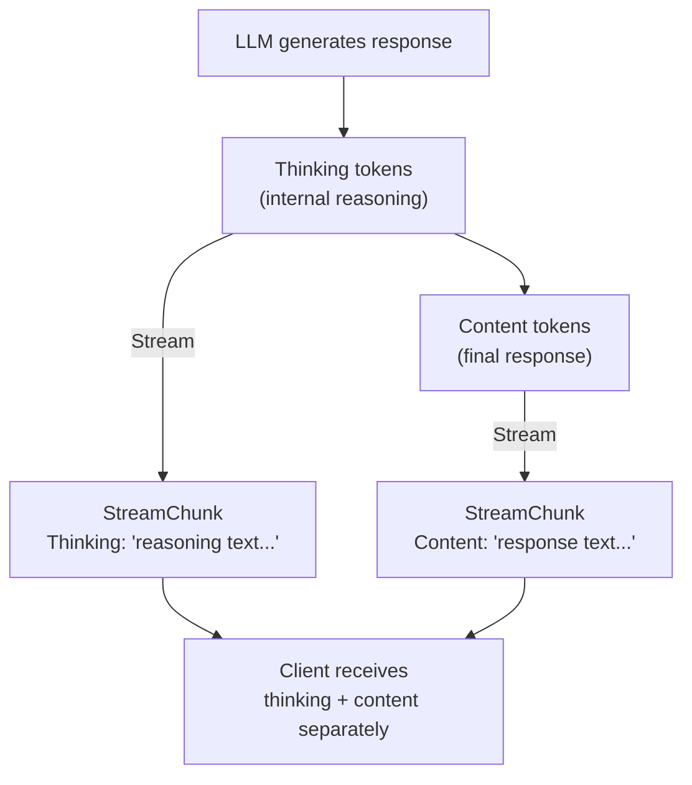
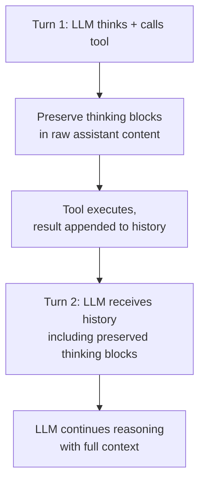

# 12 - Extended Thinking

## Overview

Extended thinking allows LLM providers to "think out loud" before producing a final response. When enabled, the model generates internal reasoning tokens that improve response quality for complex tasks at the cost of additional token usage and latency. GoClaw now supports both the legacy coarse `thinking_level` setting and a provider-first reasoning policy for capability-aware GPT-5/Codex control.

---

## 1. Configuration

The reusable default now lives on the provider in `settings.reasoning_defaults`. Agents consume that default by inheriting it, or store a custom override in top-level `reasoning_config`. `thinking_level` remains the backward-compatible coarse shim for older builds.

| Level | Behavior |
|-------|----------|
| `off` | Thinking disabled (default) |
| `low` | Minimal thinking — quick reasoning |
| `medium` | Moderate thinking — balanced reasoning |
| `high` | Maximum thinking — deep reasoning for complex tasks |

### Provider default

```json
{
  "provider_type": "chatgpt_oauth",
  "settings": {
    "reasoning_defaults": {
      "effort": "high",
      "fallback": "provider_default"
    }
  }
}
```

### Agent inherits provider default

```json
{
  "reasoning_config": {
    "override_mode": "inherit"
  }
}
```

### Agent custom override

```json
{
  "thinking_level": "high",
  "reasoning_config": {
    "override_mode": "custom",
    "effort": "xhigh",
    "fallback": "downgrade"
  }
}
```

Rules:
- Unset provider defaults and unset agent reasoning both resolve to `off`.
- `settings.reasoning_defaults` is provider-owned and reusable across agents.
- `reasoning_config.override_mode` accepts `inherit|custom`.
- `thinking_level` still accepts `off|low|medium|high`.
- `reasoning_config.effort` accepts `off|auto|none|minimal|low|medium|high|xhigh`.
- `reasoning_config.fallback` accepts `downgrade|off|provider_default`.
- Existing legacy `other_config.reasoning` payloads without `override_mode` are treated as custom overrides for backward compatibility.
- Read path resolves provider defaults first, then applies agent inherit/custom semantics, then falls back to legacy `thinking_level`.
- Write path keeps a derived coarse `thinking_level` only for custom agent overrides so rollback to older GoClaw builds stays safe.

---

## 2. Provider Support

Each provider maps the normalized reasoning policy to its own implementation parameters.



### Anthropic (Native)

| Thinking Level | Budget Tokens |
|:-:|:-:|
| low | 4,096 |
| medium | 10,000 |
| high | 32,000 |

When thinking is enabled:
- Adds `thinking: {type: "enabled", budget_tokens: N}` to the request body
- Sets `anthropic-beta: interleaved-thinking-2025-05-14` header
- Strips `temperature` parameter (Anthropic requirement — cannot use temperature with thinking)
- Auto-adjusts `max_tokens` to accommodate thinking budget (budget + 8,192 buffer)

### OpenAI-Compatible and Codex (GPT-5 / Codex families)

Known GPT-5/Codex models use a static capability registry. The runtime resolves:
- requested effort
- actual effective effort
- fallback policy used
- whether the model default was used
- whether the source was the provider default or an agent override

If the model is known:
- supported efforts pass through unchanged
- unsupported efforts are normalized via `downgrade`, `off`, or `provider_default`
- `auto` means "use the model default effort"

If the model is unknown:
- explicit non-`auto` effort is passed through as requested
- `auto` leaves provider-default reasoning untouched

Reasoning content still streams in the provider-native format, and span metadata now records the source plus requested versus effective effort.

### DashScope (Alibaba Qwen)

| Thinking Level | Budget Tokens |
|:-:|:-:|
| low | 4,096 |
| medium | 16,384 |
| high | 32,768 |

Enables thinking via `enable_thinking: true` plus a `thinking_budget` parameter.

**Model-specific support**: Only certain Qwen3 models accept the `enable_thinking` / `thinking_budget` parameters:
- **Qwen3.5 series**: `qwen3.5-plus`, `qwen3.5-turbo` (thinking + vision)
- **Qwen3 hosted**: `qwen3-max`
- **Qwen3 open-weight**: `qwen3-235b-a22b`, `qwen3-32b`, `qwen3-14b`, `qwen3-8b`

Other models (e.g., `qwen3-plus`, `qwen3-turbo`) silently skip thinking injection to avoid API errors.

**Bailian Coding note**: Bailian is a separate OpenAI-compatible Coding
endpoint. Its model catalog includes `qwen3.7-plus` with Deep Thinking and
Visual Understanding listed for selection, but this DashScope `enable_thinking`
/ `thinking_budget` injection path does not apply to Bailian unless the Coding
endpoint's explicit request controls are verified separately.

**Important limitation**: DashScope does not support streaming when tools are present. When an agent has tools enabled and thinking is active, the provider automatically falls back to non-streaming mode (single `Chat()` call) and synthesizes chunk callbacks to maintain the event flow.

### Codex (ChatGPT OAuth Responses API)

Codex natively supports extended reasoning through its Responses API. Thinking and reasoning tokens are streamed as discrete `reasoning` events with summary fragments.

**Token tracking**: Reasoning token count is exposed in `response.completed` / `response.incomplete` events as `OutputTokensDetails.ReasoningTokens` and accessible via `ChatResponse.Usage.ThinkingTokens`.

**Model metadata**: `/v1/providers/{id}/models` is now the backend source of truth for the ChatGPT OAuth model list and any known reasoning capabilities.

---

## 3. Streaming

When thinking is active, reasoning content streams to the client alongside regular content.



### Provider-Specific Streaming Events

| Provider | Thinking Event | Content Event |
|----------|---------------|---------------|
| Anthropic | `thinking_delta` in content blocks | `text_delta` in content blocks |
| OpenAI-compat | `reasoning_content` in delta | `content` in delta |
| DashScope | Same as OpenAI (when tools absent) | Same as OpenAI |
| Codex | `reasoning` items with text summaries | `content` items |

### Channel Delivery

Provider streaming and channel streaming are separate decisions. A channel may request provider streaming only to receive reasoning events, while still delivering the final answer as a normal non-streamed message.

Telegram exposes this through `reasoning_delivery`:

| Mode | Channel output |
|------|----------------|
| `streaming_only` | Show reasoning only when `dm_stream` / `group_stream` is enabled. |
| `always_bubbles` | Force provider streaming and flush reasoning into bounded channel bubbles. |
| `off` | Do not show reasoning in channel messages. |

`reasoning_stream=false` remains a legacy alias for `off` when no explicit mode is present. The bubble path is not persisted as assistant history; it is only a channel delivery surface.

### Token Estimation

Thinking tokens are estimated as `character_count / 4` for context window tracking. This rough estimate ensures the agent loop can account for thinking overhead when calculating context usage.

---

## 4. Tool Loop Handling

Extended thinking interacts with multi-turn tool conversations. When the LLM calls a tool and then needs to continue reasoning, thinking blocks must be preserved correctly across turns.



### Anthropic Thinking Block Preservation

Anthropic requires thinking blocks (including their cryptographic signatures) to be echoed back in subsequent turns. GoClaw handles this through `RawAssistantContent`:

1. During streaming, raw content blocks are accumulated — including `thinking` type blocks with their `signature` fields
2. When the assistant message is appended to history, the raw blocks are preserved
3. On the next LLM call, these blocks are sent back as-is, ensuring the API can validate thinking continuity

This is critical for correctness: if thinking blocks are dropped or modified, the Anthropic API may reject the request or produce degraded responses.

### Other Providers

OpenAI-compatible providers handle thinking/reasoning content as metadata. The `reasoning_content` is accumulated during streaming but does not require special passback handling — each turn's reasoning is independent.

---

## 5. Limitations

| Provider | Limitation |
|----------|-----------|
| DashScope | Cannot stream when tools are present — falls back to non-streaming mode. Only specific Qwen3 models support thinking. |
| Codex | Reasoning tokens tracked via API response (not in streaming chunks themselves) |
| Anthropic | Temperature parameter stripped when thinking is enabled |
| All | Thinking tokens count against the context window budget |
| All | Thinking increases latency and cost proportional to the budget level |
| GPT-5/Codex unknown models | GoClaw allows explicit effort passthrough but does not claim a capability contract |

---

## 6. Reasoning Content Stripping (Phase 6 — OpenClaw TS port)

Some models emit chain-of-thought reasoning tokens even when `effort="off"` is specified. To prevent that raw CoT from reaching end users, GoClaw supports a `StripThinking` flag on `ReasoningDecision`.

### Models Known to Leak CoT

Auto-flagged via `modelLeaksReasoning(model)` in `internal/providers/reasoning_resolution.go`:
- **Kimi family**: any model name containing `kimi` (case-insensitive, e.g. `kimi-k2`, `moonshot/kimi-k2-thinking`)
- **DeepSeek-Reasoner**: any model name containing `deepseek-reasoner`

The allowlist is a simple substring check — extendable as new leaky models appear.

### Auto-Enable Flow

1. `ResolveReasoningDecision` runs its normal flow, then a `defer` checks: if `EffectiveEffort == "off" && modelLeaksReasoning(model)`, it sets `decision.StripThinking = true`.
2. The agent loop (`loop_pipeline_callbacks.go`) reads `decision.StripThinking` and propagates it into `chatReq.Options[providers.OptStripThinking] = true`.
3. Each provider's streaming handler reads `OptStripThinking` from options at the top of `ChatStream`/`Chat` and applies guard clauses.

### Implementation Per Provider

- **Anthropic** (`anthropic_stream.go`, `anthropic.go`): `thinking_delta` events skip `result.Thinking` accumulation AND the `onChunk` emit when stripping, but `thinkingChars` still increments so `Usage.ThinkingTokens` stays billable. `RawAssistantContent` (content blocks for tool-use passback) is never touched. Non-streaming `Chat()` clears `resp.Thinking` post-parse.
- **OpenAI** (`openai_chat.go`): streaming guards `reasoning`/`reasoning_content` delta accumulation; non-streaming clears `resp.Thinking` post-parse. `Usage.ThinkingTokens` read from the usage chunk independently.
- **Codex** (`codex.go`): `processSSEEvent` takes an extra `stripThinking bool` param; the `reasoning` item case skips summary text appending when set. Usage still extracted from `response.completed`.
- **DashScope**: inherits both guards via `OpenAIProvider` embedding — no separate implementation needed.

### Invariants Preserved

| Field | Stripping effect | Rationale |
|---|---|---|
| `ChatResponse.Thinking` | Cleared | User-visible output |
| `Usage.ThinkingTokens` | **Unchanged** | Billing accuracy (Phase 1 depends on it) |
| `RawAssistantContent` | **Unchanged** | Anthropic tool-use replay requires raw thinking blocks |
| `onChunk(StreamChunk{Thinking})` | Not emitted | Streaming UI display |

---

## 7. Observability

Each LLM span can now include a `metadata.reasoning` section with:
- `source`
- `requested_effort`
- `effective_effort`
- `fallback`
- `reason`
- `supported_levels`
- `used_provider_default`

This makes silent downgrades or provider-default decisions visible in traces instead of leaving them implicit.

---

## File Reference

| Module | Path | Purpose |
|---|---|---|
| Provider types & reasoning | `internal/providers/types.go`, `internal/providers/reasoning_capability.go`, `internal/providers/reasoning_resolution.go`, `internal/providers/reasoning_observation.go` | ThinkingCapable interface, GPT-5/Codex capability registry, reasoning decision engine, trace metadata |
| Anthropic thinking | `internal/providers/anthropic.go`, `internal/providers/anthropic_stream.go`, `internal/providers/anthropic_request.go` | Budget mapping, beta header, thinking_delta streaming, block preservation for tool loops |
| OpenAI-compat, DashScope & Codex | `internal/providers/openai.go`, `internal/providers/dashscope.go`, `internal/providers/codex.go` | Reasoning effort mapping, DashScope tools+streaming fallback, Codex reasoning event streaming |

Use `grep` or your editor's symbol search for specific files.

---

## Cross-References

| Document | Relevant Content |
|----------|-----------------|
| [02-providers.md](./02-providers.md) | Provider architecture, supported providers |
| [01-agent-loop.md](./01-agent-loop.md) | LLM iteration loop, streaming chunk handling |
