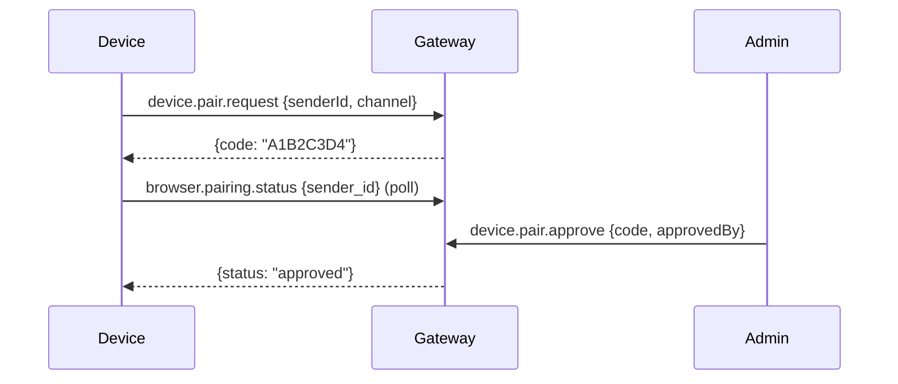

# 19 — WebSocket RPC Methods

GoClaw's primary control plane is a WebSocket-based JSON-RPC protocol (v3). Clients connect to `/ws`, authenticate via `connect`, then exchange request/response/event frames.

For the wire protocol, frame format, and connection lifecycle, see [04 — Gateway Protocol](04-gateway-protocol.md). This document catalogs every available RPC method.

---

## 1. Connection & System

### `connect`

Establish an authenticated session. Must be the first request after WebSocket upgrade.

**Request:**

```json
{
  "token": "gateway-token-or-api-key",
  "user_id": "external-user-id",
  "sender_id": "optional-device-id",
  "locale": "en"
}
```

**Response:**

```json
{
  "protocol": 3,
  "role": "admin",
  "user_id": "user-123",
  "server": {
    "version": "1.0.0",
    "uptime": "2h30m"
  }
}
```

**Auth flow:** Gateway token → timing-safe compare → admin role. If no match, SHA-256 hash → API key lookup → role derived from scopes. Pairing codes also accepted for channel devices.

### `health`

Server health and connected clients.

**Response:**

```json
{
  "status": "ok",
  "version": "1.0.0",
  "uptime": "2h30m",
  "mode": "managed",
  "database": "ok",
  "tools": ["exec", "web_fetch", "memory", "..."],
  "clients": [{"id": "...", "role": "admin", "user_id": "..."}],
  "currentId": "client-uuid"
}
```

### `status`

Quick agent/session/client counts.

**Response:**

```json
{
  "agents": [{"id": "...", "name": "...", "isRunning": false}],
  "agentTotal": 5,
  "clients": 2,
  "sessions": 42
}
```

---

## 2. Chat

### `chat.send`

Send a message to an agent and trigger execution.

**Request:**

```json
{
  "message": "Hello, agent",
  "agentId": "uuid-or-key",
  "sessionKey": "optional-session",
  "stream": true,
  "media": [{"type": "image", "url": "..."}]
}
```

**Response:**

```json
{
  "runId": "uuid",
  "content": "Agent response text",
  "usage": {"input_tokens": 100, "output_tokens": 50},
  "media": []
}
```

When `stream: true`, intermediate events are emitted: `chunk`, `tool.call`, `tool.result`, `run.started`, `run.completed`.

Rapid text-only `chat.send` requests for the same user and session are debounced by `gateway.inbound_debounce_ms`: `0` means no debounce and positive values set the wait window. Agents can override the global value with `other_config.inbound_debounce_ms`; unset inherits the global config. The merged message keeps request params from the latest send and joins text with newlines. Cancel keywords bypass debounce and abort the active run immediately. Media sends bypass the wait window and drain any pending text into the same dispatch.

### `chat.history`

Retrieve chat history for a session.

**Request:** `{agentId, sessionKey}`
**Response:** `{messages: [{role, content, timestamp, ...}]}`

### `chat.abort`

Cancel running agent invocations.

**Request:** `{sessionKey?, runId?}`
**Response:** `{ok: true, aborted: 1, runIds: ["..."]}`

### `chat.inject`

Inject a message into the session transcript without triggering the agent.

**Request:** `{sessionKey, message, label}`
**Response:** `{ok: true, messageId: "..."}`

### `chat.session.status`

Check if a session has a running agent invocation.

**Request:** `{sessionKey}`
**Response:** `{running: true, runId: "..."}`

---

## 3. Agents

### `agents.list`

List all agents.

**Response:** `{agents: [{id, name, key, emoji, avatar, agent_type, ...}]}`

### `agent`

Get single agent status.

**Request:** `{agentId}`
**Response:** `{id, isRunning}`

### `agent.wait`

Wait for agent completion.

**Request:** `{agentId}`
**Response:** `{id, status}`

### `agent.identity.get`

Get agent identity (name, emoji, avatar, description).

**Request:** `{agentId?, sessionKey?}`
**Response:** `{agentId, name, emoji, avatar, description}`

### `agents.create`

Create a new agent (admin only).

**Request:**

```json
{
  "name": "My Agent",
  "workspace": "~/agents/my-agent",
  "emoji": "🤖",
  "agent_type": "open",
  "owner_ids": ["user-1"],
  "tools_config": {},
  "memory_config": {},
  "sandbox_config": {}
}
```

**Response:** `{ok: true, agentId: "uuid", name, workspace}`

### `agents.update`

Update agent properties (admin only).

**Request:** `{agentId, name?, model?, avatar?, tools_config?, ...}`
**Response:** `{ok: true, agentId}`

### `agents.delete`

Delete an agent (admin only).

**Request:** `{agentId, deleteFiles: false}`
**Response:** `{ok: true, agentId, removedBindings: 2}`

### Agent Context Files

| Method | Description |
|--------|-------------|
| `agents.files.list` | List allowed context files |
| `agents.files.get` | Get file content |
| `agents.files.set` | Save file content |

**Request:** `{agentId, name?, content?}`

### Agent Links

| Method | Description |
|--------|-------------|
| `agents.links.list` | List agent links |
| `agents.links.create` | Create agent link |
| `agents.links.update` | Update agent link |
| `agents.links.delete` | Delete agent link |

---

## 4. Sessions

| Method | Description |
|--------|-------------|
| `sessions.list` | List sessions (paginated) |
| `sessions.preview` | Get session history + summary |
| `sessions.patch` | Update label, model, metadata |
| `sessions.delete` | Delete session |
| `sessions.reset` | Clear session messages |
| `run.timeline.get` | Get archived run/session timeline items |

**`sessions.list` request:** `{agentId, limit, offset}`
**Response:** `{sessions[], total, limit, offset}`

### `run.timeline.get`

Fetch display-safe timeline entries captured during agent runs. Pass `runId` for
one run, or `sessionKey` for the session archive panel. At least one is
required. `limit` defaults to `200` and is capped at `500`; `offset` paginates.
Viewer role can read this method. Non-admin callers only receive entries whose
`user_id` matches their connected user.

**Request:**

```json
{
  "runId": "run-123",
  "sessionKey": "agent:demo:direct:user-1",
  "limit": 100,
  "offset": 0
}
```

**Response:**

```json
{
  "runId": "run-123",
  "sessionKey": "agent:demo:direct:user-1",
  "items": [{
    "id": "019e...",
    "run_id": "run-123",
    "session_key": "agent:demo:direct:user-1",
    "seq": 1,
    "item_type": "assistant.message",
    "status": "completed",
    "title": "assistant",
    "preview": "I will check that now.",
    "created_at": "2026-05-29T10:00:00Z"
  }],
  "limit": 100,
  "offset": 0
}
```

Timeline items include `activity`, `assistant.message`, `tool.call`,
`tool.result`, and `run.status`. Tool entries store bounded previews only;
raw reasoning/thinking is not persisted.

---

## 5. Config

### `config.get`

Get current configuration.

**Response:** `{config: {...}, hash: "sha256", path: "/path/to/config.json"}`

### `config.apply`

Replace entire config (admin only). Uses optimistic locking via `baseHash`.

**Request:** `{raw: "json5 content", baseHash: "sha256"}`
**Response:** `{ok, path, config, hash, restart: false}`

### `config.patch`

Merge partial config update (admin only).

**Request:** `{raw: "{gateway: {port: 9090}}", baseHash: "sha256"}`
**Response:** `{ok, path, config, hash, restart: true}`

### `config.schema`

Get JSON schema for config form generation.

**Response:** `{json: {...schema...}}`

---

## 6. Skills

| Method | Description |
|--------|-------------|
| `skills.list` | List all available skills |
| `skills.get` | Get skill metadata and content |
| `skills.update` | Update skill metadata (DB-backed only) |

---

## 7. Cron

| Method | Description |
|--------|-------------|
| `cron.list` | List cron jobs |
| `cron.create` | Create scheduled job |
| `cron.update` | Update job settings |
| `cron.delete` | Delete job |
| `cron.toggle` | Enable/disable job |
| `cron.status` | Get scheduler status |
| `cron.run` | Trigger immediate execution |
| `cron.runs` | List execution history |

### `cron.create` Request

```json
{
  "name": "daily-report",
  "schedule": "every day at 09:00",
  "message": "Generate daily report",
  "deliver": "channel",
  "channel": "telegram",
  "to": "chat-id",
  "agentId": "uuid"
}
```

---

## 8. Channels

| Method | Description |
|--------|-------------|
| `channels.list` | List enabled channels |
| `channels.status` | Get channel connection status |
| `channels.toggle` | Toggle channel enabled/disabled |

### Channel Instances

| Method | Description |
|--------|-------------|
| `channels.instances.list` | List instances |
| `channels.instances.get` | Get instance details |
| `channels.instances.create` | Create instance |
| `channels.instances.update` | Update instance |
| `channels.instances.delete` | Delete instance |

---

## 9. Device Pairing

| Method | Description | Auth |
|--------|-------------|------|
| `device.pair.request` | Request pairing (from device) | Unauthenticated |
| `device.pair.approve` | Approve request (from admin) | Admin |
| `device.pair.deny` | Deny request | Admin |
| `device.pair.list` | List pending + paired devices | Admin |
| `device.pair.revoke` | Revoke device | Admin |
| `browser.pairing.status` | Poll pairing status | Unauthenticated |

### Pairing Flow



---

## 10. Teams

### Team CRUD

| Method | Description |
|--------|-------------|
| `teams.list` | List all teams |
| `teams.create` | Create team (admin only) |
| `teams.get` | Get team with members |
| `teams.update` | Update team properties |
| `teams.delete` | Delete team |

### Members

| Method | Description |
|--------|-------------|
| `teams.members.add` | Add agent to team with role |
| `teams.members.remove` | Remove agent from team |

### Tasks

| Method | Description |
|--------|-------------|
| `teams.tasks.list` | List team tasks (filterable) |
| `teams.tasks.get` | Get task with comments/events |
| `teams.tasks.get-light` | Get task without comments/events (lightweight) |
| `teams.tasks.active-by-session` | Get active task for a session |
| `teams.tasks.create` | Create task |
| `teams.tasks.approve` | Approve task |
| `teams.tasks.reject` | Reject task |
| `teams.tasks.comment` | Add comment |
| `teams.tasks.comments` | List comments |
| `teams.tasks.events` | List task events |
| `teams.tasks.assign` | Assign to member |
| `teams.tasks.delete` | Delete task |
| `teams.tasks.delete-bulk` | Bulk delete tasks |

### Team Context

| Method | Description |
|--------|-------------|
| `teams.known_users` | Get list of known user IDs in team |
| `teams.scopes` | Get channel/chat scopes for task routing |
| `teams.events.list` | List team task events (paginated) |

**`teams.known_users` request:** `{teamId}`
**Response:** `{users: ["user-1", "user-2", ...]}`

**`teams.scopes` request:** `{teamId}`
**Response:** `{scopes: [{channel, chatId, ...}]}`

**`teams.events.list` request:** `{team_id, limit?, offset?}`
**Response:** `{events: [...], count: N}`

### Workspace

| Method | Description |
|--------|-------------|
| `teams.workspace.list` | List workspace items |
| `teams.workspace.read` | Read workspace file |
| `teams.workspace.delete` | Delete workspace item |

---

## 11. Exec Approvals

| Method | Description |
|--------|-------------|
| `exec.approval.list` | List pending command approvals |
| `exec.approval.approve` | Approve (optionally always for this command) |
| `exec.approval.deny` | Deny command execution |

---

## 12. Usage & Quotas

| Method | Description |
|--------|-------------|
| `usage.get` | Get usage records by agent |
| `usage.summary` | Get summary of token usage |
| `quota.usage` | Get quota consumption |

---

## 13. API Keys

Admin-only methods.

| Method | Description |
|--------|-------------|
| `api_keys.list` | List API keys (masked) |
| `api_keys.create` | Create new API key |
| `api_keys.revoke` | Revoke an API key |

See [20 — API Keys & Auth](20-api-keys-auth.md) for the full authentication model.

---

## 14. Messaging

### `send`

Route an outbound message to a channel.

**Request:** `{channel: "telegram", to: "chat-id", message: "Hello"}`
**Response:** `{ok: true, channel, to}`

---

## 15. Logs

### `logs.tail`

Start or stop live log streaming.

**Request:** `{action: "start", level: "info"}`
**Response:** `{status: "started", level: "info"}`

Log entries are delivered as events while tailing is active.

---

## 16. Tenants

Multi-tenant management (admin only).

| Method | Description |
|--------|-------------|
| `tenants.list` | List tenants |
| `tenants.get` | Get tenant details |
| `tenants.create` | Create tenant |
| `tenants.update` | Update tenant |
| `tenants.users.list` | List tenant users |
| `tenants.users.add` | Add user to tenant |
| `tenants.users.remove` | Remove user from tenant |
| `tenants.mine` | Get current user's tenant |

---

## 17. TTS (Text-to-Speech)

| Method | Description |
|--------|-------------|
| `tts.status` | Get TTS status and current provider |
| `tts.enable` | Enable TTS |
| `tts.disable` | Disable TTS |
| `tts.convert` | Convert text to speech audio |
| `tts.setProvider` | Set TTS provider |
| `tts.providers` | List available TTS providers |

---

## 17.1. Voices (Voice Discovery)

Discover available TTS voices for the tenant's configured provider.

| Method | Description |
|--------|-------------|
| `voices.list` | Fetch available voices (in-memory cached, TTL 1h) |
| `voices.refresh` | Force cache invalidation (admin-only) |

### `voices.list` Request

```json
{
  "method": "voices.list",
  "id": 1
}
```

**Response** (200 OK):
```json
{
  "id": 1,
  "result": [
    {
      "voice_id": "pMsXgVXv3BLzUgSXRplE",
      "name": "Alice",
      "preview_url": "https://...",
      "category": "premade",
      "labels": {
        "use_case": "conversational",
        "accent": "american"
      }
    }
  ]
}
```

**Errors:**
- `code: -1`: Provider error (e.g., ElevenLabs API unreachable)
- `code: -2`: Cache miss + no provider context available (desktop edition in Phase 2; HTTP handler resolves provider dynamically)

### `voices.refresh` Request

Admin-only. Invalidate tenant cache, forcing fresh fetch on next list.

```json
{
  "method": "voices.refresh",
  "id": 2
}
```

**Response** (200 OK):
```json
{
  "id": 2,
  "result": { "message": "voice cache invalidated" }
}
```

---

## 18. Browser Automation

| Method | Description |
|--------|-------------|
| `browser.act` | Execute browser action (click, type, navigate) |
| `browser.snapshot` | Get accessibility snapshot of current page |
| `browser.screenshot` | Take screenshot of current page |

---

## 19. Zalo Personal

| Method | Description |
|--------|-------------|
| `zalo.personal.qr.start` | Start Zalo QR code authentication |
| `zalo.personal.contacts` | List Zalo personal contacts |

---

## 19. V3 Methods (Evolution, Episodic, Vault, Orchestration)

### Evolution Metrics

| Method | Description |
|--------|-------------|
| `agent.evolution.metrics` | Get aggregated or raw metrics for agent |
| `agent.evolution.suggestions` | List evolution suggestions with filtering |
| `agent.evolution.apply` | Apply an approved suggestion (auto-adapt) |
| `agent.evolution.rollback` | Rollback a previously applied suggestion |

**`agent.evolution.metrics` request:**

```json
{
  "agentId": "uuid",
  "type": "tool|retrieval|feedback",
  "aggregate": true,
  "since": "2026-03-30T00:00:00Z"
}
```

**Response:** Same as HTTP `GET /v1/agents/{agentID}/evolution/metrics`.

**`agent.evolution.suggestions` request:**

```json
{
  "agentId": "uuid",
  "status": "pending|approved|applied|rejected|rolled_back",
  "limit": 50
}
```

**`agent.evolution.apply` request:**

```json
{
  "agentId": "uuid",
  "suggestionId": "uuid"
}
```

### Episodic Memory

| Method | Description |
|--------|-------------|
| `agent.episodic.list` | List episodic summaries for agent |
| `agent.episodic.search` | Hybrid search episodic summaries |

**`agent.episodic.list` request:**

```json
{
  "agentId": "uuid",
  "userId": "optional-user-id",
  "limit": 20,
  "offset": 0
}
```

**`agent.episodic.search` request:**

```json
{
  "agentId": "uuid",
  "query": "search terms",
  "userId": "optional",
  "maxResults": 10,
  "minScore": 0.5
}
```

### Knowledge Vault

| Method | Description |
|--------|-------------|
| `agent.vault.documents` | List vault documents for agent |
| `agent.vault.get` | Get single vault document |
| `agent.vault.search` | Hybrid search vault documents |
| `agent.vault.links` | Get outgoing + backlinks for document |

**`agent.vault.documents` request:**

```json
{
  "agentId": "uuid",
  "scope": "team|user|global",
  "docTypes": ["guide", "reference"],
  "limit": 20,
  "offset": 0
}
```

**`agent.vault.search` request:**

```json
{
  "agentId": "uuid",
  "query": "search terms",
  "scope": "team",
  "docTypes": ["guide"],
  "maxResults": 10
}
```

### Orchestration

| Method | Description |
|--------|-------------|
| `agent.orchestration.mode` | Get agent's orchestration mode + delegation targets |

**`agent.orchestration.mode` request:**

```json
{
  "agentId": "uuid"
}
```

**Response:**

```json
{
  "mode": "standalone|delegate|team",
  "delegateTargets": [
    {"agentKey": "research-agent", "displayName": "Research Specialist"}
  ],
  "team": null
}
```

### V3 Feature Flags

| Method | Description |
|--------|-------------|
| `agent.v3flags.get` | Get v3 feature flags for agent |
| `agent.v3flags.update` | Update v3 feature flags |

**`agent.v3flags.get` request:**

```json
{
  "agentId": "uuid"
}
```

**Response:**

```json
{
  "evolutionEnabled": true,
  "episodicEnabled": true,
  "vaultEnabled": true,
  "orchestrationEnabled": false
}
```

**`agent.v3flags.update` request:**

```json
{
  "agentId": "uuid",
  "flags": {
    "evolutionEnabled": true,
    "episodicEnabled": false
  }
}
```

---

## 20. Permission Matrix

Methods are gated by role. The role is determined at `connect` time from the token type and scopes.

| Role | Access |
|------|--------|
| **Admin** | All methods |
| **Operator** | Read + write operations (chat, sessions, cron, approvals, send) |
| **Viewer** | Read-only (list, get, preview, status, history) |

### Admin-Only Methods

`config.apply`, `config.patch`, `agents.create`, `agents.update`, `agents.delete`, `channels.toggle`, `device.pair.approve`, `device.pair.deny`, `device.pair.revoke`, `teams.*`, `api_keys.*`, `tenants.*`

### Write Methods (Operator+)

`chat.send`, `chat.abort`, `chat.inject`, `sessions.delete`, `sessions.reset`, `sessions.patch`, `cron.*`, `skills.update`, `exec.approval.*`, `send`, `teams.tasks.*`

### Read Methods (Viewer+)

All other methods: list, get, preview, status, history, etc.

---

## 21. Events

The server pushes events to connected clients via event frames. Key event types:

| Event | Description |
|-------|-------------|
| `run.started` | Agent run began |
| `run.completed` | Agent run finished |
| `chunk` | Streaming text chunk |
| `tool.call` | Tool invocation started |
| `tool.result` | Tool invocation completed |
| `trace.status` | Trace status changed (cancelled, completed, error) |
| `session.updated` | Session metadata changed |
| `agent.updated` | Agent config changed |
| `cron.fired` | Cron job triggered |
| `team.task.*` | Team task lifecycle events |
| `exec.approval.pending` | Command awaiting approval |

### V3 Events

| Event | Description | Payload |
|-------|-------------|---------|
| `trace.status` | Trace status changed (real-time stop/abort visibility) | `{traceId, status, endedAt?}` |
| `evolution.metrics.updated` | New evolution metrics recorded | `{agentId, metricType, toolName, value}` |
| `evolution.suggestion` | New evolution suggestion generated | `{agentId, suggestionId, type, title}` |
| `episodic.summary` | New episodic summary created/updated | `{agentId, summaryId, userId}` |
| `vault.document.created` | New vault document created | `{agentId, docId, title, docType}` |
| `vault.document.updated` | Vault document updated | `{agentId, docId, title}` |
| `orchestration.mode.changed` | Agent orchestration mode changed | `{agentId, newMode}` |
| `v3flags.changed` | V3 feature flags updated | `{agentId, flags}` |

#### `trace.status` Event

Emitted whenever a trace status changes (e.g., `running` → `cancelled`, `running` → `completed`). Allows UI to update trace state in real-time without polling, particularly critical for stop/abort operations.

**Payload:**
```json
{
  "traceId": "uuid",
  "status": "cancelled",
  "endedAt": "2026-04-14T12:34:56.789Z"
}
```

**Status values:**
- `cancelled` — User stopped the trace via `chat.abort`
- `completed` — Trace finished successfully
- `error` — Trace failed with an error
- `running` — Emitted when trace transitions from another state (rare; mostly informational)

---

## File Reference

| Module | Path | Purpose |
|---|---|---|
| Gateway core | `internal/gateway/router.go`, `internal/gateway/client.go`, `internal/gateway/server.go` | Method dispatch, auth, WebSocket client, server mux |
| RPC method handlers | `internal/gateway/methods/` | One file per domain: chat, agents, config, sessions, skills, cron, channels, pairing, teams, exec_approval, agent_links, tenants, usage, api_keys, agent_evolution, agent_episodic, agent_vault, agent_orchestration, agent_v3flags |
| Auth & permissions | `internal/permissions/policy.go` | RBAC policy engine, role derivation |
| Wire protocol | `pkg/protocol/methods.go`, `pkg/protocol/events.go` | Method name constants, event type constants |

Use `grep` or your editor's symbol search for specific files.
