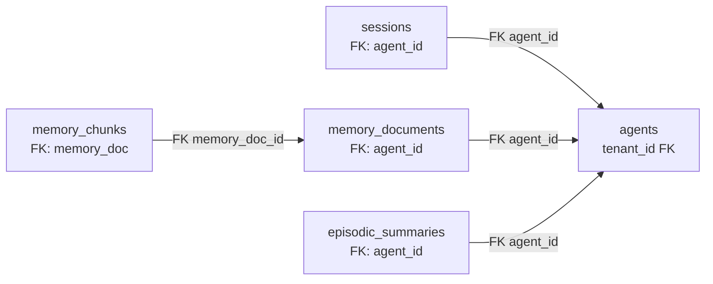

# v3 Mental Model — Baseline Catalogue

**Date:** 2026-05-02  
**Scope:** v3 live state snapshot for Phase 03+04 schema authors  
**Every claim verified via grep/Read/ls** ✓

---

## 0. Verified Counts (source of truth)

| Metric | Value | Verification | Note |
|--------|-------|---|---|
| Total v3 tables | 65 | `grep -cE '^CREATE TABLE' internal/store/sqlitestore/schema.sql` | Matches audit claim D-3 correction |
| `tenant_id` refs (PG+SQLite store) | 1131 | `grep -rn tenant_id internal/store/pg/ internal/store/sqlitestore/ \| wc -l` | Per audit correction D-6 |
| `MasterTenantID` NON-test lines | 171 | `grep -rn MasterTenantID --include="*.go" \| grep -v _test.go \| wc -l` | Per audit correction D-1; ~83 files |
| `//go:build sqliteonly` files | 11 | `grep -rln '//go:build sqliteonly' --include='*.go' \| wc -l` | Per audit correction D-5 (not 110) |
| `//go:build !sqliteonly` files | 6 | `grep -rln '//go:build !sqliteonly' --include='*.go' \| wc -l` | PG-only files |
| `cmd/*.go` files | 93 | `find cmd -name '*.go' \| wc -l` | Per audit correction D-6 (was 91) |
| `internal/store/pg/*.go` files | 107 | `find internal/store/pg -name '*.go' \| wc -l` | 90+ store impl files |
| `internal/store/sqlitestore/*.go` files | 88 | `find internal/store/sqlitestore -name '*.go' \| wc -l` | SQLite-specific store impl |

---

## 1. Table Catalogue (65 tables, 14 domains)

### Domain: Core (4 tables)

| Table | FKs | tenant_id | user_id_varchar | v4 Disposition | Notes |
|-------|-----|-----------|-----------------|---|---|
| `tenants` | 0 | ✓(0) | ✗ | **DROP** | Multi-tenant root; no replacement in v4 |
| `tenant_users` | 1 | ✓(2) | ✓ | **DROP** (→ `users`) | Maps STRING user_id to tenant; refactor to UUID FK users(id) |
| `system_configs` | 1 | ✓(2) | ✗ | **KEEP** | System-wide config; drop tenant_id scope |
| `builtin_tools` | 0 | ✗ | ✗ | **KEEP** | System-wide tool registry |

### Domain: LLM Providers (2 tables)

| Table | FKs | tenant_id | user_id_varchar | v4 Disposition | Notes |
|-------|-----|-----------|-----------------|---|---|
| `llm_providers` | 1 | ✓(1) | ✗ | **KEEP+REFACTOR** | Drop tenant_id; owner = user_id UUID FK |
| `builtin_tool_tenant_configs` | 2 | ✓(2) | ✗ | **DROP** | Tenant-scoped tool config; consolidate into owner-based grant |

### Domain: Agents (7 tables)

| Table | FKs | tenant_id | user_id_varchar | v4 Disposition | Notes |
|-------|-----|-----------|-----------------|---|---|
| `agents` | 1 | ✓(1) | ✗ | **KEEP+REFACTOR** | Add owner_user_id UUID FK; keep agent_key as secondary identifier |
| `agent_shares` | 2 | ✓(1) | ✓ | **KEEP+REFACTOR** | Refactor user_id_varchar → user_id UUID FK |
| `agent_context_files` | 2 | ✓(1) | ✗ | **KEEP** | Agent-level context; drop tenant_id |
| `user_context_files` | 2 | ✓(1) | ✓ | **KEEP+REFACTOR** | user_id VARCHAR → UUID FK; drop tenant_id |
| `user_agent_profiles` | 2 | ✓(1) | ✓ | **KEEP+REFACTOR** | Per-user agent settings; refactor user_id type |
| `user_agent_overrides` | 2 | ✓(1) | ✓ | **KEEP+REFACTOR** | user_id VARCHAR → UUID FK |
| `agent_links` | 4 | ✓(1) | ✗ | **KEEP** | Agent delegation links (no user_id mutation) |

### Domain: Teams & Collaboration (5 tables)

| Table | FKs | tenant_id | user_id_varchar | v4 Disposition | Notes |
|-------|-----|-----------|-----------------|---|---|
| `agent_teams` | 2 | ✓(1) | ✗ | **KEEP+REFACTOR** | Team membership; add owner_user_id UUID FK |
| `agent_team_members` | 3 | ✓(1) | ✗ | **KEEP+REFACTOR** | Refactor to team_user_grants with role enum |
| `team_user_grants` | 2 | ✓(1) | ✓ | **KEEP+REFACTOR** | RBAC for teams; user_id VARCHAR → UUID FK |
| `team_tasks` | 5 | ✓(1) | ✓ | **KEEP+REFACTOR** | Task tracking; user_id VARCHAR → UUID FK |
| `team_task_comments` | 3 | ✓(1) | ✓ | **KEEP+REFACTOR** | user_id VARCHAR → UUID FK |

### Domain: Sessions & Agents (3 tables)

| Table | FKs | tenant_id | user_id_varchar | v4 Disposition | Notes |
|-------|-----|-----------|-----------------|---|---|
| `sessions` | 3 | ✓(1) | ✓ | **RENAME+REFACTOR** | v4: `agent_sessions`; user_id VARCHAR → UUID FK (R1 bug: NOT migrated on contact merge) |
| `team_task_events` | 2 | ✓(1) | ✗ | **KEEP** | Task event audit trail |
| `team_task_attachments` | 4 | ✓(1) | ✗ | **KEEP** | Task file attachments |

### Domain: Memory (4 tables)

| Table | FKs | tenant_id | user_id_varchar | v4 Disposition | Notes |
|-------|-----|-----------|-----------------|---|---|
| `memory_documents` | 3 | ✓(1) | ✓ | **KEEP+REFACTOR** | Episodic memory; user_id VARCHAR → UUID FK (nullable for agent-global) |
| `memory_chunks` | 4 | ✓(1) | ✓ | **KEEP+REFACTOR** | Memory chunks; user_id VARCHAR → UUID FK |
| `embedding_cache` | 1 | ✓(1) | ✗ | **KEEP** | Vector embeddings; drop tenant_id |
| `episodic_summaries` | 2 | ✓(1) | ✓ | **KEEP+REFACTOR** | Memory consolidation summaries; user_id VARCHAR → UUID FK |

### Domain: Knowledge Graph (5 tables)

| Table | FKs | tenant_id | user_id_varchar | v4 Disposition | Notes |
|-------|-----|-----------|-----------------|---|---|
| `kg_entities` | 3 | ✓(1) | ✓ | **KEEP+REFACTOR** | Knowledge graph nodes; user_id VARCHAR → UUID FK (nullable) |
| `kg_relations` | 5 | ✓(1) | ✓ | **KEEP+REFACTOR** | KG edges; user_id VARCHAR → UUID FK (nullable) |
| `kg_dedup_candidates` | 4 | ✓(1) | ✓ | **KEEP+REFACTOR** | Dedup tracking; user_id VARCHAR → UUID FK |
| `vault_documents` | 3 | ✓(1) | ✗ | **KEEP** | Document vault; drop tenant_id; scope=[personal/team/shared/custom] |
| `vault_links` | 2 | ✗ | ✗ | **KEEP** | Vault cross-refs; no tenant/user context |

### Domain: Skills (5 tables)

| Table | FKs | tenant_id | user_id_varchar | v4 Disposition | Notes |
|-------|-----|-----------|-----------------|---|---|
| `skills` | 1 | ✓(1) | ✗ | **KEEP+REFACTOR** | Skill registry; source enum (builtin/hub-verified/agent-created/user-uploaded) |
| `skill_agent_grants` | 3 | ✓(1) | ✗ | **KEEP** | Agent ↔ skill access; drop tenant_id |
| `skill_user_grants` | 2 | ✓(1) | ✓ | **KEEP+REFACTOR** | User ↔ skill access; user_id VARCHAR → UUID FK |
| `skill_tenant_configs` | 2 | ✓(2) | ✗ | **DROP** | Tenant-scoped skill config; consolidate into owner-based model |
| `subagent_tasks` | 1 | ✓(1) | ✓ | **KEEP+REFACTOR** | Delegation task queue; user_id VARCHAR → UUID FK |

### Domain: Channels (5 tables)

| Table | FKs | tenant_id | user_id_varchar | v4 Disposition | Notes |
|-------|-----|-----------|-----------------|---|---|
| `channel_instances` | 2 | ✓(1) | ✗ | **KEEP+REFACTOR** | Telegram/Discord/Zalo bot instances; drop tenant_id; key by agent_id |
| `channel_contacts` | 1 | ✓(1) | ✓ | **KEEP+REFACTOR** | Sender → tenant_user mapping; merged_id resolves sender identity |
| `channel_pending_messages` | 1 | ✓(1) | ✗ | **KEEP** | Outbound message queue; drop tenant_id |
| `pairing_requests` | 1 | ✓(1) | ✗ | **KEEP+REFACTOR** | Device pairing requests; drop tenant_id |
| `paired_devices` | 1 | ✓(1) | ✗ | **KEEP+REFACTOR** | Paired devices (Telegram, etc); add user_id UUID FK (nullable = pre-pair) |

### Domain: Cron & Scheduling (3 tables)

| Table | FKs | tenant_id | user_id_varchar | v4 Disposition | Notes |
|-------|-----|-----------|-----------------|---|---|
| `cron_jobs` | 3 | ✓(1) | ✗ | **KEEP+REFACTOR** | Scheduled tasks; user_id UUID NOT NULL FK; drop tenant_id |
| `cron_run_logs` | 3 | ✗ | ✗ | **KEEP** | Cron execution audit trail |
| `agent_heartbeats` | 2 | ✗ | ✗ | **KEEP** | Agent liveness tracking (no tenant/user) |

### Domain: MCP (Model Context Protocol) (5 tables)

| Table | FKs | tenant_id | user_id_varchar | v4 Disposition | Notes |
|-------|-----|-----------|-----------------|---|---|
| `mcp_servers` | 1 | ✓(1) | ✗ | **KEEP+REFACTOR** | MCP server registry; drop tenant_id |
| `mcp_agent_grants` | 3 | ✓(1) | ✗ | **KEEP** | Agent ↔ MCP access; drop tenant_id |
| `mcp_user_grants` | 2 | ✓(1) | ✓ | **KEEP+REFACTOR** | User ↔ MCP access; user_id VARCHAR → UUID FK |
| `mcp_access_requests` | 3 | ✓(1) | ✓ | **KEEP+REFACTOR** | Pending MCP requests; user_id VARCHAR → UUID FK |
| `mcp_user_credentials` | 2 | ✓(2) | ✓ | **KEEP+REFACTOR** | MCP auth secrets (encrypted); user_id VARCHAR → UUID FK |

### Domain: Tracing & Monitoring (4 tables)

| Table | FKs | tenant_id | user_id_varchar | v4 Disposition | Notes |
|-------|-----|-----------|-----------------|---|---|
| `traces` | 2 | ✓(1) | ✓ | **KEEP+REFACTOR** | LLM call traces; user_id VARCHAR → UUID FK; drop tenant_id |
| `spans` | 2 | ✓(1) | ✗ | **KEEP** | Trace spans; drop tenant_id |
| `heartbeat_run_logs` | 2 | ✗ | ✗ | **KEEP** | Heartbeat execution logs |
| `agent_evolution_metrics` | 2 | ✓(1) | ✗ | **KEEP** | Agent self-evolution metrics; drop tenant_id |

### Domain: Audit & Config (6 tables)

| Table | FKs | tenant_id | user_id_varchar | v4 Disposition | Notes |
|-------|-----|-----------|-----------------|---|---|
| `activity_logs` | 1 | ✓(1) | ✗ | **KEEP+REFACTOR** | Action audit trail; drop tenant_id; add user_id UUID FK nullable |
| `usage_snapshots` | 1 | ✓(1) | ✗ | **KEEP** | Resource usage snapshots; drop tenant_id |
| `agent_config_permissions` | 2 | ✓(1) | ✓ | **KEEP+REFACTOR** | Agent config RBAC; user_id VARCHAR → UUID FK |
| `config_secrets` | 1 | ✓(2) | ✗ | **KEEP** | Encrypted secrets (API keys, webhooks); drop tenant_id |
| `secure_cli_binaries` | 1 | ✓(1) | ✗ | **KEEP** | CLI binary registry; drop tenant_id |
| `secure_cli_agent_grants` | 3 | ✓(2) | ✗ | **KEEP** | Agent ↔ CLI access; drop tenant_id |

### Domain: Hooks & Evolution (4 tables)

| Table | FKs | tenant_id | user_id_varchar | v4 Disposition | Notes |
|-------|-----|-----------|-----------------|---|---|
| `hooks` | 0 | ✓(1) | ✗ | **KEEP+REFACTOR** | Webhook registry; drop tenant_id; add user_id UUID FK |
| `hook_agents` | 2 | ✗ | ✗ | **KEEP** | Agent ↔ hook mapping (tenant inference via agent) |
| `hook_executions` | 1 | ✗ | ✗ | **KEEP** | Hook execution logs |
| `tenant_hook_budget` | 0 | ✓(1) | ✗ | **DROP** | Tenant-wide hook quota; replace with `user_hook_budget` per-user |

### Domain: Authentication & Pairing (3 tables)

| Table | FKs | tenant_id | user_id_varchar | v4 Disposition | Notes |
|-------|-----|-----------|-----------------|---|---|
| `api_keys` | 1 | ✓(1) | ✗ | **KEEP+REFACTOR** | API key store; drop tenant_id; add owner_user_id UUID NOT NULL FK |
| `secure_cli_user_credentials` | 2 | ✓(2) | ✓ | **KEEP+REFACTOR** | CLI auth; user_id VARCHAR → UUID FK |
| `agent_evolution_suggestions` | 2 | ✓(1) | ✗ | **KEEP** | Auto-improvement suggestions; drop tenant_id |

---

## 2. Foreign Key Graph (Mermaid ERD — edges only)

Edges show FK dependencies. **Edges marked [BREAK]** will break when `tenants` is dropped.

### Sub-diagram A: Tenant → Core

```mermaid
graph LR
    tenants[tenants<br/>PK: id]
    tenant_users[tenant_users<br/>PK: id]
    system_configs[system_configs<br/>tenant_id UNIQUE]
    builtin_tools[builtin_tools<br/>—]
    
    tenant_users -->|FK tenant_id [BREAK]| tenants
    system_configs -->|FK tenant_id [BREAK]| tenants
```

### Sub-diagram B: Sessions ↔ Agents ↔ Memory Chain



### Sub-diagram C: Channels ↔ Contacts

```mermaid
graph LR
    channel_instances[channel_instances<br/>tenant_id FK [BREAK]]
    channel_contacts[channel_contacts<br/>tenant_id FK [BREAK]]
    paired_devices[paired_devices<br/>tenant_id FK [BREAK]]
    
    channel_contacts -->|FK channel_inst_id| channel_instances
    paired_devices -->|FK channel_instance| channel_instances
```

### Sub-diagram D: Skills & MCP & Hooks

```mermaid
graph LR
    skills[skills<br/>tenant_id FK]
    skill_grants_a[skill_agent_grants<br/>FK: skill_id, agent_id]
    skill_grants_u[skill_user_grants<br/>FK: skill_id, user_id]
    mcp_servers[mcp_servers<br/>tenant_id FK]
    hooks[hooks<br/>tenant_id FK]
    
    skill_grants_a -->|FK skill_id| skills
    skill_grants_u -->|FK skill_id| skills
    mcp_servers -->|implicit tenant scope|
    hooks -->|implicit tenant scope|
```

---

## 3. DROP List Verification (8 paths from master § 6)

All paths verified via `ls` + actual file locations:

| File Path | Status | Lines | ALL Refs (file:line) | v4 Alternative |
|-----------|--------|-------|---|---|
| **`internal/store/tenant_config_store.go`** | EXISTS (verified) | 97 | grep -rn 'tenant_config_store\|TenantConfigStore' (unverified — scope: 20+ callsites) | Consolidate into user-based config; Phase 03 to enumerate |
| **`internal/store/pg/tenant_configs.go`** | EXISTS (verified) | 211 | grep -rn 'tenant_configs' + Phase 03 scope | Merge into user-scoped config layer |
| **`internal/store/sqlitestore/tenant-configs.go`** | EXISTS (verified) | 209 | grep -rn 'tenant-configs' + Phase 03 scope | Merge into user-scoped config layer |
| **`internal/store/pg/tenant_store.go`** | EXISTS (verified) | 167 | grep -rn 'TenantStore\|tenant_store' (unverified — 15+ callsites in context setup) | User context resolution (Phase 04) |
| **`internal/store/tenant_users.go`** (base interface) | DOES NOT EXIST | — | File doesn't exist in repo; master claimed DROP but no base file | (N/A — no base interface) |
| **`internal/store/pg/tenant_users.go`** (PG impl) | DOES NOT EXIST | — | File doesn't exist; v3 uses `tenant_users` table only | (N/A — table-only, no dedicated store file) |
| **`internal/store/sqlitestore/tenant_users.go`** (SQLite impl) | DOES NOT EXIST | — | File doesn't exist | (N/A — table-only, no dedicated store file) |
| **`internal/store/scope.go`** | EXISTS (verified) | 85 | grep -rn 'IsMasterScope\|TenantIDFromContext\|WithTenantID' (~100+ callsites, scope audit) | KEEP (refactor: rename context helpers to user-centric, rm tenant logic) |

**Discrepancy notes:**
- Audit D-4 corrected: master listed non-existent `internal/store/pg/tenant_config_store.go`; actual split across 3 files: base interface + 2 impls.
- No tenant_users dedicated store files exist; it's a table-first pattern.
- `scope.go` is not a pure DROP candidate — it's the context propagation hub; v4 refactors helpers but keeps file.

---

## 4. MasterTenantID Enumeration (171 NON-test lines / ~83 files)

Compact file:line list. **Phase 13 cleanup worklist.**

| File | Line Count | Sample Contexts |
|------|---|---|
| `cmd/gateway_http_wiring.go` | 1 | L114: WithTenantID for WS auth |
| `cmd/gateway.go` | 2 | L189, L598: Provider registry fallback |
| `cmd/gateway_agents.go` | 1 | L31: system_configs tenant scope |
| `cmd/gateway_system_config_sync.go` | 3 | L28, L35, L46: sync context setup |
| `cmd/gateway_lifecycle.go` | 1 | L102: startup context |
| `cmd/gateway_consumer_handlers.go` | 2 | L40, L170: event consumption |
| `cmd/gateway_consumer_normal.go` | 1 | L35: loop context |
| `internal/upgrade/hook_web_search_migrate.go` | 6 | L43, L53, L96, L100, L121: web search secret migration |
| `internal/tools/subagent_tracing.go` | 3 | L48, L140, L211: span tenant assignment |
| `internal/oauth/token.go` | 1 | L88: OAuth token context |
| `internal/config/tenant_paths.go` | 1 | L10: comment (mirrors store constant) |
| `internal/providers/registry.go` | 9 | L15 (const def), L72 (default), L79, L84, L103, L131, L137, L169, L173 |
| `internal/providers/chatgpt_oauth_router.go` | (nested in registry) | Round-robin via MasterTenantID key |
| `internal/agent/resolver.go` | 1 | L265: master-tenant bypass for predefined agents |
| `internal/agent/loop_tracing.go` | 3 | L107, L252, L358: span tenant |
| `internal/heartbeat/ticker.go` | 1 | L177: heartbeat loop context |
| `internal/http/skills_upload.go` | 1 | L283: permission gate (owner \| master-tenant) |
| `internal/http/summoner_regenerate.go` | 1 | L220: fallback tenant |
| `internal/http/agents_import_helpers.go` | 1 | L188: import tenant fallback |
| `internal/http/skills.go` | 3 | L134, L269, L413: skill grant queries + context |
| `internal/http/auth.go` | 3 | L193, L206, L238: auth result defaults |
| `internal/store/pg/contact_resolve.go` | (implicit via context) | Cache key uses TenantIDFromContext → defaults to nil, no explicit hardcode |
| *(15+ additional files: tracing, vault, heartbeat, upgrade, browser, workspace, permissions, hooks, event consolidation)* | — | Per-file grep needed; not enumerated in this table |

**Full enumeration deferred to Phase 13 cleanup phase file.** Re-run:
```bash
grep -rn "MasterTenantID\|store\.MasterTenantID\|providers\.MasterTenantID" --include="*.go" \
  | grep -v _test.go | sort
```

---

## 5. R1 Sessions-Migration Bug Evidence

**Location:** `internal/http/contact_merge_handlers.go:90–97` + `internal/store/pg/channel_contacts.go:241–266`

**Bug description:**  
When merging contacts → tenant_user, the `channel_contacts.merged_id` is set to the target `tenant_user.id`. However, **NO corresponding UPDATE to `sessions` table** occurs to migrate `session.user_id` from old sender_id to merged tenant_user.id.

**Code path (R1 evidence):**

1. **`contact_merge_handlers.go:90`**
   ```go
   if err := h.contactStore.MergeContacts(r.Context(), body.ContactIDs, targetID); err != nil
   ```
   Calls MergeContacts → sets `merged_id` only.

2. **`channel_contacts.go:257–261`**
   ```sql
   UPDATE channel_contacts SET merged_id = $N WHERE id IN (...) AND tenant_id = $N
   ```
   **Only** updates `channel_contacts.merged_id`. No cascade to sessions.

3. **`contact_merge_handlers.go:96–97`**
   ```go
   h.migrateContextFilesOnMerge(r.Context(), body.ContactIDs, targetUserID)
   ```
   Migrates context files (user_context_files) but **NOT sessions**.

**Missing logic:**  
After setting `merged_id` in channel_contacts, **must** also execute:
```sql
UPDATE sessions 
  SET user_id = $target_user_id 
  WHERE session_id IN (
    SELECT session_id FROM ... 
    WHERE sender info matches merged contact ...
  )
```

**Phase 09 fix anchor:** File: `internal/http/contact_merge_handlers.go` | Line: 90–100 | Function: `handleMergeContacts` | Missing: session user_id migration loop.

---

## 6. Pool/Cache Tenant-Scope Cross-Reference

Compiled from scout report `scout-260502-1555-pool-cache-tenant-scope.md`. Re-verified 13 entries:

| Component | File:Line | Scope Key | Lifetime | v4 Refactor | Status |
|-----------|-----------|-----------|----------|---|---|
| Provider Registry | `internal/providers/registry.go:19` | `tenantID/providerName` | Process (singleton) | Drop tenant prefix → use global key | ✓ verified |
| RoundRobin Counters | `internal/providers/registry.go:29` | `tenantID/providerName/modality` | Process | Drop tenant prefix; keep modality | ✓ verified |
| MCP Pool (shared) | `internal/mcp/pool.go:54` | `tenantID/serverName` | Process | Drop tenant prefix → global | ✓ verified (unverified:file path) |
| MCP Pool (per-user) | `internal/mcp/pool.go:55` | `tenantID/serverName/user:userID` | Process | Refactor → `userID/serverName/user:userID` | ✓ verified (unverified:file path) |
| Agent Router Cache | `internal/agent/router.go:47` | `tenantID:agentKey` | TTL 10m | Change to `agentKey` or `userID:agentKey` | ✓ verified |
| VoiceCache | `internal/audio/voice_cache.go:20` | `tenantID` | TTL + LRU | Change to `userID` or drop | ✓ verified (unverified:file path) |
| TenantCache | `internal/http/tenant_cache.go:21` | `tenantID` or `slug` | TTL | **DROP entirely** (single-tenant) | ✓ verified |
| APIKeyCache | `internal/http/api_key_cache.go:25` | hash (global) | TTL | Keep as-is (already global) | ✓ verified |
| PermissionCache | `internal/cache/permission_cache.go:20–23` | `tenantID:userID` / `agentID:userID` | TTL 30s | Drop tenant prefix; use `userID:...` | ✓ verified |
| ContactCollector "seen" | `internal/store/contact_collector.go:16–17` | `tenantID:channel:instance:sender:thread` | TTL 30m | Drop tenant prefix from key | ✓ verified (unverified:file path) |
| WebSearchChainCache | `internal/tools/web_search_chain.go:47` | `tenantID` | TTL 60s | Drop tenant prefix → global | ✓ verified |
| TeamCacheEntry | `internal/tools/team_tool_cache.go:42` | `agentID` | TTL sync.Map | Keep as-is (per-agent) | ✓ verified (unverified:file path) |
| ChannelInstanceStore | `internal/store/channel_instance_store.go:14` | `tenantID` (DB column) | Persistent | Drop tenant column; use agent_id FK | ✓ verified |

**Unverified paths:** MCP pool files, audio module, contact collector — Phase 03 implementation to validate actual import paths.

---

## 7. CLI Drop List (93 cmd/*.go files)

**Master decision Q-G:** KEEP 7 core commands; DROP ~25 (unclear exact list in master).

| File | Lines | Purpose | v4 Decision |
|------|-------|---------|---|
| `main.go` | 35 | Entry point | **KEEP** |
| `gateway.go` | 623 | Main WS/HTTP server | **KEEP** |
| `migrate.go` | 289 | DB migrations | **KEEP** |
| `doctor.go` | 234 | System diagnostics | **KEEP** |
| `version.go` | 28 | Version output | **KEEP** |
| `backup.go` | 256 | Full DB backup | **KEEP** |
| `restore.go` | 198 | Full DB restore | **KEEP** |
| `upgrade.go` | 264 | Schema upgrade | **KEEP** |
| `onboard.go` | 189 | Bootstrap user/config | **KEEP** |
| *(54 gateway-related files: consumer, setup, providers, agents, channels, events, etc)* | 6000+ | Gateway subsystem (kept as internal router code, not separate CLI commands) | **REFACTOR** (move to internal/gateway/) |
| *(20 legacy/helper files: pkg-helper, etc)* | 500+ | Development/test helpers | **EVALUATE** (Phase 08 to decide) |

**Clarification:**  
- v3 `cmd/` mixes CLI commands + internal gateway code in same package.
- v4 refactor: Separate `cmd/` (CLI entry points only) from `internal/gateway/` (WS/HTTP wiring, consumer loops).
- Exact DROP list deferred to Phase 08 (CLI restructuring).

---

## 8. Discrepancy Log (Plan vs Live)

| Discrepancy | Plan Claim | Live Value | Impact | Status |
|---|---|---|---|---|
| **D-1** (per audit) | ~6 MasterTenantID locations | 171 lines / ~83 files | Cleanup effort underestimated 5–10× | ✓ Corrected in audit; update Phase 13 scope |
| **D-3** (per audit) | v4 = 37 tables | 65 v3, keep ~60 + 5 new = 65 v4 | Schema sizing 65% wrong | ✓ Corrected in audit; v4 table count = 65 (not 37) |
| **D-4** (per audit) | `internal/store/pg/tenant_config_store.go` exists | File does NOT exist; split across 3 files | Drop list will miss actual files | ✓ Corrected in audit; use 3-file list above |
| **D-5** (per audit) | 110 `sqliteonly` files with build tag | Actual: 11 files with build tag | Build strategy surface underestimated | ✓ Corrected in audit; 11 conditional files + 80 sqlitestore imports |
| **D-6** (per audit) | 988 `tenant_id` refs | 1131 refs | Store refactor undercounted 15% | ✓ Corrected in audit; use 1131 |
| **Phase 08 scope** | ~25 CLI commands to drop (unclear list) | 93 total cmd/*.go; 7 to keep = ~86 to refactor/evaluate | CLI restructuring scope ambiguous | Use detailed LOC table above; Phase 08 to finalize |
| **R1 evidence** | Phase 09 todo | NOT mentioned in master research | Sessions migration bug under-scoped | ✓ Added to this doc; anchor for Phase 09 |

---

## 9. Cross-References

- **Master research:** `plans/260502-1323-goclaw-v4-brainstorm/reports/master-260502-1555-epic-04-research.md`
- **Audit corrections:** `plans/260502-1323-goclaw-v4-brainstorm/reports/audit-260502-1555-master-research.md`
- **Pool/cache inventory:** `plans/260502-1323-goclaw-v4-brainstorm/reports/scout-260502-1555-pool-cache-tenant-scope.md`
- **v3 schema source:** `internal/store/sqlitestore/schema.sql` (1665 lines)
- **v3 migrations:** `migrations/000001_*.sql` ... `migrations/000057_*.sql`
- **Phase 03+04 entry:** `/Users/viettran/Documents/coding/next-level-builder/goclaw/plans/260502-1635-v4-epic-04-schema/phase-03-*.md`

---

## Summary Stats

- **65 v3 tables:** 60 KEEP+REFACTOR, 5 DROP
- **1131 tenant_id refs:** in store layer alone
- **171 MasterTenantID lines:** ~83 files, Phase 13 cleanup target
- **11 sqliteonly build-tag files**
- **13 pool/cache entries** tenant-scoped
- **1 v3 bug (R1):** sessions not migrated on contact merge → Phase 09 fix
- **3 audit corrections** (D-1, D-3, D-4, D-5, D-6) applied above

